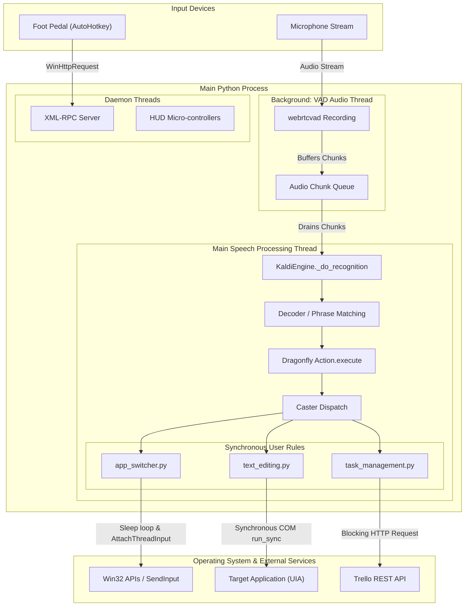

# Speech Stack Thread Architecture & Diagnostic Report

## 1. Executive Summary & Problem Diagnosis

This diagnostic report provides a comprehensive analysis of the freezing and rapid-execution behaviors observed in your speech recognition stack (**Kaldi + Dragonfly + Caster**). 

### The Core Issue
The speech accessibility stack suffers from thread-blocking issues due to a single-threaded execution model where voice command actions execute **synchronously on the main speech-processing thread**. When a voice command triggers a blocking operation—such as waiting for unresponsive Windows UI Automation (UIA) COM providers, synchronous polling loops with `time.sleep()`, or synchronous HTTP network requests—the main thread hangs completely.

### The `Ctrl+C` Phenomenon Explained
While the main thread is blocked inside a synchronous call, the background audio recording thread (`VADAudio`) continues to record microphone audio and push audio chunks into its memory queue. Pressing `Ctrl+C` in the running PowerShell terminal sends a `SIGINT` (`KeyboardInterrupt`) to the Python process. This exception instantly interrupts the stuck Python function or C-extension call (e.g. breaking out of `time.sleep()`, socket read, or COM wait). The main engine loop catches or unwinds the exception, recovers, and immediately processes the accumulated backlog of audio buffers. Consequently, all queued voice commands are decoded and executed in rapid succession.

---

## 2. End-to-End Voice Command Lifecycle

The lifecycle of a voice command transitions through several layers of the stack. Because execution ultimately loops back to the main thread, the architecture heavily relies on unhindered throughput at every stage:

```
[ Microphones ]
      │ (asynchronous audio stream)
      ▼
[ VADAudio Background Thread ] ──► (pushes to Inter-thread Queue)
      │
      ▼ (main thread drains queue)
[ KaldiEngine._do_recognition() ]
      │
      ▼ (phrase boundary detected)
[ Dragonfly Recognition Processor ]
      │
      ▼ (synchronous Action.execute())
[ Caster Dispatch & Nexus ]
      │
      ▼ (synchronous rule execution)
[ User Rules ] ──► (app_switcher / text_editing / task_management)
      │
      ▼ (blocking call)
[ OS / COM / Win32 / Network ] ── (blocks Main Thread!)
```

1. **Audio Capture:** Microphone input is captured continuously in the OS driver stream.
2. **VAD Audio Thread:** `VADAudio` (using `webrtcvad`) records audio in a dedicated background thread, buffering audio frames into an inter-thread queue.
3. **Kaldi Engine Loop:** The main Python thread runs a continuous `_do_recognition()` loop, consuming the audio buffer (`audio_iter.send(...)`).
4. **Decoding & Recognition:** The engine decodes the audio and, upon phrase boundaries, delegates to Dragonfly's recognition processor.
5. **Caster Action Dispatch:** Dragonfly synchronously executes matched grammar actions on the main thread via `Action.execute()`.
6. **User Rule Execution:** Custom user logic (`app_switcher`, `text_editing`) processes the command.
7. **OS / External Interfacing:** The user rule invokes Windows API (`win32gui`), UIA COM objects, `ctypes.windll.user32.SendInput`, or HTTP endpoints.

---

## 3. Mapped Threading & Process Architecture

The system features synchronous main-thread bound processing with minimal background daemon utilization for auxiliary tasks.



| Component | Thread Type | Execution Model | Diagnostics & Vulnerability |
| :--- | :--- | :--- | :--- |
| **VADAudio** | Background Thread | Asynchronous / Queue | Continues writing audio frames to queue even when main thread is frozen |
| **Kaldi `_do_recognition`** | Main Thread | Synchronous Loop | Drains queue; completely halts when executing any command `Action` |
| **Dragonfly / Caster Actions** | Main Thread | Synchronous | Function call chain (`Action.execute()`); any blocking call here freezes the speech engine |
| **XML-RPC / HUD Server** | Daemon Thread | Asynchronous | Serves AHK foot pedal integration safely off the main speech thread |
| **App Switcher (`app_switcher.py`)** | Main Thread | Synchronous / Polling | Uses `time.sleep()` loops and Win32 `AttachThreadInput` on main thread |
| **Text Editing (`text_editing.py`)** | Main Thread | Synchronous COM | Uses `os_controller.run_sync()`; blocks main thread waiting for UIA response |

---

## 4. Deep Dive into Problematic Components

### A. App Switcher ([app_switcher.py](../caster_user_content/util/app_switcher.py))
- **Primary Issue:** Synchronous polling loops using `time.sleep()`.
- **Mechanics:**
  - `verify_focus` runs a `while` loop calling `time.sleep(0.05)` (blocking for up to 1.5 seconds) waiting for a window focus change ([app_switcher.py:L290-L297](../caster_user_content/util/app_switcher.py#L290-L297)).
  - `find_tab()` executes a `while tries < 50` loop with `time.sleep(0.1)`, which can block the main speech thread for **up to 5 seconds** if a browser tab is missing or slow to load ([app_switcher.py:L354-L365](../caster_user_content/util/app_switcher.py#L354-L365)).
  - `switch_to_app` uses `win32process.AttachThreadInput`, `win32gui.SetForegroundWindow`, and dummy `keybd_event` injections to bypass OS focus restrictions. If the target application's message pump is frozen or unresponsive, `SetForegroundWindow` or `AttachThreadInput` can hang the calling thread.

### B. Text Editing & UI Automation ([text_editing.py](../caster_user_content/rules/global/text_editing.py))
- **Primary Issue:** Synchronous COM thread blocking via UIA.
- **Mechanics:**
  - A global UIA controller (`_GLOBAL_UIA_CONTROLLER`) manages interactions.
  - Virtually every text editing rule (e.g. `read_buffer`, `capitalize_selection`, `put_cursor_before`) invokes `os_controller.run_sync(action)` ([text_editing.py:L83](../caster_user_content/rules/global/text_editing.py#L83)).
  - **COM Deadlock Risk:** `run_sync` forces the UIA COM query to complete synchronously on the main thread. If the target application is an IDE indexing files, an elevated process running as Administrator (UAC boundary), or a hung GUI application, the underlying Windows COM engine blocks indefinitely waiting for a response from the target process.

### C. Synchronous Network Requests ([task_management.py](../caster_user_content/rules/global/task_management.py))
- **Primary Issue:** Unbounded HTTP REST requests on the speech thread.
- **Mechanics:** `task_management.py` calls `trello_tools.add_card`, which makes synchronous HTTP calls using Python's `requests` library. If network latency spikes or packet loss occurs, speech recognition freezes for the entire HTTP request timeout duration.

### D. Foot Pedal Hardware Integration ([foot_pedal.ahk](../foot_pedal.ahk))
- **Architecture Note:** The foot pedal integration is properly decoupled. AutoHotkey runs an external script (`foot_pedal.ahk`) that sends a `WinHttpRequest` to an XML-RPC server spawned inside a daemon thread by `caster_toggle_mic_key.py`.
- **Verdict:** The foot pedal does NOT block the main speech thread. It serves as a positive architectural model for how OS hooks and external events should communicate with Caster asynchronously.

---

## 5. Ctrl+C Execution Unfreezing Breakdown

The exact step-by-step mechanism of the execution queue freeze and `Ctrl+C` recovery:

```
Step 1: User issues voice command "find tab python" or "read buffer".
        │
Step 2: Main Speech Thread executes app_switcher.py / text_editing.py.
        │
Step 3: Execution hits a blocking call:
        - time.sleep(0.1) loop (up to 5s in find_tab)
        - os_controller.run_sync() waiting on a hung UIA COM target
        - Synchronous socket read in trello_tools
        │
Step 4: [MAIN THREAD FREEZES]
        The KaldiEngine._do_recognition() loop stops. No new commands are processed.
        │
Step 5: User notices freeze and speaks follow-up voice commands ("cancel", "scratch that", "open browser").
        │
Step 6: VADAudio Background Thread keeps recording audio and pushing chunks to Queue.
        Audio buffers accumulate in memory.
        │
Step 7: User presses Ctrl+C in the PowerShell console window.
        │
Step 8: Windows OS sends SIGINT to the Python process.
        Python raises a KeyboardInterrupt exception inside the main thread.
        │
Step 9: KeyboardInterrupt immediately breaks out of time.sleep() / COM wait / socket read.
        The current stuck action is aborted.
        │
Step 10: Exception unwinds back to KaldiEngine._do_recognition() loop.
        │
Step 11: Main Thread recovers and drains the accumulated Audio Chunk Queue.
        Kaldi decodes all buffered audio at maximum speed.
        │
Step 12: [SURGE EXECUTION] All queued commands execute back-to-back in rapid fire!
```

---

## 6. Technical Specifications for a "Live Thread & Process Tracker"

To visually monitor, profile, and detect thread hangs in real-time across your speech stack, we propose building a lightweight **Live Thread & Process Tracker** plugin/sidecar.

### Architecture Overview
```
[ Main Speech Thread ] ──(Decorators/Hooks)──► [ Telemetry Event Ring Buffer ]
                                                        │
[ Background Profiler Thread ] ◄───────────────────────┘
  (Samples stack frames via sys._current_frames())
        │
        ▼
[ PySide2 / Terminal Dashboard UI ] (Visualizes Thread State, Queue Depth, & Hangs)
```

### Core Requirements & Telemetry Features
1. **Action Execution Timer (Interceptor):**
   - Wrap `Dragonfly.Action.execute()` with a timer decorator.
   - Record `action_name`, `start_time`, `duration_ms`.
   - If `duration_ms > 150ms`, flag the execution as a **Thread Blocking Event**.

2. **Main Thread Stack Frame Sampling:**
   - Run a dedicated monitoring thread that samples `sys._current_frames()` every 100ms.
   - If the main speech thread remains in the same stack frame (e.g. inside `time.sleep` or `comtypes`) for longer than 300ms, extract the filename and line number and log a **Hang Warning**.

3. **Audio Queue Depth Monitor:**
   - Query `VADAudio.queue.qsize()` at 10Hz.
   - Normal state: Queue depth fluctuates between 0 and 2.
   - Frozen state: Queue depth monotonically increases (e.g. > 10 chunks). Trigger a visual warning indicator.

4. **Real-time Visual Dashboard:**
   - Display a lightweight HUD using `PySide2` (which is already present in Caster's dependencies).
   - Show:
     - **Main Thread Status:** `ACTIVE` (Green), `IDLE` (Blue), `BLOCKED` (Red with stack trace).
     - **Queue Depth Meter:** Live sparkline of pending audio buffers.
     - **Execution Log:** Scrollable table of recent commands with duration benchmarks.

---

## 7. Refactoring Recommendations & Actionable Remediation Plan

To permanently eliminate execution freezing without relying on `Ctrl+C`, implement the following targeted refactorings:

> [!IMPORTANT]
> The single most critical architectural upgrade is establishing a strict boundary between speech recognition decoding and action execution.

### Actionable Remediation Steps

1. **Offload Blocking Actions to a Worker Thread Pool:**
   - Modify Dragonfly/Caster action dispatch to execute user rules asynchronously using `concurrent.futures.ThreadPoolExecutor(max_workers=2)`.
   - The main speech thread should only decode audio and push recognized commands to the executor queue, allowing `_do_recognition()` to remain responsive at all times.

2. **Asynchronous UIA Wrappers ([text_editing.py](../caster_user_content/rules/global/text_editing.py)):**
   - Replace `os_controller.run_sync(action)` with an asynchronous wrapper (`run_async`) that offloads UIA COM calls to a worker thread with a strict timeout (e.g., `timeout=0.5s`).
   - If a UIA call times out due to an unresponsive target window, abort the thread cleanly instead of freezing the engine.

3. **Eliminate Synchronous Sleep Polling ([app_switcher.py](../caster_user_content/util/app_switcher.py)):**
   - Refactor `verify_focus` and `find_tab()` to eliminate `time.sleep()` on the main thread.
   - Use non-blocking event-driven timers (e.g. `threading.Timer` or yield-based tick polling) with a hard cap on retry attempts (e.g., max 500ms timeout instead of 5000ms).

4. **Enforce Timeouts on HTTP Requests ([task_management.py](../caster_user_content/rules/global/task_management.py)):**
   - Pass explicit timeout arguments to all network calls (`requests.post(..., timeout=(1.0, 2.0))`) and run network rules in background threads.

5. **Elevate Process Privileges (UAC Mitigation):**
   - Ensure the Python environment running Caster is launched with Administrator privileges if target windows (like IDEs or system tools) run as Administrator, preventing UI Automation COM access denial deadlocks.
