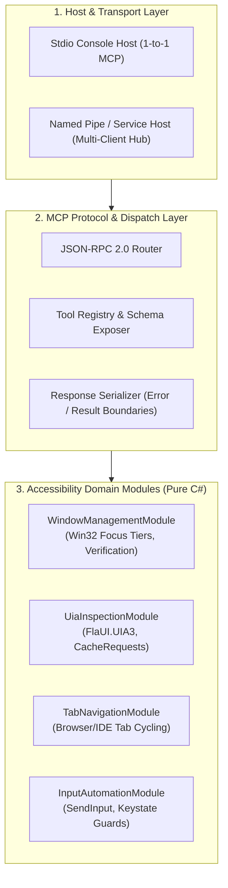
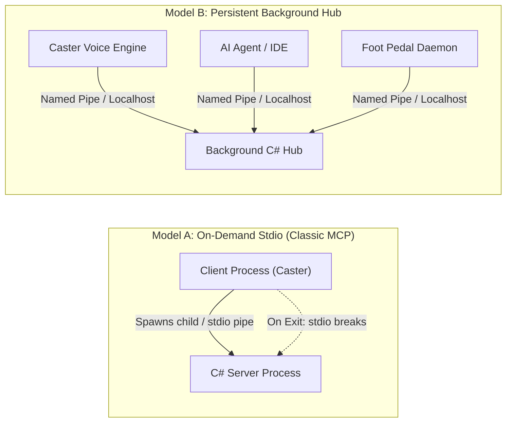

Listed directory caster
Listed directory docs
Listed directory context
Viewed repository-brain.md:1-87
Listed directory wayfinder-uia-threading
Listed directory research
Viewed map.md:1-91
Viewed 034_determine_mcp_implementation_path_research.md:1-25
Viewed 036_app_switcher_mcp_investigation.md:1-25
Viewed claude-critique-verified-takeaways.md:1-120
Viewed claude-critique-verified-takeaways.md:121-180
Listed directory architecture
Listed directory features
Viewed app_switcher.md:1-70

Here is the comprehensive architectural exploration, security analysis, and planning framework for the **Windows C# Accessibility Hub & Micro MCP Server**.

---

### Executive Vision: The "C# Accessibility Hub" Paradigm

Rather than relying on LLM "skills" that write one-off scripts on the fly or bloated third-party agent servers that crawl entire UI trees, the goal is to build an **out-of-process, deterministic C# accessibility engine**. 

```
┌────────────────────────────────────────────────────────────────────────┐
│                        Consumers / Clients                             │
│   ┌───────────────────────────┐      ┌─────────────────────────────┐   │
│   │    Caster Voice Engine    │      │    AI Coding Agents / IDE   │   │
│   │   (Deterministic Voice)   │      │    (High-Level Task Plan)   │   │
│   └─────────────┬─────────────┘      └──────────────┬──────────────┘   │
└─────────────────┼───────────────────────────────────┼──────────────────┘
                  │ JSON-RPC (MCP Protocol)           │ JSON-RPC (MCP)
                  ▼                                   ▼
┌────────────────────────────────────────────────────────────────────────┐
│               Windows C# Accessibility Hub (Out-of-Process)            │
│  ┌──────────────────────────────────────────────────────────────────┐  │
│  │ Transport Host (Stdio CLI Host / Multi-Client Named Pipe Host)   │  │
│  └──────────────────────────────┬───────────────────────────────────┘  │
│                                 ▼                                      │
│  ┌──────────────────────────────────────────────────────────────────┐  │
│  │ Dispatcher & Protocol Layer (Tools, Schemas, Request Routing)    │  │
│  └──────┬───────────────────────┬────────────────────────────┬──────┘  │
│         ▼                       ▼                            ▼         │
│  ┌──────────────┐      ┌─────────────────┐      ┌───────────────────┐  │
│  │ Window Mgmt  │      │  FlaUI / UIA3   │      │  Input Injection  │  │
│  │ Module (Win32│      │  Module (MTA    │      │  Module (Guarded  │  │
│  │ Focus Tiers) │      │  CacheRequests) │      │  Key / Mouse)     │  │
│  └──────────────┘      └─────────────────┘      └───────────────────┘  │
└────────────────────────────────────────────────────────────────────────┘
```

---

### 1. Architectural Foundation & Modularity

To ensure the server starts simple (an MVP for window listing and focusing) but can scale indefinitely without rewrites, we decouple the system into three distinct layers:



#### A. Core Engine Abstraction (`AccessibilityCore.dll`)
- A pure .NET class library containing the actual OS logic.
- Has **zero dependencies on MCP or JSON-RPC**.
- Exposes clean C# interfaces (e.g., `IWindowManager`, `IUiaInspector`, `IInputController`).
- Can be unit-tested directly or consumed by any .NET application without running a server.

#### B. Tool Plugin Registry
- Tools implement a lightweight interface (e.g., `IMcpToolModule`).
- Each module declares its metadata, input JSON schema, and execution handler.
- **MVP**: Starts with only `WindowManagementModule`.
- **Future Expansions**: Adding UIA tree queries or tab cycling is as simple as dropping in a new module class.

---

### 2. Deep Dive: Security, Permissions, and Elevation

One of the most critical decisions in Windows accessibility tooling is how to handle **User Interface Privilege Isolation (UIPI)** and elevation.

```
┌───────────────────────────────────────────────────────────────────────────┐
│                           Windows Integrity Levels                        │
│                                                                           │
│  ┌─────────────────────────────────┐   UIPI Blocks Messages & Hooks      │
│  │ High Integrity (Elevated/Admin) │ ◄──────────────────────────────┐     │
│  │ (Task Manager, Admin Terminal)  │                                │     │
│  └─────────────────────────────────┘                                │     │
│                                                                     │     │
│  ┌─────────────────────────────────┐                                │     │
│  │ Medium Integrity (Standard User)│ ───────────────────────────────┘     │
│  │ (Normal Apps, VS Code, Caster)  │                                      │
│  └─────────────────────────────────┘                                      │
└───────────────────────────────────────────────────────────────────────────┘
```

#### Comparison of Elevation Strategies

| Strategy | How it Works | UIPI Bypass Ability | Security Risk Profile | Deployment Complexity |
| :--- | :--- | :--- | :--- | :--- |
| **1. Standard User (Medium Integrity)** *(Recommended for MVP)* | Runs under the user's standard login token. | **Cannot** focus or send input to elevated windows (e.g., Task Manager). | **Minimal**: Impossible to escalate privileges or breach OS security. | Zero (just run the executable). |
| **2. Run as Administrator (Elevated)** | Runs with full Admin token (`requireAdministrator`). | Can interact with all windows on the desktop. | **High**: Any client or LLM with access to the MCP server can manipulate elevated dialogs (UAC prompts, admin consoles). | Requires UAC prompt on launch; cannot be spawned cleanly in the background without scheduled tasks or service wrappers. |
| **3. `uiAccess=true` (Accessibility Standard)** | Standard user token, but granted UIPI bypass by the OS. | **Can** interact with elevated windows *without* having full admin rights. | **Low / Balanced**: Bypasses UIPI specifically for UI automation without granting root file/system permissions. | **High**: Requires: (1) Signing with a trusted certificate, (2) Executable must reside in a protected directory (e.g., `C:\Program Files\`). |

#### Analysis & Recommendation
1. **For Phase 1 (MVP & Prototyping)**: Run as **Standard User (Medium Integrity)**. It provides complete safety during development. If a target window is elevated, the server returns an explicit, typed error (`ACCESS_DENIED_UIPI`) rather than hanging.
2. **For Production Distribution**: If cross-elevation control is required (e.g., voice-switching to an elevated PowerShell terminal), compile with `<requestedExecutionLevel level="asInvoker" uiAccess="true" />` and install to `Program Files` with a self-signed local root certificate.

---

### 3. Lifetime and Transport Models

How should clients (Caster voice rules, AI coding assistants, other tools) interact with the server?



#### Model A: Stdio Subprocess (Single-Client)
- **Mechanism**: The client launches `AccessibilityServer.exe` and communicates via standard input/output (`stdin`/`stdout`).
- **Pros**: Zero port/pipe conflicts; process lifecycle is strictly bound to the client (automatic cleanup when the client exits).
- **Critical Requirement** *(Learned from Ticket 038)*: `stdout` must be strictly reserved for JSON-RPC frames. All diagnostic logging **must** go to `stderr` or a rolling log file to prevent console buffer pauses.

#### Model B: Persistent Background Hub (Multi-Client)
- **Mechanism**: The server runs continuously as a background tray application or local Windows service, exposing a secured **Named Pipe** (e.g., `\\.\pipe\AccessibilityHub`) or a localhost HTTP/SSE endpoint.
- **Pros**: Multiple clients (voice grammar, IDE agent, foot pedal) can share a single warm cache and single COM apartment. Zero cold-start latency per command.
- **Cons**: Requires explicit connection state handling, concurrency locking, and client authentication/ACLs on the pipe.

---

### 4. Lessons from the Repository Knowledge Base

Our design builds directly on the findings synthesized in the repository's `wayfinder-uia-threading` research corpus:

1. **COM Apartment Rules (MTA)**:
   - Microsoft officially mandates that UI Automation calls occur on a dedicated thread that owns no UI windows and initializes COM as **Multithreaded Apartment (MTA)**.
   - Using .NET and `FlaUI.UIA3` natively satisfies this constraint.
2. **Deterministic Focus Escalation**:
   - Focus is not a single API call; it is a 3-tier progressive escalation:
     $$\text{Native Win32 } SetForegroundWindow \longrightarrow \text{Alt-Key Input Bypass} \longrightarrow \text{AttachThreadInput}$$
3. **Synchronous Focus Verification**:
   - The server must not return immediately after firing an API call. It must run a micro-polling loop (10ms intervals, up to 100–200ms) checking `GetForegroundWindow() == target_hwnd` to guarantee the window is active before returning success.
4. **CacheRequests for UIA Performance**:
   - Any UIA tree inspection must use `CacheRequest` to batch-fetch properties (Name, BoundingRectangle, ControlType, ProcessId) in a single cross-process round-trip rather than making N individual COM queries.

---

### 5. Proposed MVP Tool Schema (Phase 1)

For the initial prototype, we keep the tool surface atomic and minimal:

| Tool Name | Purpose | Parameters | Returns |
| :--- | :--- | :--- | :--- |
| `list_windows` | Enumerates all visible top-level desktop windows. | `{ "include_minimized": bool, "filter_process": string? }` | Array of `WindowInfo` (`hwnd`, `title`, `process_name`, `is_minimized`, `bounds`). |
| `focus_window` | Restores and brings a specific window to the foreground with verified focus. | `{ "hwnd": int }` or `{ "title_match": string, "process_name": string? }` | `{ "success": bool, "hwnd": int, "latency_ms": double, "error": string? }` |
| `get_focused_window` | Retrieves metadata about the currently active foreground window. | `{}` | `WindowInfo` of the active window. |

---

### 6. Research & Planning Roadmap

Before opening a new repository and writing code, here are the core tracks to explore and refine:

```
┌──────────────────────────────────────────────────────────────────────────┐
│                             Planning Tracks                              │
├──────────────────────────────────────────────────────────────────────────┤
│ Track 1: Transport & SDK Selection                                       │
│   • Evaluate .NET MCP SDKs (e.g. ModelContextProtocol C# SDK) vs.       │
│     minimalist raw JSON-RPC 2.0 System.Text.Json parser.                 │
│                                                                          │
│ Track 2: Concurrency & Request Synchronization                           │
│   • Design the single-threaded MTA execution queue so simultaneous       │
│     requests (e.g. rapid voice commands) do not collide on Win32 focus.  │
│                                                                          │
│ Track 3: Security & UIPI Manifest Plan                                   │
│   • Define the manifest structure and testing plan for standard vs       │
│     elevated window interactions.                                        │
│                                                                          │
│ Track 4: Client Integration Design                                       │
│   • Plan how Caster Python rules and LLM tools will consume the server.  │
└──────────────────────────────────────────────────────────────────────────┘
```

---

### Next Steps

1. **Review & Alignment**: Which transport mode (on-demand **Stdio** vs. persistent **Named Pipe Hub**) aligns best with your intended workflow?
2. **Deepen Any Topic**: We can explore any specific area in more detail (e.g., concurrency queue design, JSON-RPC schemas, or .NET project structure).
3. **Future Alignment**: Whenever you are ready to challenge and stress-test the finalized requirements, we can run a `/grill-me` session before you scaffold the new C# repository.