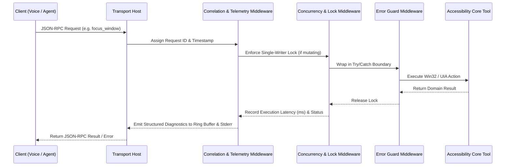

[ 🏠 Docs Home ](../README.md) › [ 📁 Accessibility MCP ](CONTEXT.md) › **002: Epistemology, Patterns & Observability**

---

# Architectural Patterns, Epistemology Framework, and Observability Design

**Document ID:** `docs/accessibility_mcp/002_epistemology_patterns_and_observability.md`  
**Status:** Working Design Blueprint / Architectural Foundation  
**Prior Document:** [`001_exploration_analysis_planning.md`](./001_exploration_analysis_planning.md)  
**Objective:** Deconstruct the Windows Accessibility Hub & Micro MCP Server from fundamental software architecture principles, uncover unknown unknowns, design a high-observability message pipeline, and establish modular work packages.

---

## 1. Epistemology: Uncovering the "Unknown Unknowns"

When building Windows desktop automation and accessibility infrastructure, projects rarely fail due to syntax or basic logic. They fail because of subtle, undocumented OS boundaries, session isolations, COM apartment rules, and race conditions.

To avoid premature solutions, we map the system across five risk domains:

```
┌─────────────────────────────────────────────────────────────────────────────┐
│                          Knowledge Discovery Matrix                         │
├──────────────────────────┬──────────────────────────┬───────────────────────┤
│ Domain                   │ Known Challenges         │ Hidden OS Traps       │
├──────────────────────────┼──────────────────────────┼───────────────────────┤
│ 1. OS Windowing & Win32  │ Focus stealing locks,    │ Ghost windows, DWM    │
│                          │ minimized window states  │ cloaking, hung UI     │
│                          │                          │ message pumps         │
├──────────────────────────┼──────────────────────────┼───────────────────────┤
│ 2. UI Automation (UIA)   │ Slow recursive trees,    │ Cyclic graphs, UWP    │
│                          │ high COM latency         │ XAML virtualization,  │
│                          │                          │ disconnected proxies  │
├──────────────────────────┼──────────────────────────┼───────────────────────┤
│ 3. Concurrency & State   │ Simultaneous voice +     │ Global OS focus race, │
│                          │ agent commands           │ modifier key state    │
│                          │                          │ leaks                 │
├──────────────────────────┼──────────────────────────┼───────────────────────┤
│ 4. Observability & IPC   │ stdout console freezes   │ JSON-RPC pipe breaks, │
│                          │ (QuickEdit trap)         │ opaque error payloads │
├──────────────────────────┼──────────────────────────┼───────────────────────┤
│ 5. Multi-Monitor & DPI   │ Coordinate mismatches    │ Per-Monitor v2 DPI    │
│                          │                          │ virtualization        │
└──────────────────────────┴──────────────────────────┴───────────────────────┘
```

### Deep Dive into Hidden OS Traps

#### A. The "Hung Application" Trap (`SendMessageTimeout`)
- **The Hazard**: If target Application A has a frozen main UI thread (e.g., waiting on a network socket or deadlocked), calling standard Win32 APIs like `GetWindowText` or certain UIA pattern queries directly against that HWND can block the calling thread indefinitely.
- **Architectural Safeguard**: The C# Core Engine must never execute bare blocking Win32 message calls without timeout boundaries (`SendMessageTimeout` with `SMTO_ABORTIFHUNG`, bounded UIA `CacheRequest` with cancellation tokens).

#### B. DWM "Cloaked" Windows & Virtual Desktops
- **The Hazard**: Modern Windows applications (UWP/WinUI, Settings, Calculator, Edge) remain in memory even when closed or on another virtual desktop. `EnumWindows` returns their HWNDs, but their UI is "cloaked" by Desktop Window Manager (DWM). If an automated switcher tries to focus a cloaked window, the OS ignores it or produces a blank focus transition.
- **Architectural Safeguard**: Window enumeration must explicitly query `DwmGetWindowAttribute(hwnd, DWMWA_CLOAKED)` and filter out cloaked/suspended application frames.

#### C. Cyclic References & Tree Explosion in UIA Snapshots
- **The Hazard**: UI Automation elements form complex bi-directional graphs. Serializing an entire window's UIA tree naively to JSON causes:
  1. Exponential cross-process COM traversal latency (seconds to minutes).
  2. Circular reference serialisation crashes.
  3. Huge multi-megabyte JSON payloads that overwhelm LLM token limits and client memory.
- **Architectural Safeguard**: Snapshot queries must enforce **bounded depth** (e.g., `depth=2`), **bounding box viewport pruning** (ignoring off-screen virtualized nodes), and **pre-filtered CacheRequests** requesting only critical attributes (`Name`, `ControlType`, `AutomationId`, `BoundingRectangle`).

---

## 2. Comparative Architecture: Lessons from Proven Systems

We evaluate how similar, mature industrial systems solved these exact problems:

```
┌─────────────────────────────────────────────────────────────────────────────┐
│                       Comparative Architecture Analysis                     │
├──────────────────────┬─────────────────────────────┬────────────────────────┤
│ System               │ Architectural Strategy      │ Lesson to Extract      │
├──────────────────────┼─────────────────────────────┼────────────────────────┤
│ Language Server      │ JSON-RPC over stdio/pipes;  │ Decouple transport     │
│ Protocol (LSP)       │ Middleware request pipeline;│ from language logic;   │
│                      │ Cancellation tokens.        │ typed diagnostics.     │
├──────────────────────┼─────────────────────────────┼────────────────────────┤
│ Chromium / DevTools  │ Flat node-id indexing;      │ Return flat node maps  │
│ Protocol (CDP)       │ Depth-limited snapshotting; │ with ID references     │
│                      │ Event-driven notifications. │ instead of deep trees. │
├──────────────────────┼─────────────────────────────┼────────────────────────┤
│ NVDA Screen Reader   │ Dedicated MTA COM thread;   │ Strict isolation from  │
│                      │ In-memory caching; C++      │ speech thread; event   │
│                      │ event debouncing.           │ rate-limiting.         │
├──────────────────────┼─────────────────────────────┼────────────────────────┤
│ Playwright / WinApp  │ Atomic selectors; Polling   │ Never assume instant   │
│ Driver               │ retry assertion loops;      │ state transitions;     │
│                      │ Strict element validation.  │ verify after action.   │
└──────────────────────┴─────────────────────────────┴────────────────────────┘
```

---

## 3. Core Software Design Patterns for the Hub

To make the system modular, maintainable, and extensible, we apply four structural design patterns:

```
┌─────────────────────────────────────────────────────────────────────────────┐
│                           Core Design Patterns                              │
├────────────────────────────┬────────────────────────────────────────────────┤
│ Pattern                    │ Role in Accessibility Hub                      │
├────────────────────────────┼────────────────────────────────────────────────┤
│ 1. Pipeline / Middleware   │ Intercepts every inbound request for logging,  │
│    (Chain of Responsibility) correlation tracing, timing, and error safety. │
├────────────────────────────┼────────────────────────────────────────────────┤
│ 2. Command-Query           │ Read queries (e.g. tree snapshot) run in       │
│    Separation (CQRS)       │ parallel MTA threads; write commands (focus,   │
│                            │ key injection) run through a serialized queue. │
├────────────────────────────┼────────────────────────────────────────────────┤
│ 3. Single-Writer Queue     │ Guarantees that multiple simultaneous actions  │
│    (Actor / Channel Model) │ (e.g. voice command + agent click) never race  │
│                            │ to steal OS focus at the same microsecond.     │
├────────────────────────────┼────────────────────────────────────────────────┤
│ 4. Flight Recorder         │ In-memory circular buffer storing the last     │
│    (Ring Buffer Diagnostics) 200 transactions for instant diagnostic dumps.  │
└────────────────────────────┴────────────────────────────────────────────────┘
```

### Pattern 1: Request/Response Middleware Pipeline

Every incoming JSON-RPC request flows through a composable pipeline before reaching a tool handler:



### Pattern 2: CQRS & Concurrency Partitioning

- **Read Operations (Queries)**: `list_windows`, `get_focused_window`, `inspect_element`, `find_elements`.
  - Stateless, non-destructive.
  - Can execute concurrently across .NET ThreadPool threads with independent COM `CacheRequest` allocations.
- **Write Operations (Commands)**: `focus_window`, `send_input`, `cycle_tabs`, `invoke_pattern`.
  - Mutates OS desktop focus and active input state.
  - Funneled through an in-memory asynchronous channel (`System.Threading.Channels.Channel<T>`) to guarantee strict sequential execution and eliminate focus-stealing race conditions.

---

## 4. High-Observability & Diagnostic Architecture

You requested high observability: the ability to see everything entering and exiting the server with complete transparency.

```
┌─────────────────────────────────────────────────────────────────────────────┐
│                          Observability Architecture                         │
│                                                                             │
│  ┌───────────────────────────────────────────────────────────────────────┐  │
│  │ 1. Telemetry Envelope (Standardized JSON Transaction Record)          │  │
│  │    • Request ID (UUID) & Correlation ID                               │  │
│  │    • Method Name & Input Parameters                                   │  │
│  │    • Execution Latency (e.g., 14.2ms)                                 │  │
│  │    • OS API Tiers Attempted (Tier 1 -> Tier 2 -> Tier 3)              │  │
│  │    • Win32 LastError Code (if any)                                    │  │
│  │    • Final Result Status (SUCCESS / AMBIGUOUS / UIPI_BLOCKED / ERROR) │  │
│  └───────────────────────────────────┬───────────────────────────────────┘  │
│                                      │                                      │
│        ┌─────────────────────────────┴─────────────────────────────┐        │
│        ▼                                                           ▼        │
│  ┌───────────────────────────────┐           ┌───────────────────────────┐  │
│  │ In-Memory Ring Buffer         │           │ Stderr Structured Stream  │  │
│  │ (Flight Recorder: Last 200    │           │ (Real-time NDJSON logs,   │  │
│  │ transactions accessible via   │           │ strictly separated from   │  │
│  │ `get_diagnostics` tool)       │           │ stdout JSON-RPC frames)   │  │
│  └───────────────────────────────┘           └───────────────────────────┘  │
└─────────────────────────────────────────────────────────────────────────────┘
```

### Dedicated Observability Tools
The server exposes two built-in administrative tools:
1. `get_server_diagnostics`: Returns server uptime, memory usage, active COM apartment state, and the recent flight recorder log.
2. `get_last_action_trace`: Returns the step-by-step Win32 escalation trace for the most recent command (e.g., showing exact millisecond timings for `SetForegroundWindow`, `AltKeyBypass`, and `verify_focus` polling).

---

## 5. Modular Work Packages (Planning Breakdown)

To avoid an overwhelming monolithic effort, we partition the research and specification into self-contained work packages:

```
┌─────────────────────────────────────────────────────────────────────────────┐
│                       Modular Work Package Structure                        │
├───────────────┬───────────────────────────────┬─────────────────────────────┤
│ Package ID    │ Focus Area                    │ Core Deliverables           │
├───────────────┼───────────────────────────────┼─────────────────────────────┤
│ **WP-01**     │ Protocol & Host Plumbing      │ JSON-RPC 2.0 router,        │
│               │                               │ stdio frame parser,         │
│               │                               │ Middleware pipeline,        │
│               │                               │ Flight recorder buffer.     │
├───────────────┼───────────────────────────────┼─────────────────────────────┤
│ **WP-02**     │ Win32 Window Engine           │ `WindowManagementCore`,     │
│               │                               │ Cloaked/DWM filtering,      │
│               │                               │ 3-tier focus escalation,    │
│               │                               │ 10ms micro-poll verifier.   │
├───────────────┼───────────────────────────────┼─────────────────────────────┤
│ **WP-03**     │ FlaUI / UIA3 Engine           │ COM MTA lifecycle manager,  │
│               │                               │ Bounded tree serializer,    │
│               │                               │ CacheRequest optimizer.     │
├───────────────┼───────────────────────────────┼─────────────────────────────┤
│ **WP-04**     │ Security & UIPI Validation    │ Manifest definitions,       │
│               │                               │ UIPI error detection,       │
│               │                               │ Fallback strategies.        │
├───────────────┼───────────────────────────────┼─────────────────────────────┤
│ **WP-05**     │ Client Bridges                │ Python Caster client,       │
│               │                               │ LLM Agent tool schemas.     │
└───────────────┴───────────────────────────────┴─────────────────────────────┘
```

---

## 6. Summary of Architectural Decisions (So Far)

1. **Pure C# Separation**: Core domain logic lives in a standalone library (`AccessibilityCore`), decoupled from MCP/JSON-RPC protocols.
2. **Channel-Based Command Queue**: Concurrency model uses parallel readers (MTA ThreadPool) and a single-writer channel for OS focus/input mutations.
3. **Strict Stream Hygiene**: `stdout` is exclusively reserved for JSON-RPC framing; `stderr` and an internal ring buffer handle telemetry.
4. **Resilient Window Traversal**: Filtering rules incorporate DWM cloaking and `SendMessageTimeout` guards to prevent hung UI freezes.
5. **Observability First**: Every transaction produces a structured telemetry envelope with step-level escalation traces.
