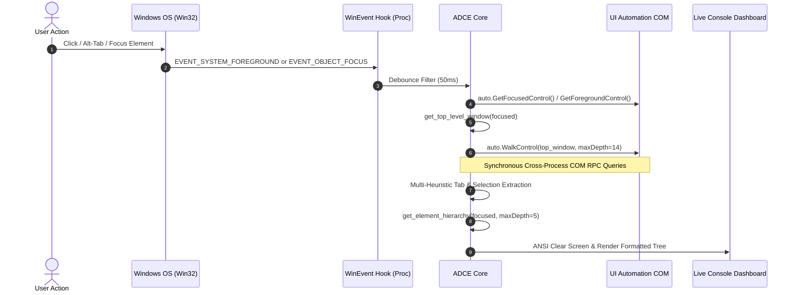
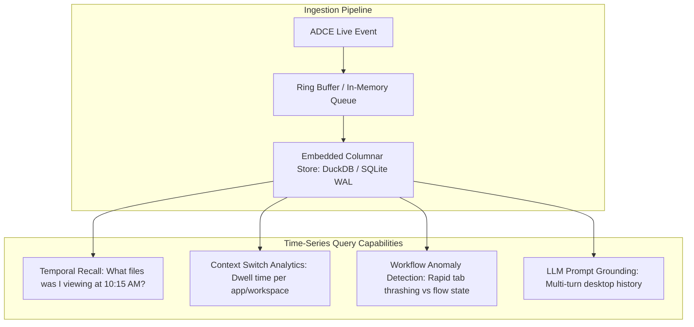

[ 🏠 Docs Home ](../README.md) › [ 📁 Accessibility MCP ](CONTEXT.md) › **009: Live Telemetry, Observability & Tab Diagnostics**

---

# Live Telemetry, Observability & Multi-Window Tab Diagnostics (009)

This document provides a comprehensive educational breakdown of the **Active Desktop Context Engine (ADCE)** live runtime mechanics, diagnoses the real-world observations captured during live testing (including the **"42-Tab Multi-App Bleed"**, **"Multiple Active Tabs"**, and **"QuickEdit vs COM Latency"** phenomena), and establishes the architectural blueprints for **Observability & Rolling Log Streams**, **Time-Series Desktop Telemetry**, and **Hybrid Ingestion Bridges**.

---

## 1. Educational Walkthrough: How the Live Context Engine Works

To understand why specific edge cases occur in practice, here is the exact runtime lifecycle of `scripts/context_poc.py` when an event occurs on the Windows desktop:



### Step-by-Step Processing Pipeline:
1. **OS Event Interception:** Win32 `SetWinEventHook` registers `EVENT_SYSTEM_FOREGROUND` (app/window switches) and `EVENT_OBJECT_FOCUS` (micro-focus transitions between text inputs, buttons, and list items).
2. **Debounce Shield:** Discards event storms occurring within $50\text{ms}$ to prevent redundant thrashing during rapid window animations.
3. **Anchor Resolution:** Calls `GetFocusedControl()`, climbing the parent chain via `get_top_level_window()` to find the root application container.
4. **Deep Subtree Traversal:** Executes `auto.WalkControl(top_window, maxDepth=14)` to discover all `TabItemControl`s, `ListItemControl`s with "tab" automation IDs, and sidebar extensions.
5. **Multi-Heuristic Selection Extraction:** Checks `SelectionItemPattern.IsSelected`, MSAA `LegacyIAccessible` State (`0x00000004`), `HasKeyboardFocus`, and fallback window title string containment.
6. **Live Terminal Redraw:** Clears the console with ANSI escape codes (`\033[2J\033[H`) and paints the colorized 3-tier view (Tabs, Hierarchy Tree, Focused Element Details).

---

## 2. Dissecting Real-World Test Observations

> **Reference:** Live Capture Snapshot (2026-08-22 12:16:26)

During live testing, the monitor produced a distinct state snapshot featuring **42 open tabs**, **three simultaneously active tabs**, and a focused button named `"Stop recording"`. Below is the technical post-mortem explaining why each behavior occurred:

### Diagnostic Matrix of Observed Behaviors

| Observed Phenomenon | Technical Root Cause | Architectural Mechanism |
| :--- | :--- | :--- |
| **42 Tabs Across Disparate Applications in a Single List** | **Container Scope Bleed:** `top_window` climbed up to the global desktop/shell container rather than anchoring to a single distinct top-level `HWND`. | When the focused element was an overlay button (`"Stop recording"`), climbing `GetParentControl()` bypassed application boundaries and reached the root Desktop window or `explorer.exe` shell. `WalkControl` then crawled *all* active windows and shell containers on screen (Waterfox + File Explorer instances). |
| **Multiple Active Tabs (`Tab 27`, `Tab 40`, `Tab 42`)** | **Multi-Tabstrip State + Heuristic Fallback Artifacts:** Active selection from Waterfox, genuine File Explorer directory, plus loose heuristic match. | • **`Tab 27`**: The legitimate active tab in **Waterfox** (viewing GitHub documentation).<br>• **`Tab 42` (`numbers_rules`)**: The legitimate active directory open in **File Explorer**.<br>• **`Tab 40` (`Kuvat`)**: A shell navigation/list item matched by loose heuristics (`"tab" in auto_id`) and marked active by fallback/selection state, rather than a tab opened by the user. |
| **Spurious Shell Items in Tab List (`Kuvat`, `Kartta`)** | **Overly Broad Tab Identification Heuristics:** `context_poc.py` matched any `ListItemControl`/`CustomControl` containing `"tab"` in `AutomationId`. | The user only had the `numbers_rules` folder open. Items like `Kuvat` (Pictures) and `Kartta` (Maps) were not user tabs; they were matched from Windows Explorer shell navigation panes (e.g. pinned library folders) or background OS components due to broad heuristic filters. |
| **`undefined 1`, `undefined 2`, `undefined 3` (Tabs 28–30)** | **Chromium / Gecko Web Panel Proxies:** Anonymous sidebar containers. | Modern browsers create placeholder `TabItemControl` accessibility proxies for sidebar utilities (e.g. extension docks, sidebar panels) that lack a descriptive accessibility `Name` attribute until explicitly focused. |
| **Antigravity / VS Code Tabs Not Enumerated in Tab List** | **Process Boundary Isolation + Electron/Monaco UIA Virtualization:** Antigravity was in a separate top-level window process (`Antigravity IDE.exe`) and utilizes Chromium on-demand accessibility trees. | 1. In that capture, `top_window` scoped across Waterfox and Explorer, bypassing the separate Antigravity HWND.<br>2. When Antigravity *is* focused, `auto.GetFocusedControl()` captures the inner `Chrome_RenderWidgetHostHWND` (code editor), but top-down `WalkControl` from `top_window` fails to discover editor tabs because Chromium lazily initializes ARIA `role="tab"` trees and the DOM depth from root `Chrome_WidgetWin_1` down to editor tabs exceeds default traversal limits. |

---

## 3. Performance & Latency: QuickEdit vs. Deep COM RPC

The user noted that switching between Waterfox and Antigravity IDE sometimes exhibited a perceptible delay, and unfreezing occurred upon `Ctrl+C`. Two distinct phenomena explain this:

```
                                  ┌───────────────────────────────────┐
                                  │   Perceived Terminal Freezes      │
                                  └─────────────────┬─────────────────┘
                                                    │
                   ┌────────────────────────────────┴────────────────────────────────┐
                   ▼                                                                 ▼
      [Windows Console QuickEdit Mode]                              [Deep Synchronous COM RPC]
      • Caused by clicking in console window.                       • Caused by auto.WalkControl(maxDepth=14).
      • Kernel driver blocks stdout write buffer.                   • Traverses 1,000+ elements across process boundaries.
      • OS-level pause; Python thread is paused.                    • Consumes 200ms–1500ms of synchronous CPU time.
      • Unfreezes when pressing Enter / Esc / Ctrl+C.               • Stalls Win32 GetMessage pump on main thread.
```

### 1. Console QuickEdit Mode (Confirmed Root Cause of Hard Freeze)
* **What it is:** When a user clicks anywhere on a Windows Command Prompt / PowerShell terminal, Windows halts output rendering to allow text selection.
* **The Symptom:** The script appears 100% frozen. `Ctrl+C` cancels the selection mode and allows the buffer to drain, giving the illusion that `Ctrl+C` "unfroze" the engine.
* **Solution:** Set `ENABLE_QUICK_EDIT_MODE = False` via `ctypes.windll.kernel32.SetConsoleMode`.

### 2. Deep Synchronous COM Traversal (Root Cause of Latency Spikes)
* **What it is:** `auto.WalkControl(top_window, maxDepth=14)` executes cross-process COM Remote Procedure Calls (RPC) across the Win32 boundary for *every single node* in the UI subtree.
* **The Cost:** When `top_window` accidentally resolves to the root desktop or a complex web browser, traversing 1,500 UI nodes takes **$250\text{ms} - 1,200\text{ms}$**. Because this occurs synchronously inside the event handler, the message loop thread cannot process subsequent OS events until the walk completes.
* **Solution:** Offload all heavy UI walks to an asynchronous worker queue on a dedicated Multi-Threaded Apartment (MTA) thread pool, returning immediately from the WinEvent callback.

---

## 4. Observability & Telemetry Architecture

To understand traversal costs, tree depth, and timing in real time, the engine requires high-fidelity telemetry.

```
┌────────────────────────────────────────┐       ┌────────────────────────────────────────┐
│  WINDOW A: Live Context Dashboard      │       │  WINDOW B: Rolling Telemetry & Logs    │
│  (Clean, Bounded, Human-Readable TUI)  │       │  (High-Velocity Trace Stream / JSONL)  │
├────────────────────────────────────────┤       ├────────────────────────────────────────┤
│ • Macro Workspace: Desktop 1 (Job)     │       │ [12:16:26.102] [HOOK] FOCUS_CHANGED    │
│ • Active App: Waterfox (PID: 1968)     │       │ [12:16:26.105] [HWND] 0x002A0B42       │
│ • Active Tab: [Waterfox] Portfolio     │       │ [12:16:26.110] [WALK] Depth: 9, Nodes: │
│ • Secondary Tabs: 41 open (Condensed)  │       │                342, Latency: 48.2ms    │
│ • Focused Node: [Button] Stop Record   │       │ [12:16:26.158] [CACHE] Hit: False      │
│ • Tree Depth: 4 levels                 │       │ [12:16:26.160] [RENDER] Paint: 1.4ms   │
└────────────────────────────────────────┘       └────────────────────────────────────────┘
```

### Core Telemetry Metrics to Measure & Stream:

```json
{
  "timestamp": "2026-08-22T12:16:26.158Z",
  "event_type": "FOCUS_CHANGED",
  "thread_id": 14208,
  "timing_ms": {
    "hwnd_resolution": 0.42,
    "uia_traversal": 48.21,
    "hierarchy_walk": 2.15,
    "total_pipeline": 51.78
  },
  "traversal_stats": {
    "top_hwnd": "0x002A0B42",
    "top_hwnd_class": "MozillaWindowClass",
    "process_name": "waterfox.exe",
    "pid": 1968,
    "nodes_scanned": 342,
    "max_depth_reached": 9,
    "tab_containers_found": 2,
    "total_tabs_discovered": 42
  },
  "cache_metrics": {
    "cache_hit": false,
    "invalidation_reason": "APP_SWITCH"
  }
}
```

### Dual-Channel Output Architecture:
1. **Interactive Dashboard (Window A):** Formats output cleanly with bounded vertical space (e.g. max 10 visible tabs with `+32 more...` pagination), preventing off-screen scrolling.
2. **Dedicated Rolling Log Stream (Window B):** Streams structured JSONL / human debug traces via a Named Pipe or secondary console window, allowing developers to inspect RPC durations and node counts without cluttering the primary UI.

---

## 5. Forward-Looking Exploration: Time-Series Desktop Telemetry (Future Roadmap)

> [!NOTE]
> **Implementation Scope Clarification:** As agreed, database persistence and time-series pipelines (e.g. DuckDB / SQLite WAL) are documented here purely for architectural reference and forward roadmap planning. The immediate milestone focuses 100% on **low-overhead structured console logging, traversal timing telemetry, and real-time observability**.

The user proposed: *"Could a time-series database quickly take this info in, store it, and let us do analysis on how things change over time?"*

### The Opportunity: Semantic Desktop Time-Series
In an AI-augmented OS environment, capturing timestamped desktop snapshots creates a **Temporal Semantic Context Graph**.



### Why Embedded Columnar Databases Excel Here:
* **Zero Infrastructure Overhead:** Embedded stores like **DuckDB** or **SQLite in WAL Mode** require no standalone server daemons, run directly within the Python process, and write thousands of events per second with $<1\text{ms}$ write latency.
* **Instant Temporal Queries:** An agent can query:
  ```sql
  SELECT timestamp, active_app, active_tab_name, focused_element_name
  FROM desktop_telemetry_events
  WHERE timestamp >= NOW() - INTERVAL 15 MINUTE
  ORDER BY timestamp ASC;
  ```
* **State Diffing:** Enables generating synthetic changelogs for LLM agents:
  > *"User switched from `waterfox.exe` (Tab: 'Nokia Careers') to `code.exe` (File: 'context_poc.py') and focused Line 142."*

---

## 6. UIA vs. Direct Process Bridges: Strategic Summary

| Criteria | Universal UIA Fallback | WebExtensions Native Messaging | VS Code / Antigravity API Bridge |
| :--- | :--- | :--- | :--- |
| **Applicability** | Universal (All Win32, WinUI, WPF, Chromium, Gecko) | Firefox, Waterfox, Chrome, Edge, Brave | VS Code, Antigravity IDE, Cursor, VSCodium |
| **Query Latency** | $20\text{ms} - 500\text{ms}$ (COM RPC dependent) | **$<0.1\text{ms}$ (Instant JSON push)** | **$<0.1\text{ms}$ (Instant JSON push)** |
| **Hidden / Minimized Tabs** | ❌ Unmounted when collapsed (`F1`) | ✅ Full knowledge of all 40+ tabs | ✅ Full knowledge of all editor groups |
| **Rich Metadata** | Name, BoundingBox only | Full URL, favicon, container ID, audio status | Full file URI, git status, cursor line/col |
| **Installation Friction** | Zero (Built into Windows OS) | Requires 1 browser extension | Requires 1 editor extension |
| **Role in Architecture** | **Universal Fallback Observer** | **Tier 1 Browser Ingestion Channel** | **Tier 1 Code Editor Ingestion Channel** |

### Architectural Verdict:
Relying on UIA for initial rapid prototyping provides universal coverage without requiring extensions. However, for a production-grade context engine, pairing universal UIA with **direct lightweight JSON bridges** (Browser Native Messaging + VS Code Extension Host) eliminates the traversal overhead, guarantees 100% accurate tab detection even when sidebars are collapsed (`F1`), and reduces CPU and latency to absolute zero.

---

## 7. Next Implementation Milestones

1. **Top HWND Scoping Fix:** Anchor `extract_window_tabs()` strictly to `GetForegroundWindow()` to prevent cross-app container bleed.
2. **Tabstrip Grouping:** Categorize tabs by parent container (`[Browser Main]`, `[Sidebar Extension]`, `[File Explorer]`).
3. **Telemetry & Timing Output:** Add execution timers (`elapsed_ms`, `nodes_scanned`) to the monitor display.
4. **Console QuickEdit Disabling:** Programmatically disable QuickEdit mode on startup to prevent click-to-pause locks.
5. **Decoupled MTA Worker:** Move `WalkControl` execution to a background worker thread.
