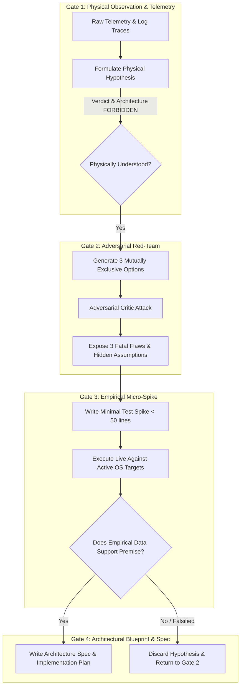

[ 🏠 Docs Home ](../README.md) › [ 📁 Accessibility MCP ](CONTEXT.md) › **015: Epistemic Recalibration & Adversarial Architecture Review**

---

# Epistemic Recalibration & Adversarial Architecture Review (015)

> **Document Status:** Active / Architectural Circuit Breaker & Epistemic Protocol  
> **Target System:** Active Desktop Context Engine (ADCE) & Engineering Gating System  
> **Related Documents:** [008: Real-World Observations](008_real_world_observations_and_caching_architecture.md) | [010: Traversal Telemetry](010_telemetry_benchmarks_and_live_findings.md) | [011: FlaUI Evaluation](011_flaui_evaluation_and_dual_plane_architecture.md) | [013: Empirical Post-Mortem](013_v23_empirical_postmortem_and_event_diagnostics.md) | [014: C# Daemon Handover](014_csharp_daemon_handover_and_skill_spec.md)

---

## 1. The Epistemic Circuit Breaker: "Wait, Hold On a Second"

> [!WARNING]
> **Architectural Freeze & Recalibration:**  
> Between documents `010` and `014`, our exploratory engineering experienced a classic LLM failure mode: **premature convergence and solution bias (jumping the gun)**. Upon observing severe DOM traversal latencies in Python UIA (crawling 6,800 browser nodes over COM), we immediately rushed into prescribing an elaborate, full-scale compiled C# (.NET 10 / FlaUI 5) daemon architecture and skill handover specification (`014`) before validating our core physical assumptions.
>
> Document `014` is hereby **paused and held** as an exploratory blueprint rather than an approved production directive. This document (`015`) establishes an **epistemic circuit breaker**, performs an adversarial red-team audit of our previous assumptions, compares three mutually exclusive architectural paths, and codifies a permanent 4-gate verification workflow to prevent premature solution locking.

```
┌────────────────────────────────────────────────────────────────────────────────────────┐
│                              THE "JUMPING THE GUN" TRAP                                │
├────────────────────────────────┬───────────────────────────────────────────────────────┤
│ **Observed Telemetry (010)**   │ 6,800 nodes in browser tree took ~5,800 ms to crawl.   │
├────────────────────────────────┼───────────────────────────────────────────────────────┤
│ **Premature Leap (011 → 014)** │ "Python COM is slow; let's rewrite the core in C#."   │
├────────────────────────────────┼───────────────────────────────────────────────────────┤
│ **Unchecked Assumption**       │ Assumed FlaUI 5 / .NET 10 bypasses browser DOM lag.   │
├────────────────────────────────┼───────────────────────────────────────────────────────┤
│ **Missing Step**               │ Zero empirical C# micro-spikes tested against live OS.│
├────────────────────────────────┼───────────────────────────────────────────────────────┤
│ **Corrected Stance (015)**     │ Stop. Red-team assumptions. Falsify before building.   │
└────────────────────────────────┴───────────────────────────────────────────────────────┘
```

---

## 2. Post-Mortem: Why High-Reasoning Models Jump the Gun

High-reasoning AI models have an innate teleological bias toward closure, synthesis, and code generation. When a technical bottleneck is identified:
1. **The Sycophancy of Action:** The model rushes to provide an actionable, end-to-end "solution" (e.g. creating full architecture diagrams, data schemas, and handover specifications) to feel helpful and decisive.
2. **Confusing Runtime Overhead with Underlying OS Physics:** We conflated Python's `comtypes` / GIL overhead with the fundamental physics of Windows UI Automation (`UIAutomationCore.dll`).
3. **Skipping the Falsification Spike:** We designed an entire multi-tier C# daemon architecture without executing a single 30-line compiled C# test against an active 50-tab Waterfox window.

---

## 3. Adversarial Red-Team of the 014 C# FlaUI Proposal

Applying the *"Cynical Principal Systems Architect"* red-team lens to the proposed C# .NET 10 daemon:

```
┌────────────────────────────────────────────────────────────────────────────────────────┐
│                         ADVERSARIAL CRITIQUE: C# FLAUI DAEMON                          │
├───────────────────────┬────────────────────────────────────────────────────────────────┤
│ **Critique Vector**   │ **Fatal Flaw / Unexamined Operational Reality**                │
├───────────────────────┼────────────────────────────────────────────────────────────────┤
│ **1. UIA Physics**    │ FlaUI is not magic; it wraps `UIAutomationCore.dll` COM. If   │
│                       │ Chromium or Gecko stalls during cross-process LPC for iframe   │
│                       │ nodes, compiled C# will block on the exact same OS thread.     │
├───────────────────────┼────────────────────────────────────────────────────────────────┤
│ **2. Toolchain Tax**  │ Introducing .NET 10 LTS into a pure Python Caster repository   │
│                       │ forces dual-language build chains, C# SDK installations, and   │
│                       │ cross-language packaging headaches for end users.              │
├───────────────────────┼────────────────────────────────────────────────────────────────┤
│ **3. IPC Brittleness**│ An out-of-process daemon requires IPC (Named Pipes/JSON-RPC).  │
│                       │ This introduces pipe reconnection logic, process watchdogging, │
│                       │ and marshaling overhead that may offset UIA speed gains.       │
└───────────────────────┴────────────────────────────────────────────────────────────────┘
```

### Specific Technical Vulnerabilities in 014:
1. **The `CacheRequest` Fallacy in WebExtensions:** UIA 3 `CacheRequest` works wonders on static Win32/WPF control trees. However, WebExtension sidebar extensions (e.g., Tree Style Tab, Sidebery) render inside nested browser iframes. If the browser's accessibility provider does not materialize off-screen iframe children during a top-level cache request, C# will still be forced to perform recursive, on-demand COM lookups.
2. **Process Lifecycle Complexity:** An out-of-process C# daemon introduces orphaned process risks, background crash handling, and complex multi-process coordination between Caster (Python 3.10), the MCP client, and the .NET daemon.

---

## 4. Mutually Exclusive Architectural Options & Fatal Flaws

To prevent premature lock-in, we analyze three distinct architectural paths. No verdict is declared; each option is evaluated with its fatal flaws and hidden operational assumptions:

```
┌────────────────────────────────────────────────────────────────────────────────────────────────────────────────┐
│                                    3 MUTUALLY EXCLUSIVE ARCHITECTURAL OPTIONS                                  │
├─────────────────────────┬───────────────────────────────────┬──────────────────────────────────────────────────┤
│ Option                  │ 3 Fatal Flaws                     │ Hidden Operational Assumptions                   │
├─────────────────────────┼───────────────────────────────────┼──────────────────────────────────────────────────┤
│ **Option A:**           │ 1. Zero coverage for non-browser  │ Assumes users are willing to install and keep    │
│ **Direct Extension /**  │    apps (VS Code, Explorer, CLI). │ active a custom browser companion extension in   │
│ **Native Messaging**    │ 2. Requires maintaining separate  │ all browser profiles and instances.              │
│ *(Bypass UIA for Web)*  │    extensions per browser engine. │                                                  │
│                         │ 3. Extension permission friction. │                                                  │
├─────────────────────────┼───────────────────────────────────┼──────────────────────────────────────────────────┤
│ **Option B:**           │ 1. FlaUI is still bound to OS UIA │ Assumes UIA 3 `CacheRequest` can prefetch nested │
│ **Standalone C# .NET**  │    `UIAutomationCore.dll` delays. │ WebExtension DOM iframe trees without triggering │
│ **FlaUI 5 Daemon**      │ 2. Introduces .NET build toolchain│ synchronous browser UI-thread stalls.            │
│ *(Out-of-Process UIA3)* │    and multi-runtime maintenance. │                                                  │
│                         │ 3. Complex IPC & lifecycle sync.  │                                                  │
├─────────────────────────┼───────────────────────────────────┼──────────────────────────────────────────────────┤
│ **Option C:**           │ 1. Cannot extract deep background │ Assumes high-level window envelope (HWND, Title, │
│ **Pruned In-Process**   │    or collapsed sidebar tabs.     │ Focus) provides 90% of AI context value, making  │
│ **Python Win32 / UIA**  │ 2. Susceptible to missing nested  │ deep tab extraction a dispensable luxury.        │
│ *(Zero Deep Traversal)* │    controls in Electron/WPF apps. │                                                  │
│                         │ 3. Still incurs Python COM locks. │                                                  │
└─────────────────────────┴───────────────────────────────────┴──────────────────────────────────────────────────┘
```

---

## 5. The 4-Gate Epistemic Gating Protocol

To prevent future premature architectural leaps, all future exploratory and systems development within the ADCE project must pass through four sequential gates:



### Gate Definitions:
1. **Gate 1: Physical Observation & Telemetry (No Solutionizing):**  
   Present only raw logs (`nodes_scanned`, `elapsed_ms`, error codes) and hypothesize on OS/COM mechanics. Architectural proposals are strictly prohibited in this phase.
2. **Gate 2: Adversarial Red-Teaming (Ban the Verdict):**  
   Force the generation of three mutually exclusive options. Submit all three to a cynical red-team prompt focused on maintainability, toolchain tax, and OS boundary fragility.
3. **Gate 3: Empirical Micro-Spike (Falsification First):**  
   Before any architecture spec is written, build the smallest possible script (<50 lines) to test the single most dangerous assumption. If the spike fails, the proposal is discarded immediately.
4. **Gate 4: Architectural Blueprint & Formal Specification:**  
   Only after the micro-spike empirically proves sub-millisecond execution or architectural viability may a formal design document (like `014`) be approved.

---

## 6. Proposed Workflow & Agent Rules Integration

We will formalize these epistemic constraints directly in the `.agents/` configuration:

### 1. Workflow Proposal: `.agents/workflows/adversarial-architecture-review.md`
A dedicated review workflow that can be run whenever a significant architecture pivot is proposed:
* **Step 1:** Ingest the candidate architecture proposal.
* **Step 2:** Act as a Cynical Principal Systems Architect trying to kill the project.
* **Step 3:** Evaluate against 4 axes: OS boundary fragility, developer/toolchain friction, runtime IPC overhead, and hidden assumptions.
* **Step 4:** Define the minimal micro-spike required to falsify the proposal.

### 2. Workspace Rule Addition (`.agents/AGENTS.md`)
Add an explicit constraint under General Guidelines:
> **Epistemic Discipline & Architectural Gating:**  
> Do not propose multi-file architectural rewrites or cross-runtime pivots based on theoretical advantages alone. Every major architectural recommendation must be preceded by a minimal empirical spike (<50 lines) validating the underlying OS physics and an adversarial red-team review identifying fatal flaws.

---

## 7. Next Empirical Action (Gate 3 Spike)

Before reopening discussion on C# vs Python vs Native Messaging:
* **Micro-Spike 1 (`spike_csharp_flaui_cache.cs`):** A standalone, compiled 40-line C# script using FlaUI 5 to measure raw latency when extracting 50+ tabs from a live Waterfox window with Tree Style Tab.
* **Micro-Spike 2 (`spike_win32_shallow_python.py`):** A 30-line Python script measuring pure top-level HWND + Bounding Box caching latency with zero recursive DOM traversal.

Only after comparing the raw output of these two spikes will any architecture be advanced to implementation.
