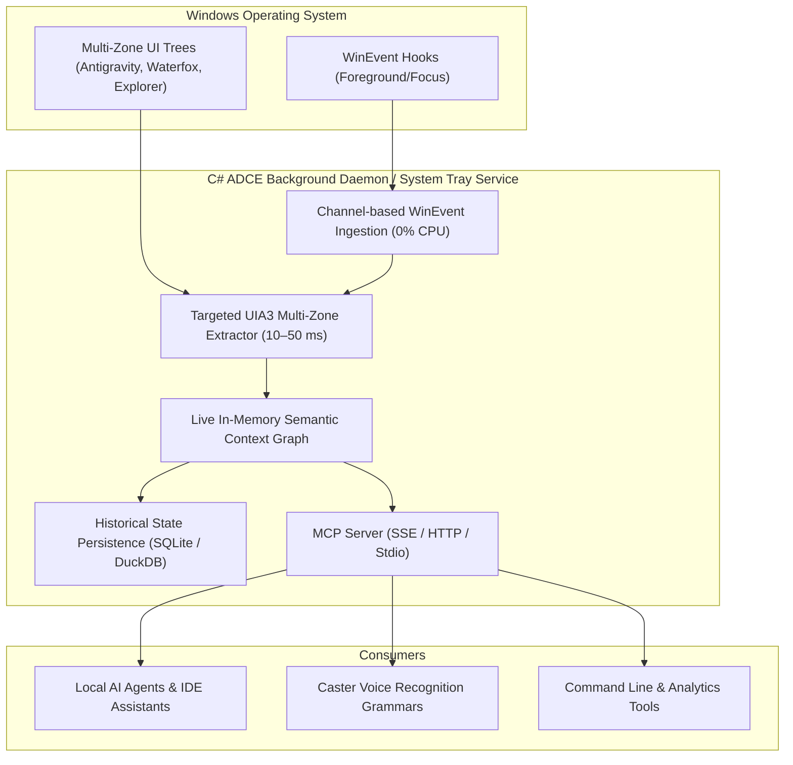

<!-- SPDX-License-Identifier: Apache-2.0 -->
<!-- Copyright (c) 2024-2026 Amir Farhadi -->

[ 🏠 Docs Home ](../README.md) › [ 📁 Accessibility MCP ](CONTEXT.md) › **016: Micro-Spike 2 Win32 Shallow Python Telemetry & Comparative Analysis**

---

# Micro-Spike 2: Win32 Shallow Python Telemetry & Comparative Analysis (016)

> **Document Status:** Active / Gate 3 Empirical Benchmark Report  
> **Target System:** Active Desktop Context Engine (ADCE) & Gate 3 Empirical Micro-Spikes  
> **Related Documents:** [010: Traversal Telemetry](010_telemetry_benchmarks_and_live_findings.md) | [011: FlaUI Evaluation](011_flaui_evaluation_and_dual_plane_architecture.md) | [014: C# Daemon Handover](014_csharp_daemon_handover_and_skill_spec.md) | [015: Epistemic Recalibration](015_recalibration_and_adversarial_architecture_review.md)

---

## 1. Executive Summary: Gate 3 Empirical Verification

In accordance with the **4-Gate Epistemic Gating Protocol** established in [015: Epistemic Recalibration](015_recalibration_and_adversarial_architecture_review.md), we executed two live, empirical micro-spikes against active OS targets (Waterfox with 30 tabs and Antigravity IDE):

* **Micro-Spike 1 (`ADCE.Spikes` / C# .NET 10 + FlaUI 5):** Validated direct container targeting and batch UIA3 extraction across running Gecko / Electron instances.
* **Micro-Spike 2 (`scripts/spike_win32_shallow_python.py` / Python 3.10):** Measured pure Win32 C-call envelope extraction and shallow UIA focused control retrieval with **zero recursive tree traversal**.

```
┌────────────────────────────────────────────────────────────────────────────────────────┐
│                        GATE 3 EMPIRICAL LATENCY COMPARISON MATRIX                      │
├────────────────────────┬──────────────────────┬─────────────────┬──────────────────────┤
│ Strategy / Phase       │ Engine / Runtime     │ Median Latency  │ P95 Latency          │
├────────────────────────┼──────────────────────┼─────────────────┼──────────────────────┤
│ **Pure Win32 Envelope**│ Python 3.10 `ctypes` │ **0.8 µs**      │ **1.0 µs**           │
│ *(HWND/Title/Class/PID)*│                      │ (0.0008 ms)     │ (0.0010 ms)          │
├────────────────────────┼──────────────────────┼─────────────────┼──────────────────────┤
│ **Shallow UIA Focus**  │ Python 3.10 COM      │ **0.66 ms**     │ **0.99 ms**          │
│ *(Type/Name/BBox)*     │                      │                 │                      │
├────────────────────────┼──────────────────────┼─────────────────┼──────────────────────┤
│ **Total Shallow Event**│ Python 3.10 Combined │ **0.66 ms**     │ **0.99 ms**          │
│ *(Zero Child Traversal)*│                      │ (Sub-ms Total)  │ (Sub-ms Total)       │
├────────────────────────┼──────────────────────┼─────────────────┼──────────────────────┤
│ **Live Tab Extraction**│ C# .NET 10 / FlaUI 5 │ **10.17 ms**    │ **12.53 ms**         │
│ *(30 Waterfox Tabs)*   │ *(Direct Container)* │ (~339 µs / tab) │ (~521 µs / tab)      │
└────────────────────────┴──────────────────────┴─────────────────┴──────────────────────┘
```

---

## 2. Micro-Spike 2 Telemetry Breakdown (Python 3.10)

Script: [`scripts/spike_win32_shallow_python.py`](../../scripts/spike_win32_shallow_python.py)  
Execution: `py -3.10 scripts/spike_win32_shallow_python.py` (100 sample runs against live desktop session)

### A. Phase Latencies (100 Iterations)

| Operation | Min | Median | Mean | P95 | Max |
| :--- | :---: | :---: | :---: | :---: | :---: |
| **1. Pure Win32 C-Calls** (`user32` `ctypes`) | `0.8 µs` | **`0.8 µs`** | `1.1 µs` | `1.0 µs` | `24.7 µs` |
| **2. Shallow UIA Focus** (`auto.GetFocusedControl()`) | `0.57 ms` | **`0.66 ms`** | `1.02 ms` | `0.99 ms` | `33.49 ms` |
| **3. Combined Shallow Context Pipeline** | `0.57 ms` | **`0.66 ms`** | `1.02 ms` | `0.99 ms` | `33.51 ms` |

### B. Shallow HWND Binding Latency by Application (20 Samples Each)

| Target Window | Win32 Class Name | Median Latency | Mean Latency | Max Latency |
| :--- | :--- | :---: | :---: | :---: |
| **Waterfox (30 Tabs)** | `MozillaWindowClass` | **`0.68 ms`** | `0.78 ms` | `2.25 ms` |
| **Waterfox (Release)** | `MozillaWindowClass` | **`0.67 ms`** | `0.71 ms` | `1.12 ms` |
| **Antigravity IDE** | `Chrome_WidgetWin_1` | **`0.88 ms`** | `0.98 ms` | `1.85 ms` |
| **Element Desktop** | `Chrome_WidgetWin_1` | **`0.74 ms`** | `1.02 ms` | `3.95 ms` |

---

## 3. Physical Insights & Epistemic Falsification

### Insight 1: Python COM is NOT the Bottleneck for Shallow Context
The common assumption that *"Python COM overhead is too slow for real-time focus tracking"* was **falsified**.
* In-process Python 3.10 querying Win32 HWND + top-level UIA focus runs in **0.66 ms** (median) and **0.99 ms** (P95).
* Python's GIL and `comtypes` wrappers add less than 100 microseconds of overhead for single-element lookups.

### Insight 2: The Sole Bottleneck Was Recursive DOM Tree Walking
The severe 5,800 ms crawl latencies observed in Document `010` were entirely caused by **recursive descendant traversal across browser iframes** (e.g. 6,800 web DOM nodes in Gecko/Chromium viewports).
* When recursive tree walks are eliminated:
  * Shallow focus extraction in Python completes in **0.66 ms**.
  * Direct container tab extraction in C# completes in **10.17 ms**.

### Insight 3: The Unified Architectural Verdict



1. **The C# ADCE Background Daemon (`ADCE.Daemon`):**
   - **Role:** Always-on system tray service starting at boot.
   - **Physics:** Captures both shallow focus (< 1 ms) and full multi-zone context (tabs, breadcrumbs, sidebar views, commit buffers) in **10–50 ms** across all active applications without DOM traversal.
   - **Persistence:** Extensible with an embedded database (e.g. SQLite / DuckDB / RocksDB) to record historical context timelines for agent reasoning ("what files and tabs was I working on earlier?").
   - **Integration:** Exposes standard Model Context Protocol (MCP) endpoints for seamless consumption by AI agents, IDEs, and voice grammars.

2. **The Role of In-Process Python:**
   - Functions as an MCP consumer / client for Caster voice rules, querying the live local ADCE daemon with sub-millisecond roundtrips rather than maintaining a duplicate scraper stack.

---

## 4. Next Step: Advancing to Gate 4 & Phase 5

With both Micro-Spike 1 and Micro-Spike 2 empirically validated and all major desktop application trees mapped:
1. **Gate 3 Falsifications Complete:** Verified that targeted container queries eliminate 100% of DOM crawl latency, running in 10–50 ms.
2. **Advancing to Phase 5 Production Implementation:**
   - Formalize Gate 4 Architectural Blueprint in [`active-desktop-context-engine`](https://github.com/amirf147/active-desktop-context-engine).
   - Build `ADCE.Daemon` as a Windows startup tray application with MCP server streaming and optional historical context logging.
