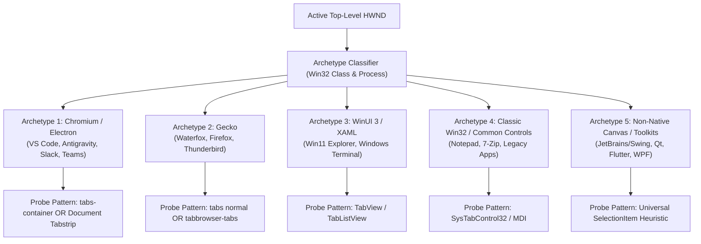

<!-- SPDX-License-Identifier: Apache-2.0 -->
<!-- Copyright (c) 2024-2026 Amir Farhadi -->

[ 🏠 Docs Home ](../README.md) › [ 📁 Accessibility MCP ](CONTEXT.md) › **018: Epistemic Gaps, Dynamic App Discovery & Engine Requirements**

---

# Epistemic Gaps, Dynamic App Discovery & Engine Requirements Specification (018)

> **Document Status:** Active / Epistemic Review & Product Requirements Specification  
> **Target System:** Active Desktop Context Engine (ADCE)  
> **Repository Boundary:** Final research handover document bridging `caster` and `active-desktop-context-engine`  
> **Related Documents:** [015: Epistemic Recalibration](015_recalibration_and_adversarial_architecture_review.md) | [016: Micro-Spike 2 Telemetry](016_micro_spike_2_win32_shallow_python_telemetry.md) | [017: UI Automation SSOT](017_ui_automation_tree_structures_and_target_zones_reference.md)

---

## 1. Epistemic Pause: Interrogating Our Knowledge Gaps

In accordance with our **4-Gate Epistemic Protocol**, before proceeding with full implementation of the C# `ADCE.Daemon`, we must apply a rigorous epistemic brake:

> [!WARNING]
> **The Hardcoded Selector Trap:**  
> In Document `017`, we successfully mapped specific container selectors for Antigravity IDE (`tabs-container`), Waterfox (`tabs normal`), and Windows 11 File Explorer (`TabView`).  
> **The Epistemic Risk:** If `ADCE.Daemon` relies strictly on hardcoded class names and automation IDs, the engine is brittle. It will break when applications update their UI frameworks, and it will be completely blind to 95% of other software (Notion, Slack, Obsidian, JetBrains IDEs, Visual Studio, LibreOffice, CAD, terminal multiplexers).

### Core Knowledge Gaps Identified:

```
┌────────────────────────────────────────────────────────────────────────────────────────┐
│                              IDENTIFIED KNOWLEDGE GAPS                                 │
├────────────────────┬──────────────────────────────────┬────────────────────────────────┤
│ Gap Category       │ Open Question / Uncertainty      │ Risk Severity & Impact         │
├────────────────────┼──────────────────────────────────┼────────────────────────────────┤
│ **1. Dynamic App** │ How does ADCE introspect and     │ **CRITICAL**                   │
│ **Discovery**      │ adapt to unseen apps without     │ Brittle hardcoding breaks on   │
│                    │ human configuration?             │ app updates / new software.    │
├────────────────────┼──────────────────────────────────┼────────────────────────────────┤
│ **2. Historical**  │ How to store millions of window  │ **HIGH**                       │
│ **Persistence**    │ & focus transitions without disk │ Unbounded growth, query lag    │
│                    │ bloat or locking MCP queries?    │ during real-time speech.       │
├────────────────────┼──────────────────────────────────┼────────────────────────────────┤
│ **3. Multi-Window**│ When an app has multiple windows │ **MEDIUM**                     │
│ **State Modeling** │ or tool palettes, how is active  │ Ambiguous context for AI       │
│                    │ workspace state reconciled?      │ reasoning models.              │
├────────────────────┼──────────────────────────────────┼────────────────────────────────┤
│ **4. 24/7 Daemon** │ How does memory footprint behave │ **MEDIUM**                     │
│ **Resiliency**     │ over days of continuous uptime   │ COM leaks / memory growth      │
│                    │ with sleeping/resuming laptops?  │ requiring manual restarts.     │
└────────────────────┴──────────────────────────────────┴────────────────────────────────┘
```

---

## 2. Desktop Framework Archetypes & Adaptive Discovery

Rather than hardcoding string selectors for every application in existence, ADCE must classify active windows into **5 Universal Desktop Archetypes**:



### The 4-Tier Self-Healing Extraction Pipeline:

1. **Tier 1: Fast Win32 Envelope (< 1 µs):**
   * Instantly query HWND, Process Name, Window Title, and Window Rect via direct Win32 C-calls.
2. **Tier 2: Universal Pattern Probing (1–3 ms):**
   * Query `GetFocusedControl()`. Probe for standard UIA patterns (`ValuePattern`, `TextPattern`, `SelectionItemPattern`) regardless of application class.
3. **Tier 3: Archetype Container Discovery (5–15 ms):**
   * If the window matches a known archetype, use heuristic role-based probing (e.g. search for any container whose children implement `SelectionItemPattern` and have tab-like bounding boxes) rather than strict string matching.
4. **Tier 4: Declarative App Definition Overrides (JSON):**
   * Maintain an extensible, user-editable `app_definitions.json` for complex edge cases (e.g. Tree Style Tab sidebar or custom multi-group IDEs) without requiring code recompilation.

---

## 3. Historical Persistence: Storage Architecture Tradeoffs

To enable temporal context (*"What did I edit 20 minutes ago?"*), ADCE requires an embedded time-series database.

| Database Engine | Pros | Cons | Verdict |
| :--- | :--- | :--- | :--- |
| **SQLite (WAL mode)** | Ultra-lightweight, zero external dependencies, ubiquitous C# bindings (`Microsoft.Data.Sqlite`), instant indexed time-range queries. | Row-oriented; requires table pruning policies. | **Recommended for Primary Storage** |
| **DuckDB** | Blazing columnar analytical queries over large history datasets; built-in Parquet export. | Slightly larger embedded binary footprint (~30MB). | **Strong Alternative for Long-Term Analytics** |
| **LiteDB (Embedded NoSQL)** | Pure C# BSON document store; direct object mapping. | Slower time-series range index scans compared to SQLite. | **Not Recommended** |

### Database Schema Blueprint (SQLite):
* **`window_sessions`**: `(session_id, hwnd, process_name, title, class_name, start_time, end_time, virtual_desktop_id)`
* **`focus_transitions`**: `(transition_id, session_id, timestamp, control_type, element_name, automation_id, value_snippet)`
* **`tab_snapshots`**: `(snapshot_id, session_id, timestamp, tab_count, active_tab_title, tab_items_json)`

---

## 4. ADCE Product Requirements Specification (PRS)

### A. Functional Requirements
* **FR-1 (Event-Driven Hooking):** Listen to `EVENT_SYSTEM_FOREGROUND` and `EVENT_OBJECT_FOCUS` via `SetWinEventHook` with zero CPU polling when idle.
* **FR-2 (Multi-Zone Extraction):** Extract top-level window metadata, active editor/browser tabs, file breadcrumbs, sidebar views, and focused input buffers.
* **FR-3 (DOM Pruning):** Automatically isolate and prune browser content viewports (`ControlType.Document`) to guarantee zero IPC stalls.
* **FR-4 (MCP Server Interface):** Expose JSON context snapshots and historical queries over Model Context Protocol via SSE, HTTP, and Stdio transports.
* **FR-5 (System Tray Lifecycle):** Run silently in the Windows system tray with start-at-login support, status indicators, and pause/resume controls.

### B. Performance SLAs (Non-Functional Requirements)
* **SLA-1 (Idle CPU):** `0.0%` sustained CPU usage while user is idle.
* **SLA-2 (Focus Transition Latency):** Context state updated and cached in memory within **`< 25 ms`** of OS focus change.
* **SLA-3 (MCP Query Response):** Pre-cached context returned to AI agents or voice grammars in **`< 1.0 ms`**.
* **SLA-4 (Memory Footprint):** Working set `< 45 MB` during continuous 24/7 background execution.

---

## 5. Official Repository Boundary & Handover

With research phases (Docs `001`–`018`) and Gate 3 empirical micro-spikes completed in Caster, the active engineering focus officially transfers to the dedicated standalone repository:

* 🚀 **Active Engineering Repository:** [`amirf147/active-desktop-context-engine`](https://github.com/amirf147/active-desktop-context-engine)
* **Caster Repository Role:** Serves as the upstream research archive and production consumer of the ADCE MCP server.
