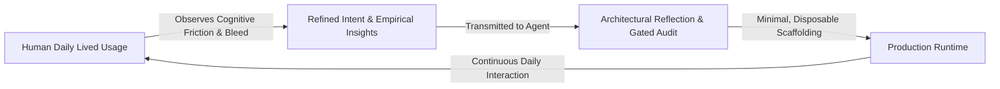

[ 🏠 Docs Home ](../README.md) › [ 📁 Antigravity ](README.md) › **001: Epistemic Detachment, Disposable Scaffolding, & Memory Mechanics**

---

# 001 — Epistemic Detachment, Disposable Scaffolding, & Memory Mechanics

**Document ID**: `AGY-DOC-001`  
**Status**: Living Exploratory Note & Architectural Baseline  
**Date**: September 2026  
**Context**: Antigravity Self-Observation, Context Window Economics, & Human-in-the-Loop Telemetry  

---

## 1. Core Ethos: Radical Detachment & Disposable Scaffolding

When designing agent workflows, prompt harnesses, and repository architectures, there is an insidious cognitive trap: **falling in love with our own productions**.

Developers often spend weeks building brittle scaffolding—elaborate regex wrappers, complex prompt harnesses, multi-layer heuristic memory schemes, and dense rulebooks. When the underlying model shifts or the platform evolves, developers defensively protect this obsolete scaffolding rather than adapting to reality.

### The Invariance Principle
1. **Scaffolding is Ephemeral; Intent is Permanent**: As synthesized by Daniel Miessler and demonstrated across AI development cycles, external harnesses are temporary bridges. As frontier models absorb higher reasoning, planning, and native tool-calling capabilities, bespoke scaffolding becomes technical debt.
2. **Immediate Discardability**: We must remain fundamentally willing to discard any script, rule, or architectural pattern the moment a cleaner, native, or empirically superior alternative emerges. No custom construct is sacred.
3. **Zero-Cost Deprecation**: If an Antigravity platform update or next-generation foundation model renders an internal Caster workaround obsolete, that workaround is torn out immediately without nostalgia or hesitation.

---

## 2. Human-Driven Experiential Testing vs. Synthetic Micro-Scripts

A common failure mode in autonomous coding agents is over-indexing on narrow, synthetic unit tests. While automated tests can verify syntax, type safety, and bounded logic, they are structurally blind to:
* **Cognitive Load & Ergonomic Friction**: How it actually feels to command and interact with the system during extended work.
* **Subtle Instruction Bleed**: Low-level probability shifts where the model begins favoring generic training priors over custom repository guidelines.
* **Attention Degradation**: Drift occurring across long multi-turn sessions that cannot be modeled in a one-off test runner.

**The Testing Contract:**
* Synthetic automated scripts (`scripts/check_absolute_paths.py`, linters) serve strictly as deterministic baseline guardrails.
* The true testing engine is the **human operator over real-world time**: using the voice computing and agentic tools continuously, identifying ergonomic mismatches and behavioral quirks, and feeding raw observational insights back into the loop.

---

## 3. Empirical Grounding: Auditing Antigravity's Internal Memory

A key question emerged regarding whether Antigravity experiences "memory rot" by silently authoring an evolving internal "brain" that reinforces calcified opinions over time. An empirical audit of the live Antigravity filesystem (`~/.gemini/antigravity-ide/`) and system prompts reveals the actual mechanics:

| Component | Popular / Web Assistant Hypothesis | Empirical Ground Truth (Local Installation Audit) | Reality Verdict |
| :--- | :--- | :--- | :--- |
| **Auto-Generated "Brain" Bloat** | The agent continuously summarizes sessions into an internal vector memory bank, which silently bloats subsequent system prompts. | While `<knowledge_items>` exists in the system prompt schema (`metadata.json` + `artifacts/`), live inspection of `~/.gemini/antigravity-ide/knowledge/` reveals **only `knowledge.lock` and 0 generated KIs**, despite 353 historical conversations in `conversations/` and `brain/`. | **Falsified.** Antigravity is not silently poisoning its own prompt prefix with accumulating background memories. |
| **"Knowledge Tab" Pruning** | Users must open Agent Manager (`Ctrl+E`) to prune an auto-generated Knowledge section. | `Ctrl+E` in the IDE is the standard file picker. Antigravity 2.0 provides sidebars for Projects, Scheduled Tasks, Skills, and Settings; **no "Knowledge pruning tab" exists**. | **Hallucination.** Blended from external tool interfaces (Claude Projects, Cursor, or ChatGPT memory settings). |
| **Root `MEMORY.md`** | Custom instructions require maintaining a root `MEMORY.md` kept under 200 lines. | Antigravity has **zero native support for `MEMORY.md`**. Antigravity discovers rules strictly from `GEMINI.md`, `AGENTS.md`, and `.agents/rules/*.md`. | **Hallucination.** Imported from third-party tools (MemGPT, Roo-Code/Cline). |
| **Multi-Session History Ingestion** | Prompt history retains the last ~20 conversation summaries via hardcoded FIFO queues. | In live prompts, Antigravity injects metadata for **exactly 1 recent conversation summary**, keeping context strictly bounded. | **Partially True, but strictly bounded.** Multi-session context injection is aggressively pruned. |
| **Instruction Slot Saturation** | When total instructions exceed 150–200, attention drift occurs and the agent ignores rules. | While the exact numerical threshold is arbitrary, the underlying phenomenon—**prior-versus-context tension** and **instruction bleed**—is physically real. | **Mechanically Accurate.** Documented in [`antigravity_editor_insights.md`](../features/antigravity_editor_insights.md). |

### Where True "Memory Rot" Actually Resides
If the engine's internal brain is not bloating, what causes an agent to become stubborn or drift?
1. **Workspace Documentation Rot**: When an agent reads unmaintained, superseded markdown tickets (such as early Wayfinder hypotheses regarding COM deadlocks vs. later empirical proofs of PowerShell QuickEdit freezes). This is why Caster mandates the strict **Truth Hierarchy** in [`repository-brain.md`](../context/repository-brain.md).
2. **Instruction Bleed & Default Bias**: When base platform instructions (e.g., default `file:///` links) collide with workspace rules (e.g., relative markdown links in `.agents/AGENTS.md`), the model's attention mechanism must resolve contradictory token probabilities.

---

## 4. Theory & Mechanics: 1M Context vs. Fast Orchestrator Loops

The intuition that **iterative, rapid back-and-forth orchestration supersedes monolithic brute-force models** is rooted in transformer mechanics and probability theory.

### A. KV Cache Economics & The 1M Context Bottleneck
While modern foundation models boast context windows of 1M to 2M+ tokens, standard self-attention exhibits quadratic complexity:
$$\text{Attention}(Q, K, V) = \text{softmax}\left(\frac{Q K^T}{\sqrt{d_k}}\right) V \implies \mathcal{O}(N^2)$$

Furthermore, persisting Key-Value token states across multi-turn interactions encounters the physical memory wall:
$$\text{Memory}_{\text{KV}} = 2 \times L \times H_{\text{kv}} \times d_k \times N \times B$$
*(where $L$ is layer count, $H_{\text{kv}}$ is KV heads, $d_k$ is head dimension, $N$ is sequence length, and $B$ is precision bytes).*

* **Anthropic's Approach**: Uses post-hoc Rotary Position Embedding (RoPE) scaling, Grouped-Query Attention (GQA), and context compaction on standard GPU clusters, incurring steep token cost surcharges beyond 200k tokens.
* **Google's Approach**: Gemini was architected natively for long context via **RingAttention** (developed with UC Berkeley), distributing sequence self-attention blocks across physical rings of Tensor Processing Units (TPUs). Coupled with hardware-level **Context Caching** (persisting KV states directly in TPU memory clusters at substantial cost savings), Google enables low-latency, multi-million token ingestion.
* **The Cognitive Trap**: Even when 1M tokens fit in hardware memory, attention dilution ("lost-in-the-middle") degrades recall accuracy over unstructured monolithic payloads.

### B. Error Compounding ($p^k$) in Autonomous Generation
A single monolithic model attempting to ingest an entire codebase and output a 15-step refactoring plan in one turn faces compounding degradation:
$$P(\text{System Success}) = p^k$$

If a state-of-the-art model has an individual step accuracy of $p = 0.95$, a 15-step autonomous run yields an overall success probability of only:
$$0.95^{15} \approx 46.3\%$$

Any error at Step 3 cascades irreversibly into Steps 4–15, poisoning subsequent code generations.

### C. The Winning Architecture: Verification Asymmetry
Generating bug-free code is computationally hard (NP-hard in the general case). **Verifying code is polynomial ($\mathcal{O}(1)$ to $\mathcal{O}(N)$) and cheap**:
* Running an AST linter, a TypeScript/Python type checker, a unit test, or an empirical Win32 focus micro-spike takes milliseconds.
* **Hierarchical Orchestration Framework**:
  1. **Strategic Orchestrator (High Reasoning / Low Frequency)**: Manages the Directed Acyclic Graph (DAG) of architectural subtasks.
  2. **Worker Agents (Low Latency / Fast Execution)**: Fast models (e.g., Gemini Flash) execute narrow, bounded micro-tasks.
  3. **Deterministic Grounding (Automated Verification)**: Dispatched code is immediately validated by local deterministic tooling before acceptance. This resets the $p^k$ error degradation at every sub-task.

---

## 5. Summary & Operational Principles

1. **Be Ready to Discard**: Treat custom rules, scaffolds, and prompt harnesses as disposable. Adapt immediately when better models or native features arrive.
2. **Prioritize Human Insight**: Rely on human-in-the-loop daily lived experience to detect cognitive friction and ergonomic drift.
3. **Anchor in Ground Truth**: Prevent "documentation rot" by maintaining [`repository-brain.md`](../context/repository-brain.md) as the canonical SSOT.
4. **Enforce Epistemic Discipline**: When evaluating new architectural ideas, reject speculative theory and execute the [4-Gate Protocol](../../.agents/workflows/adversarial-architecture-review.md).
