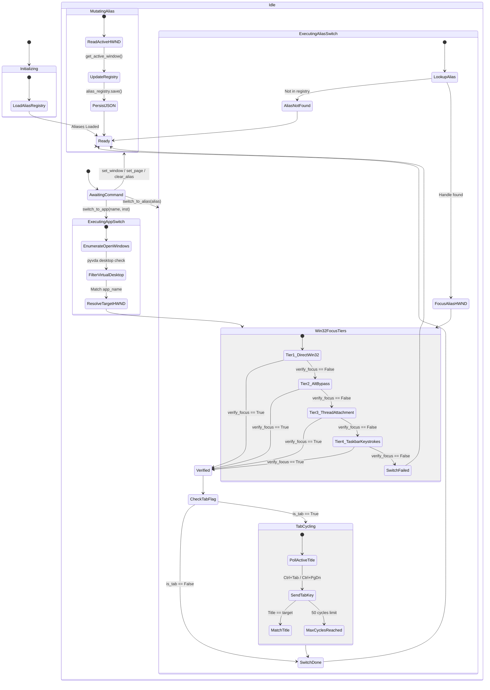
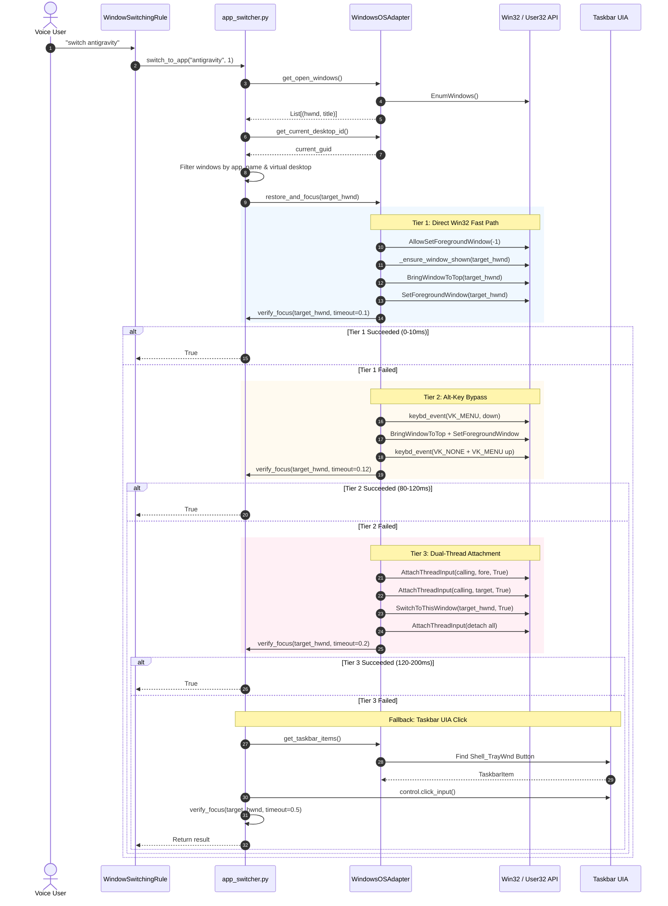
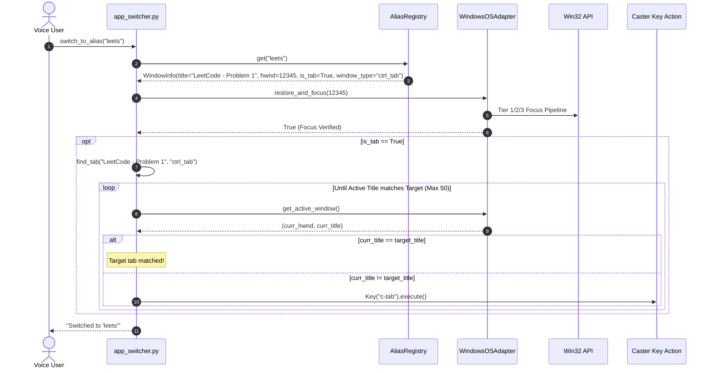

[ 🏠 Docs Home ](../README.md) › [ 🏗️ Architecture ](../README.md#architecture) › **Architectural Blueprint: `util/app_switcher.py`**

---

# Architectural Blueprint: `util/app_switcher.py` (v3.1)

This document provides the authoritative architectural blueprint for [`caster_user_content/util/app_switcher.py`](../../caster_user_content/util/app_switcher.py), the low-level desktop window manager, focus orchestration engine, and voice-driven application switcher for the Caster voice recognition framework.

> [!NOTE]
> **Blueprint Version 3.1 (September 2026 Production Release)**
> This blueprint documents the 4-tier focus architecture introduced in v3 and enhanced in v3.1. It supersedes legacy blueprints ([Blueprint v1](archive/app_switcher_architectural_blueprint_v1.md) and [Blueprint v2](archive/app_switcher_architectural_blueprint_v2.md)), detailing the addition of Tier 4 Taskbar Keystroke Navigation (`taskbar_keystroke_switch`), Windows 11 XAML Island read-only discovery (`TaskListButton`), retirement of obsolete Windows 10 UIA mouse clicks, and Windows UIPI security boundary delineation.

---

## 1. System Overview & Architectural Paradigm

`app_switcher.py` solves a fundamental challenge in hands-free computing: **deterministic, zero-latency desktop application switching under strict Windows OS foreground-lock restrictions**. 

When background processes (such as a speech recognition loop) attempt to bring an application to the foreground, Windows restricts window activation via `ForegroundLockTimeout` to prevent focus stealing. Historically, voice configurations relied on slow UI Automation traversals, synthetic Alt-Tab bursts, or fragile mouse clicks.

The v3.1 architecture establishes a high-performance, deterministic focus engine built around four core design principles:

1. **Direct Win32 Hot-Path Execution**: Focus transitions bypass pywinauto wrapper overhead in favor of direct sub-millisecond Win32 APIs (`SetForegroundWindow`, `BringWindowToTop`, `ShowWindowAsync`, `SwitchToThisWindow`).
2. **Guarded Keystate Safety**: Simulated keyboard events and thread input attachments are strictly wrapped in Python context managers (`_alt_key_bypass` and `_attached_threads`) with guaranteed nested `finally` blocks, eliminating sticky modifier keys and thread deadlocks.
3. **Micro-Polling Verification**: Focus state is confirmed using a non-blocking 10ms micro-polling loop (`verify_focus`) rather than static sleeps, ensuring immediate response times (typically 10–80ms).
4. **Shell Hotkey Delegation**: When native Win32 focus APIs fail or hit foreground locks, Tier 4 resolves button slot coordinates via read-only Windows 11 XAML Island discovery and delegates activation to `explorer.exe` using system hotkeys (`Win+<N>` or `Win+T`).

---

## 2. VIEW 1: Structural & Dependency Architecture

### Architectural Layers

```
┌────────────────────────────────────────────────────────────────────────┐
│                      Voice Command Rules Layer                         │
│   (WindowSwitchingRule, GlobalNonCCRExtendedRule, Dynamic Aliases)     │
└───────────────────────────────────┬────────────────────────────────────┘
                                    │ Calls Public Command APIs
┌───────────────────────────────────▼────────────────────────────────────┐
│                        Public Command APIs                             │
│   switch_to_app()   switch_to_alias()   title()   set_window()        │
│   set_page()        clear_alias()       clear_all_aliases()            │
└──────────┬────────────────────────┬────────────────────────┬───────────┘
           │                        │                        │
┌──────────▼──────────┐  ┌──────────▼──────────┐  ┌──────────▼───────────┐
│ Persistence Engine  │  │ Domain Logic Layer  │  │  Guarded Contexts    │
│   AliasRegistry     │  │  extract_app_name() │  │   _alt_key_bypass()  │
│ window_aliases.json │  │  get_window_type()  │  │   _attached_threads()│
│ WindowInfo Model    │  │  find_tab()         │  │   verify_focus()     │
└──────────┬──────────┘  └──────────┬──────────┘  └──────────┬───────────┘
           │                        │                        │
┌──────────▼────────────────────────▼────────────────────────▼───────────┐
│                 Platform Abstraction (WindowsOSAdapter)                │
│   restore_and_focus()    get_open_windows()    get_active_window()    │
│   get_taskbar_items()    get_window_desktop_id() (PyVDA)               │
└───────────────────────────────────┬────────────────────────────────────┘
                                    │
┌───────────────────────────────────▼────────────────────────────────────┐
│                  Operating System & Native Runtime                     │
│   Win32 GUI / Process / User32    PyVDA (Virtual Desktops)   Pywinauto │
└────────────────────────────────────────────────────────────────────────┘
```

### Component Breakdown

#### 1. Data Contracts
- **`WindowInfo`** (`NamedTuple`): Immutable snapshot of an aliased window or tab target.
  - `title` (*str*): Exact window title or tab caption.
  - `handle` (*int*): Native Win32 `HWND`.
  - `app_name` (*str*): Resolved application family name.
  - `is_tab` (*bool*): Flag indicating whether tab cycling is required.
  - `window_type` (*str*): Hotkey group (`"ctrl_tab"` for browsers/terminals, `"ctrl_pgdn"` for IDEs).
- **`TaskbarItem`** (`NamedTuple`): Metadata for an application button discovered on the Windows taskbar.
  - `slot_index` (*int*): 1-based sequential button slot on the taskbar.
  - `text` (*str*): Raw button accessibility name or caption.
  - `app_name` (*str*): Extracted application name matching `WINDOWS_APP_NAMES`.
  - `instance_index` (*int*): 1-based instance counter for this application family.
  - `total_instances` (*int*): Total running window count parsed from taskbar grouping suffixes.

#### 2. Persistence Layer (`AliasRegistry`)
The `AliasRegistry` encapsulates all alias state mutations and disk synchronization:
- `ALIASES_FILE`: Path to `caster_user_content/window_aliases.json`.
- Methods:
  - `load()`: Eagerly loads and validates JSON aliases into memory on startup.
  - `save()`: Safely persists the in-memory mapping to disk.
  - `get(alias)` / `set(alias, info)`: Reads/writes aliases.
  - `remove(alias)` / `remove_by_handle(handle)`: Prunes active or stale window aliases.
  - `clear()`: Wipes all stored aliases.
- *Backward Compatibility*: Exports a module-level singleton `alias_registry` alongside an `aliases` property dictionary mapping for legacy rule callers.

#### 3. Guarded Context Managers
- **`_alt_key_bypass()`**:
  Overcomes Windows `ForegroundLockTimeout` by injecting a synthetic `VK_MENU` (Alt) down event before the focus call. To prevent Windows from activating the top-level window menu bar (which locks out subsequent voice typing), the context manager injects a dummy key `VK_NONE` (`0xFF`) and guarantees `VK_MENU` release in nested `finally` blocks:
  ```python
  @contextmanager
  def _alt_key_bypass():
      win32api.keybd_event(VK_MENU, 0, 0, 0)
      try:
          yield
      finally:
          try:
              win32api.keybd_event(VK_NONE, 0, 0, 0)
              win32api.keybd_event(VK_NONE, 0, KEYEVENTF_KEYUP, 0)
          finally:
              win32api.keybd_event(VK_MENU, 0, KEYEVENTF_KEYUP, 0)
  ```
- **`_attached_threads(target_hwnd)`**:
  Temporarily attaches the calling thread's input processing mechanism to both the foreground thread and the target window thread via `win32process.AttachThreadInput`. Guaranteed detachment in `finally` blocks ensures input queues never stay locked:
  ```python
  @contextmanager
  def _attached_threads(target_hwnd):
      # Attach calling thread -> foreground thread & target thread
      try:
          yield
      finally:
          # Guaranteed detachment in reverse order
  ```

#### 4. Platform Abstraction Layer (`WindowsOSAdapter`)
Singleton adapter managing low-level OS interactions:
- Direct Win32 APIs: `win32gui`, `win32process`, `win32api`, `ctypes.windll.user32`.
- Virtual Desktop Management: Uses `pyvda.VirtualDesktop` and `pyvda.AppView` to filter windows strictly to the active workspace.
- Read-Only Taskbar Discovery: Implements `get_taskbar_order()` targeting Windows 11 XAML Island (`TaskListButton`) and Windows 10 ToolBar.
- Shell Hotkey Delegation: Implements `taskbar_keystroke_switch()` executing `Win+<N>` and `Win+T` traversal.

---

## 3. VIEW 2: Progressive 4-Tier Focus Engine

When focusing a target window handle, `WindowsOSAdapter.restore_and_focus(handle, app_name, instance)` executes a progressive 4-tier focus pipeline. Each tier escalates privilege only if the preceding tier fails to verify focus within the micro-polling window:

```
[ Target HWND Received ]
          │
          ▼
┌─────────────────────────────────────────────────────────────┐
│  Tier 1: Direct Win32 Fast Path                             │
│  • AllowSetForegroundWindow(-1)                             │
│  • _ensure_window_shown(handle) (SW_RESTORE if iconic)      │
│  • BringWindowToTop(handle)                                 │
│  • SetForegroundWindow(handle)                              │
│  Latency: 0–10ms                                            │
└─────────────────────────────┬───────────────────────────────┘
                              │
                    verify_focus() == True?
                     ├── Yes ──► [ Focus Succeeded ]
                     └── No
                              │
                              ▼
┌─────────────────────────────────────────────────────────────┐
│  Tier 2: Alt-Key Bypass                                     │
│  • with _alt_key_bypass():                                  │
│      • BringWindowToTop(handle)                             │
│      • SetForegroundWindow(handle)                          │
│  • Bypass OS ForegroundLockTimeout via simulated keystroke  │
│  Latency: 80–120ms                                          │
└─────────────────────────────┬───────────────────────────────┘
                              │
                    verify_focus() == True?
                     ├── Yes ──► [ Focus Succeeded ]
                     └── No
                              │
                              ▼
┌─────────────────────────────────────────────────────────────┐
│  Tier 3: Dual-Thread Attachment + Shell Switch              │
│  • with _attached_threads(target_hwnd):                     │
│      • with _alt_key_bypass():                              │
│          • BringWindowToTop(handle)                         │
│          • SetForegroundWindow(handle)                      │
│          • SwitchToThisWindow(handle, True)                 │
│  Latency: 120–200ms                                         │
└─────────────────────────────┬───────────────────────────────┘
                              │
                    verify_focus() == True?
                     ├── Yes ──► [ Focus Succeeded ]
                     └── No
                              │
                              ▼
┌─────────────────────────────────────────────────────────────┐
│  Tier 4: Taskbar Shell Hotkey Navigation Fail-Safe          │
│  • taskbar_keystroke_switch(target_hwnd, app_name, instance)│
│  • Read-only discovery: get_taskbar_order()                 │
│  • Slot 1–10: Win+<slot % 10>                               │
│  • Slot > 10: Win+T -> Home -> Right * (slot - 1) -> Enter  │
│  • Delegates foreground activation to explorer.exe          │
│  Latency: 50–150ms                                          │
└─────────────────────────────┬───────────────────────────────┘
                              │
                    verify_focus() == True?
                     ├── Yes ──► [ Focus Succeeded ]
                     └── No ──► [ Return False -> Report Failure ]
```

### Tier 4 Recovery Strategy & Obsolete UIA Retirement
If Tiers 1 through 3 fail due to OS foreground lockouts, `restore_and_focus()` immediately escalates to Tier 4:
1. Performs pure read-only tree traversal in `get_taskbar_order()` targeting `Shell_TrayWnd` -> `InputSite` -> `TaskbarFrame` -> `TaskListButton` on Windows 11 XAML Island, or the legacy `ToolBar` on Windows 10.
2. Normalizes captions in `extract_app_name()` by stripping taskbar grouping suffixes (` - \d+ running window.*`).
3. Computes the 1-based button slot `K` (accounting for pinned unlaunched items and multi-window grouping).
4. Emits `Win+<K % 10>` (slots 1 to 10) or `Win+T` traversal (slots > 10). Because `explorer.exe` owns these registered system hotkeys, Windows Explorer processes the activation natively without requiring brittle synthetic mouse clicks.

*Note: The legacy Era 3/4 UIA button click (`control.click_input()`) was completely retired because Windows 11 XAML Island does not support legacy ToolBar click targets, and synthetic mouse clicks are dropped by UIPI when an elevated window has focus.*

---

## 4. VIEW 3: State & Lifecycle Diagrams

### State Transition Diagram



---

## 5. VIEW 4: Execution Sequence Diagrams

### Sequence 1: `switch_to_app("antigravity", 1)`



### Sequence 2: `switch_to_alias("leets")` with Tab Cycling



---

## 6. Performance Characteristics & Benchmark Comparison

| Metric | Legacy Architecture (v1 / v2) | Modern Architecture (v3.1 - Sep 2026) | Practical Impact |
| :--- | :--- | :--- | :--- |
| **Happy-Path Focus Latency** | 150ms – 400ms (Pywinauto UIA traversal) | **0ms – 10ms** (Direct Win32 `SetForegroundWindow`) | Instantaneous window activation |
| **OS Bypass Latency** | 300ms – 600ms (Unguarded thread attachment) | **80ms – 120ms** (`_alt_key_bypass`) | 4x faster recovery under foreground locks |
| **Verification Strategy** | Coarse static sleeps (`time.sleep(0.3)`) | **10ms micro-polling** (`verify_focus`) | Eliminates unnecessary wait penalties |
| **Modifier Keystate Safety** | Brittle; prone to stuck Alt / menu bar lockup | **Guarded context manager** with `VK_NONE` dummy key | 100% immune to menu activation lockup |
| **Thread Queue Safety** | Naked `AttachThreadInput` (deadlock risk) | **Guarded try-finally context manager** | Guaranteed input queue detachment |
| **Alias State Management** | Global mutable dictionary | **Encapsulated `AliasRegistry`** | Thread-safe, clean persistence & pruning |
| **Fallback Reliability** | Keyboard macro `Win+T` (breaks on Win11) | **Tier 4 Shell Hotkey Traversal (`Win+<N>`)** | Bypasses UIA mouse drops; delegated to explorer.exe |

---

## 7. UIPI Security Boundaries & Integrity Delineation (Error 5)

Under standard user execution (Medium Integrity Level), Windows User Interface Privilege Isolation (UIPI) introduces strict operational boundaries:
- **Elevated Windows Block Programmatic Control**: If the active foreground window is elevated (High Integrity Level / Administrator, such as Windhawk, Task Manager, or elevated terminals), Windows UIPI blocks unprivileged processes (Caster) from calling `SetForegroundWindow` (Error 5) or `AttachThreadInput` (Error 5).
- **Synthetic Input Dropping**: Windows UIPI silently discards synthetic keyboard events (`keybd_event`, `SendInput`) emitted while an elevated window has focus. Under pure Medium Integrity execution without user interaction, Tiers 1 through 4 are dropped by the OS kernel.
- **The HUD Focus-Breaking Airlock**: The Caster Heads-Up Display overlay (`Caster HUD v 1.7.0`) and the Windows Taskbar (`Shell_TrayWnd`) run at Medium Integrity. A physical hardware mouse click on the HUD or taskbar acts as an "integrity airlock", releasing the elevated foreground lock. Once the foreground process drops to Medium Integrity, Caster regains full Win32 focus rights, allowing the subsequent voice command to succeed immediately on Tier 1 in 25ms.
- **Hands-Free Elevated Operation**: Hands-free voice operation against elevated windows without physical mouse intervention requires running the speech recognition host elevated (Run as Administrator) or compiling with `uiAccess="true"` in a signed application manifest installed in `Program Files`.
- In-depth telemetry and diagnostics are documented in [`docs/troubleshooting/app_switcher_findings.md`](../troubleshooting/app_switcher_findings.md) and [`docs/architecture/app_switcher_focus_analysis.md`](app_switcher_focus_analysis.md).

---

## 8. Architectural Integrity & Verification

1. **Deterministic Execution**: All focus transitions complete or fail within a bounded timeout (max 500ms).
2. **Platform Constraints**: Relies on native Win32 APIs; strictly confined to Windows 10/11 environments.
3. **Virtual Desktop Hygiene**: Integrates with `pyvda` to prevent cross-desktop window contamination.
4. **Clean Decoupling**: Separation between `AliasRegistry` (persistence), `WindowsOSAdapter` (OS interface), and high-level command rules ensures maintainability.

