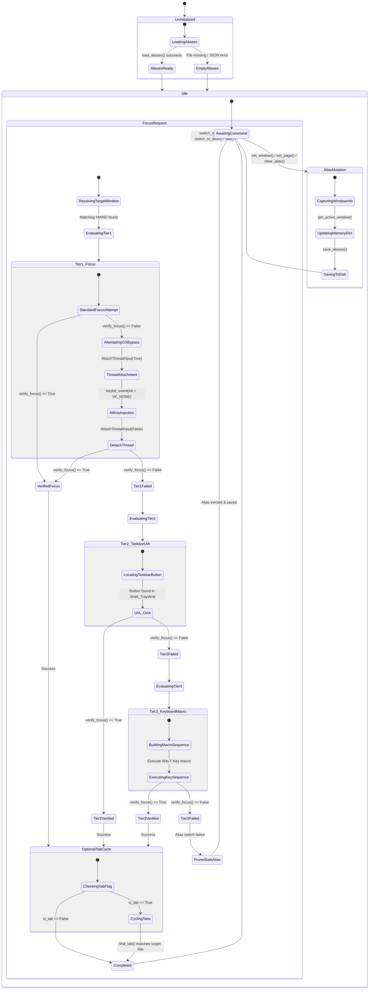
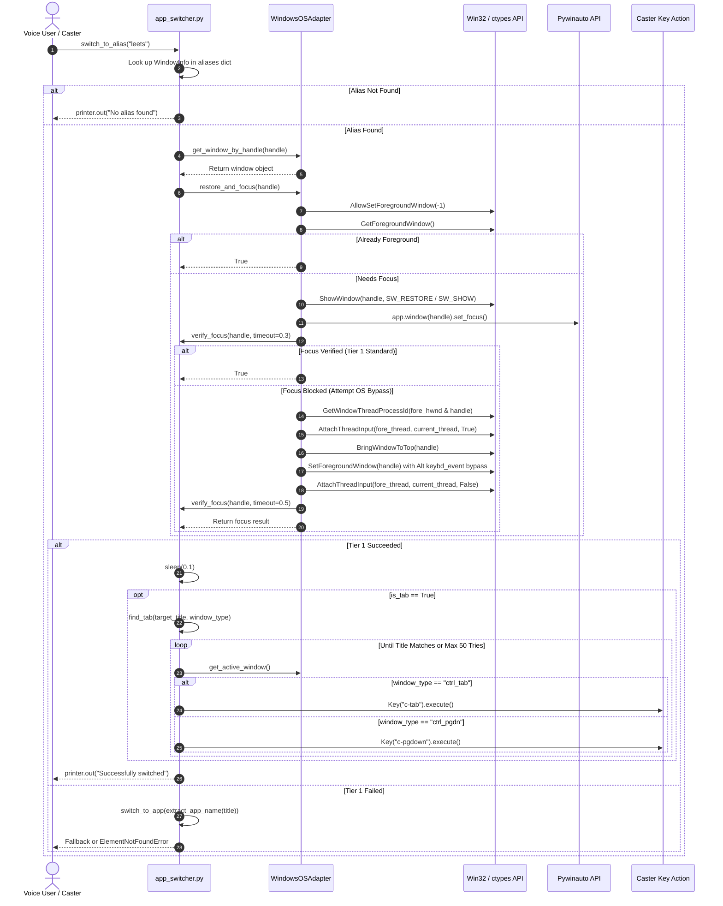

[ 🏠 Docs Home](../../README.md) › [ 🏗️ Architecture ](../README.md#architecture) › [ 🗄️ Architecture Archive ](./) › **Architectural Blueprint v1: `util/app_switcher.py` (Archived)**

> [!NOTE]
> **Historical Archive**: This document represents **Blueprint v1** (initial pre-refactor architectural analysis).
> For the current production architecture and focus engine specifications, please refer to the active [App Switcher Architectural Blueprint (v3)](../app_switcher_architectural_blueprint.md) and the [App Switcher Evolution Timeline](../../history/app_switcher_timeline.md).

---

# Architectural Blueprint v1: `util/app_switcher.py`

This document presents the initial historical architectural analysis of [`app_switcher.py`](../../../caster_user_content/util/app_switcher.py), the low-level Windows desktop context manager and voice-driven window switching module for the Caster voice recognition framework extension.

---

## VIEW 1: The Structural & Dependency View

### Analytical Summary
The structural architecture of `app_switcher.py` exhibits a clear separation between domain data models, low-level OS platform adapters, persistence storage, and public command handlers:

1. **Platform Abstraction Layer (`WindowsOSAdapter`)**: Encapsulates direct win32 API calls (`win32gui`, `win32process`, `win32api`, `ctypes`), `pywinauto` UIA/Win32 `Desktop` instances, and virtual desktop integration via `pyvda`.
2. **Data & State Contracts**: Uses Python `NamedTuple` instances (`WindowInfo`, `TaskbarItem`) to maintain immutable state snapshots of application windows and UI automation controls.
3. **Persistence Layer**: Reads and writes window/tab aliases to `window_aliases.json` via standard JSON serialization.
4. **Command Execution & Recovery**: Provides multi-tiered focus switching algorithms (`switch_to_app`, `switch_to_alias`, `find_tab`) that interface with Caster's `Key` actions for synthetic keyboard injection when win32 focus APIs fail.

#### Architectural Insights & Coupling
- **Tight External Coupling**: Direct dependency on Windows OS binaries via `ctypes.windll.user32` and `win32gui`. This confines `app_switcher.py` strictly to Windows environments.
- **Graceful Degradation**: `pyvda` is optionally loaded with a try-except fallback (`PYVDA_AVAILABLE`), ensuring core window switching remains functional even if virtual desktop tracking is unavailable.
- **Monolithic Singleton Instantiation**: `os_env = WindowsOSAdapter()` is instantiated at module load time, acting as a global adapter instance throughout the file.

### Structural Diagram

```mermaid
graph TD
    subgraph Client["Voice Command Rules Layer"]
        WindowSwitchingRule["Window Switching Rules / Commands"]
    end

    subgraph CoreModule["app_switcher.py"]
        direction TB
        subgraph PublicAPI["Public Execution APIs"]
            SetWindow["set_window(alias)"]
            SetPage["set_page(alias)"]
            SwitchToAlias["switch_to_alias(alias)"]
            SwitchToApp["switch_to_app(app_name, instance)"]
            TitleSwitch["title(window_title)"]
            ClearAlias["clear_alias() / clear_all_aliases()"]
        end

        subgraph LogicLayer["Domain Logic & Utilities"]
            ExtractAppName["extract_app_name(caption)"]
            GetWindowType["get_window_type(title)"]
            FindTab["find_tab(target_title, window_type)"]
            VerifyFocus["verify_focus(target_hwnd, timeout)"]
        end

        subgraph Persistence["Persistence Engine"]
            AliasStore["aliases: Dict[str, WindowInfo]"]
            LoadAliases["load_aliases()"]
            SaveAliases["save_aliases()"]
            AliasFile[("window_aliases.json")]
        end

        subgraph DataModels["Data Structures"]
            WindowInfoModel["WindowInfo (NamedTuple)"]
            TaskbarItemModel["TaskbarItem (NamedTuple)"]
        end

        subgraph OSAdapter["WindowsOSAdapter Class"]
            GetOpenWin["get_open_windows()"]
            GetActiveWin["get_active_window()"]
            GetTaskbar["get_taskbar_items()"]
            RestoreFocus["restore_and_focus(handle)"]
            DesktopUIA["_desktop_uia: Desktop(uia)"]
            DesktopWin32["_desktop_win32: Desktop(win32)"]
        end
    end

    subgraph ExternalDeps["External Operating System & Framework Libraries"]
        Win32GUI["win32gui / win32process / win32api"]
        CtypesUser32["ctypes.windll.user32"]
        PywinautoLib["pywinauto (Desktop, Application)"]
        PyVDALib["pyvda (VirtualDesktop, AppView)"]
        CasterActions["castervoice.lib.actions (Key)"]
        EnvVars["environment_variables (WINDOWS_APP_NAMES)"]
    end

    WindowSwitchingRule --> PublicAPI
    SwitchToApp --> RestoreFocus
    SwitchToApp --> GetTaskbar
    SwitchToApp --> CasterActions
    SwitchToAlias --> RestoreFocus
    SwitchToAlias --> FindTab
    SetWindow --> GetActiveWin
    SetWindow --> SaveAliases
    SetPage --> GetActiveWin
    SetPage --> SaveAliases
    SaveAliases --> AliasFile
    LoadAliases --> AliasFile
    AliasStore --> WindowInfoModel

    OSAdapter --> Win32GUI
    OSAdapter --> CtypesUser32
    OSAdapter --> PywinautoLib
    OSAdapter --> PyVDALib
    ExtractAppName --> EnvVars
```

---

## VIEW 2: The State & Lifecycle View

### Analytical Summary
The lifecycle of `app_switcher.py` revolves around the initial loading of persistence state, runtime state querying of open window handles, and transitioning through a 3-Tier Failsafe Focus Mechanism during window switching operations.

#### Lifecycle Phases
1. **Module Initialization**: `load_aliases()` reads existing alias definitions from disk and constructs in-memory `WindowInfo` objects.
2. **State Query & Desktop Inspection**: `get_active_window()` and `get_open_windows()` query Win32 GUI handles and pywinauto UIA elements, filtering by active virtual desktop IDs.
3. **Alias State Mutation**:
   - `set_window()` / `set_page()`: Binds an alias key to the current active `WindowInfo`.
   - `clear_alias()`: Removes active handle key mappings.
   - Stale Alias Pruning: If switching to an alias encounters `ElementNotFoundError`, the alias is evicted from memory and disk.
4. **Window Focus Transitioning**:
   - **Tier 1 (Win32 & Pywinauto Focus)**: Standard `ShowWindow` + `SetForegroundWindow` / `set_focus()`.
   - **Tier 1 Fallback (OS Bypass)**: If standard focus is blocked by Windows OS focus-steal protections, `restore_and_focus()` executes `AttachThreadInput` + synthetic Alt key injection (`keybd_event`).
   - **Tier 2 (Taskbar UIA Click)**: If Tier 1 fails, locates the taskbar button in `Shell_TrayWnd` and sends a UIA click.
   - **Tier 3 (Keyboard Macro)**: If Tier 2 fails, executes Windows shortcut macro (`Win+T`, `Home`, `Right * index`, `Enter`).

### State Diagram

---

## VIEW 3: The Execution & Sequence View

### Analytical Summary
The sequence below traces the runtime invocation of `switch_to_alias("leets")`—one of the primary happy path voice execution sequences:

1. **Trigger**: User speaks a voice command mapped to `switch_to_alias`.
2. **Alias Resolution**: Looks up `"leets"` in the global `aliases` dictionary to obtain target `WindowInfo`.
3. **Handle Verification**: Queries `WindowsOSAdapter` to locate the window by `handle`.
4. **Tier 1 Focus Execution**:
   - Calls `restore_and_focus(handle)`.
   - `AllowSetForegroundWindow(-1)` permits focus switching across processes.
   - If window is minimized, calls `win32gui.ShowWindow(handle, SW_RESTORE)`.
   - Fires Pywinauto `set_focus()`.
   - Polls `verify_focus(handle)`.
5. **OS Focus Bypass (If standard focus fails)**:
   - Attaches current thread input to target foreground window thread (`AttachThreadInput`).
   - Injects Alt key down (`0x12`), `win32gui.SetForegroundWindow(handle)`, dummy key press (`0xFF`), and Alt key up to bypass Windows focus restrictions without triggering menu bar highlighting.
   - Detaches thread input.
6. **Tab Synchronization**:
   - If `info.is_tab` is `True`, invokes `find_tab(info.title, info.window_type)`.
   - Fires tab navigation keys (`c-tab` for browsers/terminals or `c-pgdown` for IDEs like VS Code / Windsurf / Antigravity) up to 50 times until the target window title matches.

### Sequence Diagram

