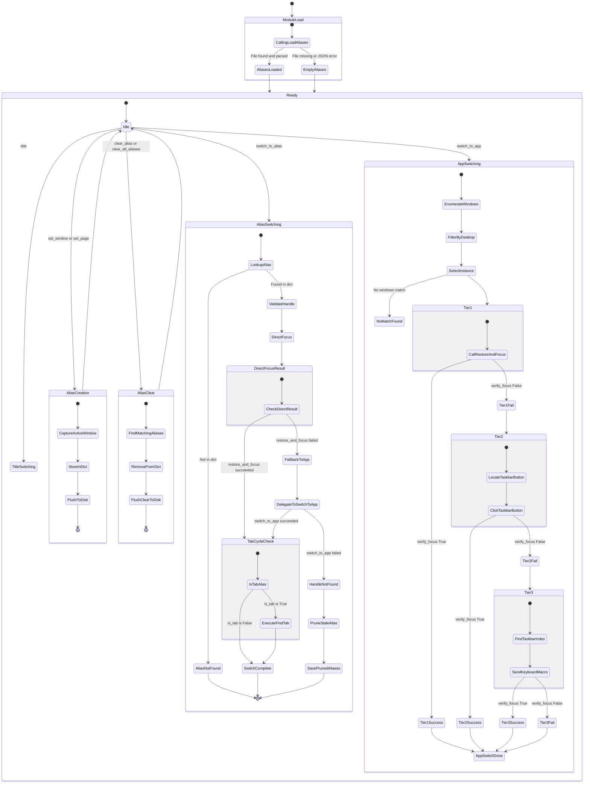
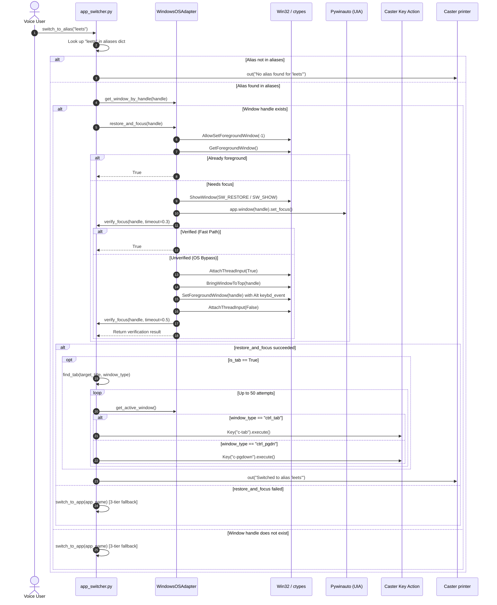

[ 🏠 Docs Home ](../../README.md) › [ 🏗️ Architecture ](../README.md#architecture) › [ 🗄️ Architecture Archive ](./) › **Architectural Blueprint v2: `util/app_switcher.py` (Archived)**

> [!NOTE]
> **Historical Archive**: This document represents **Blueprint v2** (pre-refactor iteration with pywinauto focus wrappers, global mutable alias dictionary, and legacy 3-tier failsafe).
> For the active production architecture, please refer to the current [App Switcher Architectural Blueprint (v3)](../app_switcher_architectural_blueprint.md) and the [App Switcher Evolution Timeline](../../history/app_switcher_timeline.md).

---

# Architectural Blueprint v2: `util/app_switcher.py`

This document presents a deep architectural analysis of [app_switcher.py](../../../caster_user_content/util/app_switcher.py), the voice-driven window switching and desktop focus management module for the Caster/Dragonfly speech recognition framework.

---

## VIEW 1: The Structural & Dependency View

### Analytical Summary

The module is organized into five distinct architectural layers:

1. **Platform Abstraction Layer** — [WindowsOSAdapter](../../../caster_user_content/util/app_switcher.py) encapsulates all raw OS calls (`win32gui`, `win32process`, `win32api`, `ctypes`), dual pywinauto `Desktop` backends (UIA + Win32), and optional virtual desktop tracking via `pyvda`. This class contains methods including the critical `restore_and_focus` method with its 2-phase focus algorithm.

2. **Data Contracts** — Two `NamedTuple` classes (`WindowInfo`, `TaskbarItem`) provide immutable snapshots of window state and taskbar UI elements.

3. **Persistence Layer** — The `aliases` global dictionary is serialized to/from `window_aliases.json` via `load_aliases` and `save_aliases`. `load_aliases()` is called eagerly at module import time.

4. **Public Command APIs** — Six voice-callable entry points: `set_window`, `set_page`, `clear_alias`, `clear_all_aliases`, `switch_to_app`, `switch_to_alias`, `title`, and the debug utility `show_window_info`.

5. **Domain Logic Utilities** — Module-level helpers: `extract_app_name`, `get_window_type`, `find_tab`, `verify_focus`, and `extract_total_instances`.

#### Architectural Insights & Coupling

- **Tight OS Coupling**: Direct dependency on Windows binaries via `ctypes.windll.user32` and `win32gui`. This module is Windows-only by design.
- **Graceful Degradation**: `pyvda` is optionally imported with a try-except guard. When unavailable, virtual desktop filtering is silently skipped.
- **Module-Level Singleton**: `os_env = WindowsOSAdapter()` is instantiated during module load, making it a process-wide singleton.
- **Two Distinct Switching Strategies**: `switch_to_app` uses a 3-tier failsafe system. `switch_to_alias` uses `restore_and_focus` directly, falling back to `switch_to_app` only if that fails.

### Structural Diagram

```mermaid
graph TD
    subgraph Client["Voice Command Rules Layer"]
        WindowSwitchingRule["Window Switching Rules"]
    end

    subgraph CoreModule["app_switcher.py"]
        direction TB

        subgraph PublicAPI["Public Command APIs"]
            SetWindow["set_window()"]
            SetPage["set_page()"]
            SwitchToAlias["switch_to_alias()"]
            SwitchToApp["switch_to_app()"]
            TitleSwitch["title()"]
            ClearAlias["clear_alias()"]
            ClearAllAliases["clear_all_aliases()"]
            ShowWindowInfo["show_window_info()"]
        end

        subgraph DomainLogic["Domain Logic and Utilities"]
            ExtractAppName["extract_app_name()"]
            ExtractTotalInst["extract_total_instances()"]
            GetWindowType["get_window_type()"]
            FindTab["find_tab()"]
            VerifyFocus["verify_focus()"]
        end

        subgraph Persistence["Persistence Layer"]
            AliasDict["aliases dict"]
            LoadAliases["load_aliases()"]
            SaveAliases["save_aliases()"]
            AliasFile[("window_aliases.json")]
        end

        subgraph DataModels["Data Contracts"]
            WindowInfoModel["WindowInfo NamedTuple"]
            TaskbarItemModel["TaskbarItem NamedTuple"]
        end

        subgraph OSAdapter["WindowsOSAdapter"]
            GetOpenWin["get_open_windows()"]
            GetActiveWin["get_active_window()"]
            GetTaskbar["get_taskbar_items()"]
            RestoreFocus["restore_and_focus()"]
            IterWindows["iter_windows()"]
            GetWinByHandle["get_window_by_handle()"]
            GetCurrDesktop["get_current_desktop_id()"]
            GetWinDesktop["get_window_desktop_id()"]
            DesktopUIA["_desktop_uia"]
            DesktopWin32["_desktop_win32"]
        end
    end

    subgraph ExternalDeps["External Dependencies"]
        Win32["win32gui / win32process / win32api"]
        Ctypes["ctypes.windll.user32"]
        PywinautoLib["pywinauto"]
        PyVDA["pyvda - optional"]
        CasterKey["castervoice Key"]
        CasterPrinter["castervoice printer"]
        EnvVars["WINDOWS_APP_NAMES"]
    end

    WindowSwitchingRule --> PublicAPI

    SwitchToApp --> GetOpenWin
    SwitchToApp --> GetCurrDesktop
    SwitchToApp --> GetWinDesktop
    SwitchToApp --> RestoreFocus
    SwitchToApp --> GetTaskbar
    SwitchToApp --> VerifyFocus
    SwitchToApp --> ExtractAppName

    SwitchToAlias --> GetWinByHandle
    SwitchToAlias --> RestoreFocus
    SwitchToAlias --> SwitchToApp
    SwitchToAlias --> FindTab
    SwitchToAlias --> ExtractAppName

    TitleSwitch --> IterWindows
    TitleSwitch --> RestoreFocus

    SetWindow --> GetActiveWin
    SetWindow --> GetWindowType
    SetWindow --> SaveAliases
    SetPage --> GetActiveWin
    SetPage --> GetWindowType
    SetPage --> SaveAliases
    ClearAlias --> GetActiveWin
    ClearAlias --> SaveAliases
    ShowWindowInfo --> GetOpenWin
    ShowWindowInfo --> ExtractAppName

    FindTab --> GetActiveWin
    FindTab --> CasterKey

    SwitchToApp --> CasterKey

    GetTaskbar --> ExtractAppName
    GetTaskbar --> ExtractTotalInst

    LoadAliases --> AliasFile
    SaveAliases --> AliasFile
    AliasDict --> WindowInfoModel

    RestoreFocus --> Win32
    RestoreFocus --> Ctypes
    RestoreFocus --> PywinautoLib
    RestoreFocus --> VerifyFocus
    GetCurrDesktop --> PyVDA
    GetWinDesktop --> PyVDA
    GetActiveWin --> PywinautoLib
    GetActiveWin --> Win32
    GetOpenWin --> Win32
    IterWindows --> PywinautoLib
    GetTaskbar --> PywinautoLib
    ExtractAppName --> EnvVars
    SwitchToApp --> CasterPrinter
    SwitchToAlias --> CasterPrinter
    TitleSwitch --> CasterPrinter
```

---

## VIEW 2: The State & Lifecycle View

### Analytical Summary

The module has two fundamentally different window-switching execution paths:

#### Path A — `switch_to_alias` (Alias-Based Switching)
1. Look up alias in the in-memory `aliases` dict.
2. Validate the window handle still exists via `get_window_by_handle()`.
3. Attempt `restore_and_focus()` directly.
4. If `restore_and_focus` fails → **fallback**: extract the app name from the stored title and delegate to `switch_to_app()`.
5. If `switch_to_app` also fails → raise `ElementNotFoundError`.
6. On success, if `is_tab == True` → execute `find_tab()` to cycle to the correct tab.
7. On `ElementNotFoundError` → **prune the stale alias** from memory and disk.

#### Path B — `switch_to_app` (Application-Based 3-Tier Switching)
1. Enumerate open windows via `get_open_windows()`.
2. Filter by app name match AND current virtual desktop (via `pyvda`).
3. Select the requested instance index.
4. **Tier 1**: `restore_and_focus()` — Pywinauto `set_focus()` + OS bypass with `AttachThreadInput` + Alt key injection.
5. **Tier 2**: Taskbar UIA Click — Locate the button in `Shell_TrayWnd` toolbar, send `click_input()`.
6. **Tier 3**: Keyboard Macro — `Key("w-t/3, home, right:{idx}/3, enter")` via Caster.
7. Each tier independently calls `verify_focus()` to confirm success before proceeding.
8. No alias pruning occurs in this path.

### State Diagram

---

## VIEW 3: The Execution & Sequence View

### Sequence Diagram: `switch_to_alias`

