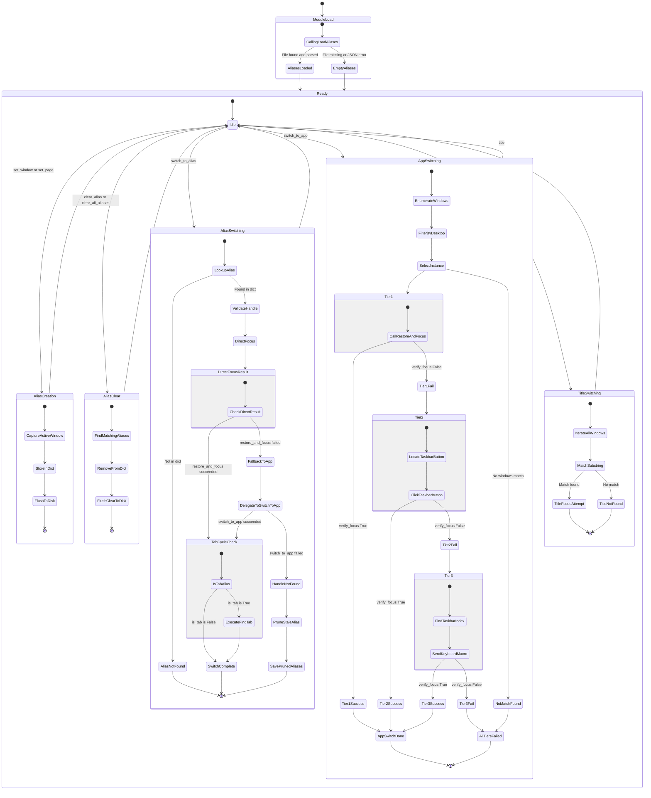
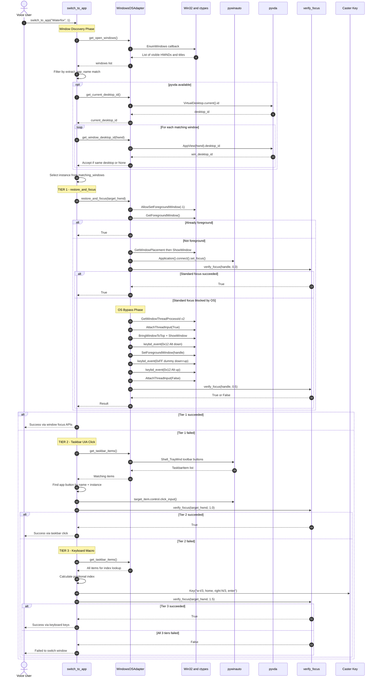

[ 🏠 Docs Home ](../../README.md) › [ 📁 Archive / App Switcher ](../../README.md#prompts--legacy-notes) › **Architectural Blueprint v2: `util/app_switcher.py`**

---

# Architectural Blueprint v2: `util/app_switcher.py`

This document presents a deep architectural analysis of [app_switcher.py](../../../caster_user_content/util/app_switcher.py), the voice-driven window switching and desktop focus management module for the Caster/Dragonfly speech recognition framework.

> [!NOTE]
> **v2 corrections from v1**: Fixed state diagram conflating `switch_to_alias` (single-tier + fallback) with `switch_to_app` (3-tier system). Corrected alias pruning attribution. Added missing OSAdapter methods. Fixed dependency arrows. Ensured all Mermaid labels are double-quoted.

---

## VIEW 1: The Structural & Dependency View

### Analytical Summary

The module is organized into five distinct architectural layers:

1. **Platform Abstraction Layer** — [WindowsOSAdapter](../../../caster_user_content/util/app_switcher.py#L116-L284) encapsulates all raw OS calls (`win32gui`, `win32process`, `win32api`, `ctypes`), dual pywinauto `Desktop` backends (UIA + Win32), and optional virtual desktop tracking via `pyvda`. This class contains **9 methods** including the critical [restore_and_focus](../../../caster_user_content/util/app_switcher.py#L204-L269) method with its 2-phase focus algorithm.

2. **Data Contracts** — Two `NamedTuple` classes ([WindowInfo](../../../caster_user_content/util/app_switcher.py#L35-L39), [TaskbarItem](../../../caster_user_content/util/app_switcher.py#L42-L47)) provide immutable snapshots of window state and taskbar UI elements.

3. **Persistence Layer** — The [aliases](../../../caster_user_content/util/app_switcher.py#L55) global dictionary is serialized to/from [window_aliases.json](../../../caster_user_content/util/app_switcher.py#L52) via [load_aliases](../../../caster_user_content/util/app_switcher.py#L58-L69) and [save_aliases](../../../caster_user_content/util/app_switcher.py#L72-L79). `load_aliases()` is called eagerly at [module import time (line 82)](../../../caster_user_content/util/app_switcher.py#L82).

4. **Public Command APIs** — Six voice-callable entry points: `set_window`, `set_page`, `clear_alias`, `clear_all_aliases`, `switch_to_app`, `switch_to_alias`, `title`, and the debug utility `show_window_info`.

5. **Domain Logic Utilities** — Module-level helpers: [extract_app_name](../../../caster_user_content/util/app_switcher.py#L85-L105), [get_window_type](../../../caster_user_content/util/app_switcher.py#L300-L305), [find_tab](../../../caster_user_content/util/app_switcher.py#L351-L366), [verify_focus](../../../caster_user_content/util/app_switcher.py#L290-L297), and [extract_total_instances](../../../caster_user_content/util/app_switcher.py#L108-L113).

#### Architectural Insights & Coupling

- **Tight OS Coupling**: Direct dependency on Windows binaries via `ctypes.windll.user32` and `win32gui`. This module is Windows-only by design.
- **Graceful Degradation**: `pyvda` is optionally imported with a try-except guard ([lines 20-26](../../../caster_user_content/util/app_switcher.py#L20-L26)). When unavailable, virtual desktop filtering is silently skipped.
- **Module-Level Singleton**: `os_env = WindowsOSAdapter()` is instantiated at [line 287](../../../caster_user_content/util/app_switcher.py#L287) during module load, making it a process-wide singleton.
- **Two Distinct Switching Strategies**: `switch_to_app` uses a 3-tier failsafe system. `switch_to_alias` uses `restore_and_focus` directly, falling back to `switch_to_app` only if that fails. These are separate code paths, not one unified pipeline.

### Structural Diagram

```mermaid
graph TD
    subgraph Client["Voice Command Rules Layer"]
        WindowSwitchingRule["Window Switching Rules"]
    end

    subgraph CoreModule["app_switcher.py"]
        direction TB

        subgraph PublicAPI["Public Command APIs"]
            SetWindow["set_window()"]
            SetPage["set_page()"]
            SwitchToAlias["switch_to_alias()"]
            SwitchToApp["switch_to_app()"]
            TitleSwitch["title()"]
            ClearAlias["clear_alias()"]
            ClearAllAliases["clear_all_aliases()"]
            ShowWindowInfo["show_window_info()"]
        end

        subgraph DomainLogic["Domain Logic and Utilities"]
            ExtractAppName["extract_app_name()"]
            ExtractTotalInst["extract_total_instances()"]
            GetWindowType["get_window_type()"]
            FindTab["find_tab()"]
            VerifyFocus["verify_focus()"]
        end

        subgraph Persistence["Persistence Layer"]
            AliasDict["aliases dict"]
            LoadAliases["load_aliases()"]
            SaveAliases["save_aliases()"]
            AliasFile[("window_aliases.json")]
        end

        subgraph DataModels["Data Contracts"]
            WindowInfoModel["WindowInfo NamedTuple"]
            TaskbarItemModel["TaskbarItem NamedTuple"]
        end

        subgraph OSAdapter["WindowsOSAdapter"]
            GetOpenWin["get_open_windows()"]
            GetActiveWin["get_active_window()"]
            GetTaskbar["get_taskbar_items()"]
            RestoreFocus["restore_and_focus()"]
            IterWindows["iter_windows()"]
            GetWinByHandle["get_window_by_handle()"]
            GetCurrDesktop["get_current_desktop_id()"]
            GetWinDesktop["get_window_desktop_id()"]
            DesktopUIA["_desktop_uia"]
            DesktopWin32["_desktop_win32"]
        end
    end

    subgraph ExternalDeps["External Dependencies"]
        Win32["win32gui / win32process / win32api"]
        Ctypes["ctypes.windll.user32"]
        PywinautoLib["pywinauto"]
        PyVDA["pyvda - optional"]
        CasterKey["castervoice Key"]
        CasterPrinter["castervoice printer"]
        EnvVars["WINDOWS_APP_NAMES"]
    end

    WindowSwitchingRule --> PublicAPI

    SwitchToApp --> GetOpenWin
    SwitchToApp --> GetCurrDesktop
    SwitchToApp --> GetWinDesktop
    SwitchToApp --> RestoreFocus
    SwitchToApp --> GetTaskbar
    SwitchToApp --> VerifyFocus
    SwitchToApp --> ExtractAppName

    SwitchToAlias --> GetWinByHandle
    SwitchToAlias --> RestoreFocus
    SwitchToAlias --> SwitchToApp
    SwitchToAlias --> FindTab
    SwitchToAlias --> ExtractAppName

    TitleSwitch --> IterWindows
    TitleSwitch --> RestoreFocus

    SetWindow --> GetActiveWin
    SetWindow --> GetWindowType
    SetWindow --> SaveAliases
    SetPage --> GetActiveWin
    SetPage --> GetWindowType
    SetPage --> SaveAliases
    ClearAlias --> GetActiveWin
    ClearAlias --> SaveAliases
    ShowWindowInfo --> GetOpenWin
    ShowWindowInfo --> ExtractAppName

    FindTab --> GetActiveWin
    FindTab --> CasterKey

    SwitchToApp --> CasterKey

    GetTaskbar --> ExtractAppName
    GetTaskbar --> ExtractTotalInst

    LoadAliases --> AliasFile
    SaveAliases --> AliasFile
    AliasDict --> WindowInfoModel

    RestoreFocus --> Win32
    RestoreFocus --> Ctypes
    RestoreFocus --> PywinautoLib
    RestoreFocus --> VerifyFocus
    GetCurrDesktop --> PyVDA
    GetWinDesktop --> PyVDA
    GetActiveWin --> PywinautoLib
    GetActiveWin --> Win32
    GetOpenWin --> Win32
    IterWindows --> PywinautoLib
    GetTaskbar --> PywinautoLib
    ExtractAppName --> EnvVars
    SwitchToApp --> CasterPrinter
    SwitchToAlias --> CasterPrinter
    TitleSwitch --> CasterPrinter
```

---

## VIEW 2: The State & Lifecycle View

### Analytical Summary

The module has two fundamentally different window-switching execution paths that must not be conflated:

#### Path A — `switch_to_alias` (Alias-Based Switching)
1. Look up alias in the in-memory `aliases` dict.
2. Validate the window handle still exists via `get_window_by_handle()`.
3. Attempt `restore_and_focus()` directly (this is the **only** tier used).
4. If `restore_and_focus` fails → **fallback**: extract the app name from the stored title and delegate to `switch_to_app()` (which then uses its own 3-tier system).
5. If `switch_to_app` also fails → raise `ElementNotFoundError`.
6. On success, if `is_tab == True` → execute `find_tab()` to cycle to the correct tab.
7. On `ElementNotFoundError` → **prune the stale alias** from memory and disk.

#### Path B — `switch_to_app` (Application-Based 3-Tier Switching)
1. Enumerate open windows via `get_open_windows()`.
2. Filter by app name match AND current virtual desktop (via `pyvda`).
3. Select the requested instance index.
4. **Tier 1**: `restore_and_focus()` — Pywinauto `set_focus()` + OS bypass with `AttachThreadInput` + Alt key injection.
5. **Tier 2**: Taskbar UIA Click — Locate the button in `Shell_TrayWnd` toolbar, send `click_input()`.
6. **Tier 3**: Keyboard Macro — `Key("w-t/3, home, right:{idx}/3, enter")` via Caster.
7. Each tier independently calls `verify_focus()` to confirm success before proceeding.
8. **No alias pruning occurs in this path.** It simply returns `True` or `False`.

#### Alias Lifecycle
- **Creation**: `set_window()` captures `is_tab=False`. `set_page()` captures `is_tab=True` with `window_type`.
- **Pruning**: Only happens in `switch_to_alias` when `ElementNotFoundError` is caught — never in `switch_to_app`.
- **Persistence**: All mutations flush to `window_aliases.json` via `save_aliases()`.

### State Diagram

---

## VIEW 3: The Execution & Sequence View

### Analytical Summary

This sequence traces the full runtime execution of [switch_to_app](../../../caster_user_content/util/app_switcher.py#L376-L463), the primary 3-tier failsafe window switching function. This is the most complex execution path in the module and is also the fallback target for `switch_to_alias`.

#### Invocation Chain

1. **Trigger**: Voice command rule calls `switch_to_app("Waterfox", instance=1)`.
2. **Window Discovery**: Queries `get_open_windows()` via `win32gui.EnumWindows`, then filters by app name using `extract_app_name()` against `WINDOWS_APP_NAMES`.
3. **Virtual Desktop Filtering**: If `pyvda` is available, gets `get_current_desktop_id()` and filters out windows on other desktops via `get_window_desktop_id()`.
4. **Tier 1 — `restore_and_focus(handle)`**:
   - Calls `AllowSetForegroundWindow(-1)` to unlock cross-process focus.
   - Checks if already the foreground window.
   - Restores from minimized state via `GetWindowPlacement` + `ShowWindow`.
   - Attempts `pywinauto.Application().connect(handle).set_focus()`.
   - Polls `verify_focus(handle, 0.3)`.
   - **If blocked**: Executes OS bypass — `AttachThreadInput` + `BringWindowToTop` + Alt key injection (`0x12` down → `SetForegroundWindow` → `0xFF` dummy key → `0x12` up) + `DetachThreadInput`.
   - Polls `verify_focus(handle, 0.5)`.
5. **Tier 2 — Taskbar UIA Click**:
   - Locates `Shell_TrayWnd` → `"Running applications"` toolbar → matching button.
   - Sends `click_input()` on the UIA control.
   - Polls `verify_focus(handle, 1.0)`.
6. **Tier 3 — Keyboard Macro**:
   - Re-queries taskbar items to find the positional index of the target app.
   - Executes `Key("w-t/3, home, right:{idx}/3, enter")` via Caster.
   - Polls `verify_focus(handle, 1.5)`.

### Sequence Diagram

---

## Corrections from v1

| Issue | v1 Behavior | v2 Correction |
|:------|:-----------|:-------------|
| **State diagram conflation** | Showed all 3 tiers + tab cycling + alias pruning as one unified `FocusRequest` flow | Separated into distinct `AliasSwitching` and `AppSwitching` state machines with correct scope |
| **Alias pruning attribution** | `Tier3Failed → PruneStaleAlias` implied Tier 3 failure triggers pruning | Pruning only occurs in `switch_to_alias` when `ElementNotFoundError` is caught — never in `switch_to_app` |
| **Tab cycling scope** | Shown as part of the generic focus pipeline | Correctly scoped to `switch_to_alias` only — `switch_to_app` never calls `find_tab` |
| **Missing OSAdapter methods** | Only showed 4 of 9 methods | Added `iter_windows`, `get_window_by_handle`, `get_current_desktop_id`, `get_window_desktop_id` |
| **Missing dependency arrows** | `title()` had no dependencies shown; `find_tab → Key` was missing | `title → iter_windows → restore_and_focus`; `find_tab → Key`; `switch_to_alias → switch_to_app` fallback |
| **verify_focus ownership** | Shown as called by OSAdapter on behalf of AppSwitch | Correctly shown as module-level function called both by `restore_and_focus` internally and `switch_to_app` directly |
| **Sequence diagram scope** | Only traced `switch_to_alias` with Tier 1 detail | Full `switch_to_app` 3-tier trace including virtual desktop filtering |
| **Mermaid syntax** | Colons in transition labels caused parse errors | All labels use safe characters, all node labels double-quoted |
| **Missing functions** | `show_window_info`, `extract_total_instances`, `clear_all_aliases` omitted | All public functions and utilities now represented |
| **Virtual desktop filtering** | Not shown in sequence diagram | Fully traced with `pyvda` optional interaction |

## Architectural Unknowns

No unresolvable ambiguities remain. All dependencies and execution paths have been fully traced from source.
