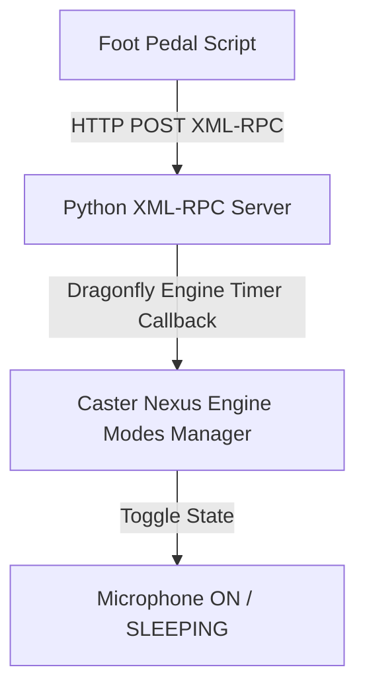

# Caster Microphone Toggle (XML-RPC IPC)

This documentation describes the local IPC mechanism implemented to quickly and reliably toggle Caster's microphone state between `active` (on) and `sleeping` via foot pedal actions.

## Architecture & How It Works

Instead of simulating keyboard shortcuts that might conflict with other software or get lost, this solution uses an **XML-RPC client-server architecture** running entirely on the local loopback address (`127.0.0.1`).

### 1. Python XML-RPC Server (`caster_toggle_mic_key.py`)
Located in [caster_toggle_mic_key.py](file:///c:/Users/Amir/AppData/Local/caster/caster_user_content/rules/caster_toggle_mic_key.py).
* Caster automatically loads this rule from your user rules folder.
* It starts a background `SimpleXMLRPCServer` thread listening on `127.0.0.1:8341`.
* It registers the function `toggle_mic_mode`.
* When called, the function schedules a callback on Dragonfly's engine main thread using `engine.create_timer(..., 0.05)`. This ensures thread-safety when modifying the Caster/Dragonfly engine modes state.
* If a reload occurs, the rule safely shuts down any running server on the port before opening a new one.

### 2. AutoHotkey v2 Client Integration
* **Foot Pedal Integration (`foot_pedal.ahk`)**:
  Located in [foot_pedal.ahk](file:///c:/Users/Amir/AppData/Local/caster/foot_pedal.ahk).
  * Integrates with the Olympus RS31H foot pedal.
  * Under **Left Pedal (F13)**, a short tap calls `toggleCaster()` to trigger the local XML-RPC endpoint.

---

## Configuration

* **Server Port**: Configured by default to `8341` in `caster_toggle_mic_key.py`.
* **AHK Endpoint**: The endpoint targets `http://127.0.0.1:8341/`.
