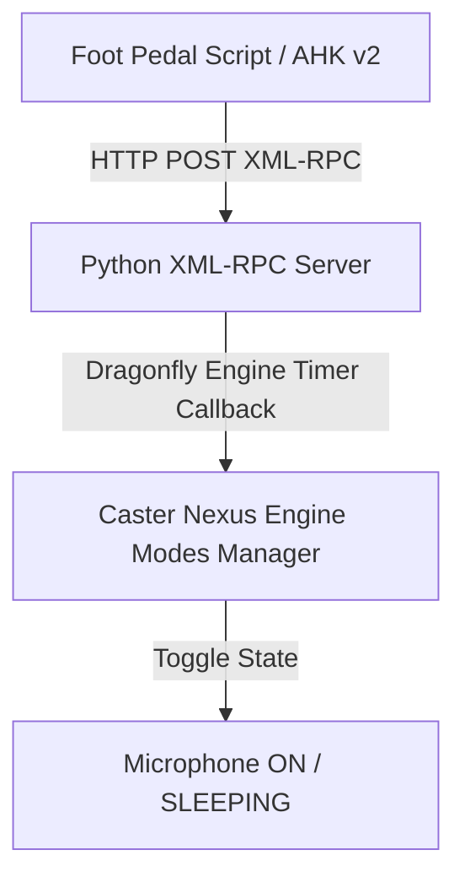

# Olympus RS31H Foot Pedal Control & XML-RPC IPC Bridge

[foot_pedal.ahk](../foot_pedal.ahk) provides advanced control for the Olympus RS31H USB foot pedal, paired with a background Python XML-RPC server ([caster_toggle_mic_key.py](../caster_user_content/rules/caster_toggle_mic_key.py)) for thread-safe, hands-free Caster microphone toggling.

It solves common hardware issues like button "bouncing" and key repetition by implementing a robust debouncing and polling state machine to distinguish between tap, hold, long-press, and multi-pedal chord combinations.

---

## Architecture & How It Works

Instead of simulating global key combinations that could conflict with active application shortcuts or drop key events, Caster microphone toggling is handled through a local **XML-RPC client-server bridge** running on loopback (`127.0.0.1`).

### 1. Python XML-RPC Server ([caster_toggle_mic_key.py](../caster_user_content/rules/caster_toggle_mic_key.py))
Located in [caster_toggle_mic_key.py](../caster_user_content/rules/caster_toggle_mic_key.py).

* Automatically loaded by Caster from the user rules directory.
* Runs a daemon `SimpleXMLRPCServer` thread listening on `127.0.0.1:8341`.
* Exposes the RPC method `toggle_mic_mode`.
* **Thread Safety**: When invoked, the server schedules a callback on Dragonfly's main execution loop using `engine.create_timer(..., 0.05)`. This ensures safe state transitions when toggling Caster Nexus between `active` and `sleeping`.
* **Reload Safety**: Intercepts Caster module reloads to cleanly stop any existing server thread before binding a new instance to port `8341`.

### 2. AutoHotkey v2 Client Integration ([foot_pedal.ahk](../foot_pedal.ahk))
Located in [foot_pedal.ahk](../foot_pedal.ahk).

* Intercepts `F13` - `F16` hardware key inputs sent by the foot pedal.
* Under a short tap on **Left Pedal (`F13`)**, `toggleCaster()` dispatches a synchronous XML-RPC `POST` request to `http://127.0.0.1:8341/`.
* Displays non-intrusive mouse-cursor tooltips for visual status cues (e.g., `🎤 Caster Toggle Sent` or `❌ Caster Toggle Failed`).

---

## Hardware Requirements & Setup

* **AutoHotkey v2.0** or newer.
* **Olympus RS31H USB Foot Pedal** (or any pedal configured to send `F13` - `F16` keypresses).
  * *Note*: Programming keys beyond `F12` on the RS31H requires editing its XML configuration file using Olympus utility tools.
* **Enable ViaCam** configured with the cursor control toggle hotkey (default: `F11`).

---

## Pedal Mappings & Smart Features

The script maps the pedal buttons (`F13` - `F16`) to the following actions:

* **Right Pedal (`F15`): Smart Left Click**
  * **Short Tap (First Time):** Sends `F11` to enable ViaCam head-tracking.
  * **Short Tap (Subsequent):** Sends a standard **Left Mouse Click** (`LButton`).
  * **Press and Hold:** Initiates a **Left Mouse Drag** (`LButton down`). Releasing the pedal drops the selection (`LButton up`).

* **Left Pedal (`F13`) + Right Pedal (`F15`) Combination: Right Mouse Click**
  * **Hold `F13` + Press `F15`:** Sends a **Right Mouse Click** (`RButton`). Suppresses individual pedal actions (mic toggle and left click).

* **Middle Pedal (`F14`): Scroll Down**
  * **Short Tap:** Scrolls down one notch (`WheelDown`).
  * **Press and Hold:** Continuous downward scrolling until released.

* **Top Pedal (`F16`): Scroll Up**
  * **Short Tap:** Scrolls up one notch (`WheelUp`).
  * **Press and Hold:** Continuous upward scrolling until released.

* **Left Pedal (`F13`): Caster Microphone Toggle & Reset**
  * **Short Tap:** Toggles Caster's microphone state between `active` and `sleeping` via the XML-RPC IPC bridge.
  * **Long Press (500 ms):** Resets the Right Pedal (`F15`) state back to sending `F11` on its next tap, and fires an `F11` hotkey immediately.

---

## Configuration

All timing thresholds and network endpoints can be customized in their respective files:

### AutoHotkey v2 ([foot_pedal.ahk](../foot_pedal.ahk))
* `F15_HoldDelay`: Hold duration in ms before mouse drag starts (default: `200` ms).
* `F13_HoldDelay`: Long-press duration in ms for Left Pedal reset (default: `500` ms).
* `Scroll_HoldDelay`: Hold duration in ms before continuous scrolling starts (default: `250` ms).
* `Scroll_RepeatRate`: Interval in ms between scroll steps during a hold (default: `50` ms).

### Python XML-RPC Server ([caster_toggle_mic_key.py](../caster_user_content/rules/caster_toggle_mic_key.py))
* `RPC_HOST`: Default loopback host `127.0.0.1`.
* `RPC_PORT`: Default port `8341`.
