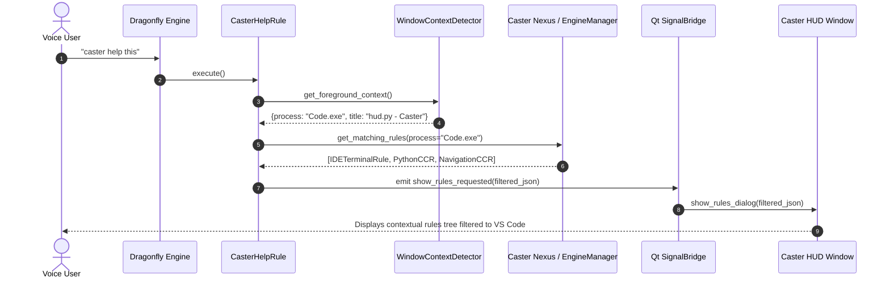

[ 🏠 Docs Home ](../README.md) › [ 📁 Caster HUD ](001_caster_hud_architecture_and_threading_primer.md) › **008: Caster Help Rule & Context-Aware Voice Assistance Architecture**

---

# 008 — Caster Help Rule & Context-Aware Voice Assistance Architecture

**Document ID**: `CASTER-DOC-HUD-008`  
**Status**: Future Architecture & Engineering Design Blueprint  
**Target Subsystem**: `castervoice/rules/core/utility_rules/caster_help_rule.py`, `castervoice/asynch/hud/`  
**Authors**: Antigravity Principal Architecture Team (Pair Programming with Amir Farhadi)  

---

## 1. Executive Summary & Vision

As voice programming grammars scale to hundreds of rules across dozens of IDEs, browsers, terminals, and languages, voice coders frequently face **discovery friction**:
- *"What are the exact voice commands active in this terminal right now?"*
- *"Does Caster have specific rules for this tool, or am I in the global fallback grammar?"*
- *"What was the spec for that multi-token navigation rule?"*

This architecture blueprint designs a first-class, **context-aware voice assistance subsystem (`CasterHelpRule`)** that bridges real-time desktop window inspection with the Caster HUD to provide immediate, contextual command discovery without disrupting workflow.

---

## 2. Voice Command Grammar Specification (`CasterHelpRule`)

```
┌──────────────────────────────────────────────┬────────────────────────────────────────────────────────┐
│ Voice Command                                │ Action / Behavior                                      │
├──────────────────────────────────────────────┼────────────────────────────────────────────────────────┤
│ "caster help" / "caster help this"           │ Queries active foreground window & displays matching   │
│                                              │ rules for the current application/context in HUD.      │
│ "caster help rules"                          │ Opens interactive Rules Tree Dialog with search filter.│
│ "caster help <app_or_grammar>"               │ Filtered query (e.g. "caster help vscode", "help git") │
│ "caster help hud"                            │ Opens HUD hotkey reference & layout controls dialog.   │
│ "caster help clear" / "hide caster help"     │ Dismisses active help cards or cleans telemetry.       │
└──────────────────────────────────────────────┴────────────────────────────────────────────────────────┘
```

---

## 3. Architecture & Data Flow

```
┌─────────────────────────────────────────────────────────────────────────────┐
│ 1. Active Window Context Discovery                                          │
│    • Queries Win32 GetForegroundWindow() & GetWindowThreadProcessId()       │
│    • Identifies process executable (e.g. Code.exe, chrome.exe, wt.exe)      │
│    • Evaluates Dragonfly AppContext predicates against active grammars      │
├─────────────────────────────────────────────────────────────────────────────┤
│ 2. Context Seam Integration (Optional ADCE Enhancement)                     │
│    • If ADCE is active: queries micro-semantic zone (e.g. [EditorBuffer])   │
│    • If standalone: operates 100% autonomously via Dragonfly nexus engine   │
├─────────────────────────────────────────────────────────────────────────────┤
│ 3. HUD Presentation & Filtered View                                         │
│    • Serializes matching active grammar specs into JSON payload             │
│    • Emits show_rules_requested or renders formatted contextual card        │
│    • Applies current HUD theme stylesheet seamlessly                        │
└─────────────────────────────────────────────────────────────────────────────┘
```

---

## 4. Architectural Mermaid Blueprint



---

## 5. Next Steps & Implementation Roadmap

1. **Phase 1: Dynamic Window Filter in `hud_support.py`**:
   - Implement `get_active_rules_for_current_context()` querying `dragonfly.get_current_engine().grammars`.
2. **Phase 2: `CasterHelpRule` Grammar Implementation**:
   - Create `castervoice/rules/core/utility_rules/caster_help_rule.py` with expandable `Choice` elements for common targets (`vscode`, `git`, `terminal`, `browser`, `python`, `ccr`).
3. **Phase 3: HUD Context Card Overlay**:
   - Support quick ephemeral tooltip or search-filtered modal directly in `RulesTreeDialog`.

*Recorded in `docs/caster_hud/008_caster_help_rule_and_context_aware_assist_architecture.md`.*
