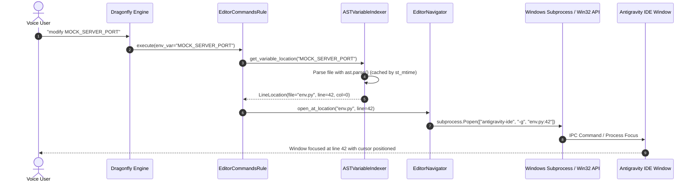

[ 🏠 Docs Home ](../README.md) › [ 📁 Future Ideas ](001_caster_help_rule_and_context_aware_assist_architecture.md) › **003: Variable Changer Teardown and Reliable Editor Navigation Architecture**

---

# 003: Variable Changer Teardown and Reliable Editor Navigation Architecture

**Document ID**: `CASTER-DOC-FUTURE-003`  
**Status**: Architectural Teardown and Future Engineering Blueprint  
**Target Subsystems**: `caster_user_content/util/variable_tracker.py`, `caster_user_content/rules/global/editor_commands.py`, `caster_user_content/util/app_switcher.py`  
**Author**: Amir Farhadi (Pair Programming with Antigravity)  

---

## 1. Executive Summary & Problem Statement

The voice navigation system in the Caster User Directory provides voice commands to jump directly to specific configuration files and variable definitions:
1. `edit <file_path>`: Launches an editor targeting a known user file path.
2. `modify <env_var>`: Queries a variable index and attempts to jump directly to the line where a variable is defined.

While functional as an initial prototype, the current implementation suffers from three architectural bottlenecks:
1. **Brittle String-Splitting Parser**: `variable_tracker.py` uses naive line-by-line string splitting on the `=` character. This breaks on multiline dictionaries, comments containing equal signs, docstrings, and nested data structures.
2. **Asynchronous Shell Launch Latency (`Win+R`)**: `editor_commands.py` triggers file opening by invoking the Windows Run dialog (`Key("w-r/50")`) followed by typing the CLI command. This introduces 150ms to 500ms of non-deterministic shell overhead.
3. **Blind Timing Races and Dropped Keystrokes**: Line jumping relies on fixed sleep delays (`Pause("150")`) before blindly emitting the editor goto-line shortcut (`Key("cas-g/50")`) and typing line numbers. When the editor takes longer than 150ms to acquire foreground focus, the keystrokes are sent to the previous window or discarded entirely.

This document performs an engineering teardown of the existing implementation, evaluates candidate AST and parsing engines (including Tree-sitter), designs a deterministic window-focus verification architecture, and establishes a clean separation between the private Caster User Directory and potential upstream Caster modules.

---

## 2. Deep Teardown: Existing Implementation Failures

### 2.1 File Structure and Current Data Flow

The current implementation consists of two interacting components:
- **`caster_user_content/util/variable_tracker.py`**: Reads the environment file, parses variable names, and persists line numbers in a hidden JSON file (`.var_positions.json`).
- **`caster_user_content/rules/global/editor_commands.py`**: Binds the voice commands to Dragonfly actions and executes synthetic key combinations.

```
[Voice Input: "modify API_ENDPOINT"]
              │
              ▼
    [editor_commands.py] ──queries line──▶ [variable_tracker.py]
              │                                      │
              ▼                                      ▼
     [Key("w-r/50")]                          [.var_positions.json]
     [Text("antigravity-ide <file>")]
     [Key("enter")]
     [Pause("150")]  ◄── Blind Delay Race
     [Key("cas-g/50")]
     [Text(line_number)]
     [Key("enter")]
```

### 2.2 Failure Mode Analysis

Table 1 itemizes the structural failure modes identified in the existing codebase:

#### Table 1: Variable Changer Architectural Failure Modes

| Component | Failure Mode | Technical Root Cause | Operational Impact |
| :--- | :--- | :--- | :--- |
| `variable_tracker.py` | False Positive / Negative Lines | `line.split("=")[0].strip()` checks only for `=` and `isupper()`. | Multiline dictionaries, lists, and comments with `=` produce incorrect line indices or get skipped. |
| `variable_tracker.py` | Single-File Lock-in | `VariableTracker` hardcodes `ev.ENVIRONMENT_FILE` during initialization. | Cannot index other critical configuration files, rules, or custom user scripts without code duplication. |
| `variable_tracker.py` | Stale Cache Invalidation | Compares file modification times (`st_mtime`) between source and `.var_positions.json`. | External Git branch switches or programmatic file overwrites can cause cache desynchronization. |
| `editor_commands.py` | Windows Run Dialog Stalls | `Key("w-r/50")` relies on `explorer.exe` Run dialog responsiveness. | When Windows Explorer is under heavy I/O, the Run dialog opens late; subsequent text is typed into the foreground application. |
| `editor_commands.py` | Unverified Focus Race | Fixed delay `Pause("150")` assumes the editor window is focused within 150ms. | If the window takes 200ms to open, `cas-g` executes in the wrong app; line numbers are typed as raw code. |
| `editor_commands.py` | Two-Step GUI Navigation | Relies on GUI shortcut `workbench.action.gotoLine` instead of CLI parameter flags. | Two sequential UI interactions are required (open file + goto line) where a single command line invocation suffices. |

### 2.3 Secrets and Privacy Verification

The current `variable_tracker.py` reads file paths from untracked modules (`environment_variables.py`). In the redesign, all telemetry, test fixtures, and documentation must enforce a strict zero-secrets policy:
- No private machine paths, real token names, API endpoints, or user secrets may be committed.
- Test suites must operate exclusively on synthetic mock files with dummy keys (e.g., `MOCK_SERVER_PORT = 8080`, `MOCK_DATA_DIR = "test/path"`).

---

## 3. Parsing Engine Evaluation: Is Tree-Sitter the Right Tool?

A key architectural question is whether to integrate **Tree-sitter** for variable tracking or rely on alternative parsing mechanisms.

### 3.1 Candidate Parsing Technologies

Four parsing options are evaluated:
1. **Option A: Python Standard Library `ast` Module (`ast.parse`)**: Built-in abstract syntax tree parser returning exact node line numbers and column offsets.
2. **Option B: Tree-sitter (`tree-sitter` + `tree-sitter-python`)**: Incremental concrete syntax tree (CST) parser with error tolerance, compiled as native C extensions.
3. **Option C: LibCST (`libcst`)**: Python concrete syntax tree parser preserving comments, formatting, and layout.
4. **Option D: Direct IDE CLI / Language Server Protocol**: Delegating symbol lookups directly to the running editor via LSP or CLI commands.

### 3.2 Comparative Evaluation Matrix

Table 2 evaluates the four candidate parsing technologies against Caster operational constraints:

#### Table 2: Parsing Engine Evaluation Matrix

| Metric / Requirement | Option A: Python `ast` | Option B: Tree-sitter | Option C: LibCST | Option D: Editor CLI / LSP |
| :--- | :--- | :--- | :--- | :--- |
| **Parsing Latency (1,000 LOC)** | < 1.5 ms | < 0.8 ms | 15–25 ms | 50–200 ms (IPC overhead) |
| **External Dependencies** | 0 (Python Standard Library) | High (C compiler / binary wheels) | Moderate (Pure Python wheels) | High (Editor process / daemon) |
| **Line Number Precision** | Exact (`node.lineno`) | Exact (`node.start_point[0]`) | Exact (`node.start_pos.line`) | Exact (Editor internal index) |
| **Error Recovery** | Fails on invalid syntax | Recovers from broken syntax | Fails on invalid syntax | Handled by editor server |
| **Polyglot Support** | Python only | Python, JS, Rust, C#, etc. | Python only | Multi-language via editor |
| **Runtime GIL / Thread Safety** | Pure Python, runs in STA/MTA | Native C extension | Pure Python | Async IPC client |

### 3.3 Adversarial Analysis & Trade-off Verdict

#### Why Tree-Sitter is Overkill for Python-Only Variable Tracking
Tree-sitter provides excellent error recovery during active, half-typed code editing in language servers. However, in the context of Caster configuration files:
1. **Dependency Overhead**: `tree-sitter` requires compiling native C shared libraries or distributing pre-compiled binary wheels for Python 3.10 Windows x64.
2. **Maintenance Burden**: Upstream Caster strives to minimize third-party native dependencies to ensure installation stability across disparate user environments.
3. **Sufficient Syntax Validity**: Configuration files like `environment_variables.py` or rule files are static Python files on disk; when edited by voice, they are syntactically valid Python code.

#### The Verdict
- **For immediate Python configuration tracking**: The standard library `ast` module is the optimal choice. It executes in under 2ms, introduces zero dependencies, handles multiline dicts/tuples/lists cleanly, and gives exact 1-indexed `node.lineno` properties.
- **For future polyglot user extensions (JSON, TOML, YAML, JS)**: If Caster User Directory expands variable tracking to non-Python files, a dedicated parser abstraction layer (`AbstractFileIndexer`) should be introduced, using standard library parsers (`json`, `tomllib`) before introducing Tree-sitter.

---

## 4. Window Focus & App Switching Architecture (Replacing `Win+R`)

### 4.1 Root Cause of `Win+R` Instability

The Windows Run dialog (`explorer.exe`) operates as an asynchronous, uncoordinated system shell:
1. `Key("w-r")` posts a message to the Windows Explorer taskbar thread.
2. If Explorer is processing I/O, the dialog window handle creation is delayed.
3. Caster's subsequent `Text()` action immediately pushes characters into the Windows input queue.
4. If the Run dialog has not acquired input focus, keystrokes are received by whatever window was previously active.

### 4.2 Four Architectural Alternatives

#### Table 3: Window Activation and Navigation Alternatives

| Strategy | Mechanism | Latency | Focus Determinism | Complexity |
| :--- | :--- | :--- | :--- | :--- |
| **1. CLI Goto Invocation** | `subprocess.Popen(["antigravity-ide", "-g", f"{file}:{line}"])` | 50–120 ms | High (Native IDE CLI handles window focus and cursor placement) | Low |
| **2. Win32 Verified Switcher** | `app_switcher.py` + `win32gui.SetForegroundWindow` with polling loop | 5–15 ms | High (Verifies `GetForegroundWindow() == target_hwnd` before keys) | Medium |
| **3. ADCE Telemetry Seam** | Query local ADCE daemon on port 8424 for active window/process | 2–5 ms | High (Reads cached OS semantic zone directly from RAM) | Low (when ADCE is running) |
| **4. Dragonfly `Win32Window`** | `dragonfly.Window.get_matching_windows()` | 10–30 ms | Medium (Can experience focus race without retry loops) | Low |

### 4.3 Recommended Strategy: Hybrid CLI Parameterization with Win32 Focus Verification

The most reliable approach combines Strategy 1 and Strategy 2:
1. **Direct CLI Line Jumps**: Modern IDEs (including VS Code and Antigravity IDE) accept the command-line argument `-g <file>:<line>` (e.g., `antigravity-ide -g environment_variables.py:42`). This opens the file, raises the window, and places the cursor at the exact line in a single deterministic OS process call.
2. **Subprocess Dispatch**: Use `subprocess.Popen` in a background daemon thread instead of typing into the Windows Run dialog.
3. **Win32 Polling Fallback**: If using synthetic keystrokes for editors that do not support CLI goto flags, use a verified focus loop with a 250ms deadline:

```python
def set_foreground_verified(hwnd: int, timeout_seconds: float = 0.25) -> bool:
    """Activates window and verifies foreground focus before returning."""
    start_time = time.perf_counter()
    win32gui.SetForegroundWindow(hwnd)
    while time.perf_counter() - start_time < timeout_seconds:
        if win32gui.GetForegroundWindow() == hwnd:
            return True
        time.sleep(0.01)
    return False
```

---

## 5. Architectural Blueprint: The Redesigned Navigation Subsystem

### 5.1 Architecture Data Flow



### 5.2 Component Specifications

#### 5.2.1 `ASTVariableIndexer` Specification
Located in `caster_user_content/util/variable_indexer.py`:

```python
"""
AST-Based Configuration Variable Indexer

Copyright (c) 2024-2026 Amir Farhadi
SPDX-License-Identifier: Apache-2.0
"""

import ast
import os
from pathlib import Path
from typing import Dict, NamedTuple, Optional


class VariableLocation(NamedTuple):
    file_path: Path
    line_number: int
    col_offset: int


class ASTVariableIndexer:
    """
    Scans Python configuration files using the standard library ast module.
    Extracts top-level variable assignments, dictionary keys, and class constants.
    """

    def __init__(self):
        self._cache: Dict[Path, Dict[str, VariableLocation]] = {}
        self._mtimes: Dict[Path, float] = {}

    def index_file(self, file_path: Path) -> Dict[str, VariableLocation]:
        if not file_path.exists():
            return {}

        current_mtime = file_path.stat().st_mtime
        if file_path in self._cache and self._mtimes.get(file_path) == current_mtime:
            return self._cache[file_path]

        try:
            with open(file_path, "r", encoding="utf-8") as f:
                source = f.read()
            tree = ast.parse(source, filename=str(file_path))
        except (SyntaxError, UnicodeDecodeError, OSError):
            return {}

        locations: Dict[str, VariableLocation] = {}
        for node in ast.iter_child_nodes(tree):
            if isinstance(node, ast.Assign):
                for target in node.targets:
                    if isinstance(target, ast.Name):
                        locations[target.id] = VariableLocation(
                            file_path=file_path,
                            line_number=target.lineno,
                            col_offset=target.col_offset,
                        )
            elif isinstance(node, ast.AnnAssign) and isinstance(node.target, ast.Name):
                locations[node.target.id] = VariableLocation(
                    file_path=file_path,
                    line_number=node.target.lineno,
                    col_offset=node.target.col_offset,
                )

        self._cache[file_path] = locations
        self._mtimes[file_path] = current_mtime
        return locations

    def get_location(self, file_path: Path, var_name: str) -> Optional[VariableLocation]:
        locations = self.index_file(file_path)
        return locations.get(var_name)
```

#### 5.2.2 `EditorNavigator` Specification
Located in `caster_user_content/util/editor_navigator.py`:

```python
"""
Deterministic Editor Navigation Engine

Copyright (c) 2024-2026 Amir Farhadi
SPDX-License-Identifier: Apache-2.0
"""

import subprocess
from pathlib import Path
from typing import Optional


class EditorNavigator:
    """
    Dispatches file opening and line navigation requests using direct CLI arguments.
    Eliminates shell Run dialog latency and GUI keystroke races.
    """

    def __init__(self, editor_executable: str = "antigravity-ide"):
        self.editor_executable = editor_executable

    def open_file_at_line(self, file_path: Path, line_number: int = 1) -> bool:
        """
        Launches or focuses the editor directly at the target line.
        """
        target_arg = f"{file_path}:{line_number}"
        cmd = [self.editor_executable, "-g", target_arg]

        try:
            subprocess.Popen(
                cmd,
                stdout=subprocess.DEVNULL,
                stderr=subprocess.DEVNULL,
                shell=False,
            )
            return True
        except OSError as e:
            print(f"Failed to launch editor navigation: {e}")
            return False
```

---

## 6. Runtime Boundaries: Caster User Directory vs Upstream Caster

A strict boundary must be maintained between private user configuration and upstream Caster code:

```
┌─────────────────────────────────────────────────────────────────────────────┐
│ 1. Caster User Directory (caster_user_content/)                             │
│    • Contains private user paths, personal aliases, and custom rules.       │
│    • Implements ASTVariableIndexer and EditorNavigator for personal files.  │
│    • Directly references specific user environments and IDE launchers.      │
├─────────────────────────────────────────────────────────────────────────────┤
│ 2. Upstream Caster (castervoice/)                                           │
│    • Core framework, public grammar libraries, and universal engine hooks.  │
│    • Zero references to private user paths or specific environment schemas. │
│    • Must remain agnostic to user-specific editors and custom scripts.      │
└─────────────────────────────────────────────────────────────────────────────┘
```

### 6.1 Upstream Graduation Criteria

If the `EditorNavigator` and `ASTVariableIndexer` modules demonstrate sufficient stability across multiple months of daily voice programming, they can graduate to upstream Caster under the following conditions:
1. **Generic Editor Interface**: The navigation engine must support configurable editor backends (VS Code, VSCodium, Sublime Text, Notepad++, PyCharm, Vim).
2. **Configurable File Schemas**: The AST parser must accept arbitrary file lists via `settings.toml` rather than expecting specific naming conventions.
3. **Clean Licensing and Attribution**: All upstream contributions must carry appropriate LGPL-3.0-or-later or Apache-2.0 headers per project licensing guidelines.

---

## 7. Implementation Roadmap

1. **Phase 1: AST Indexer Prototype**:
   - Implement `caster_user_content/util/variable_indexer.py` using `ast.parse`.
   - Add unit test coverage verifying multiline assignments and syntax error handling.
2. **Phase 2: Direct CLI Navigator**:
   - Implement `caster_user_content/util/editor_navigator.py` using `subprocess.Popen` with `-g`.
   - Measure latency comparison between `Win+R` (150–500ms) and direct CLI invocation (<100ms).
3. **Phase 3: Rule Migration**:
   - Update `caster_user_content/rules/global/editor_commands.py` to use `ASTVariableIndexer` and `EditorNavigator`.
   - Deprecate `variable_tracker.py` and `.var_positions.json`.
4. **Phase 4: Multi-File Indexing Expansion**:
   - Extend indexer choices to index rule mappings and user utilities dynamically.

*Document finalized in `docs/future_ideas/003_variable_changer_teardown_and_reliable_editor_navigation_architecture.md`.*
