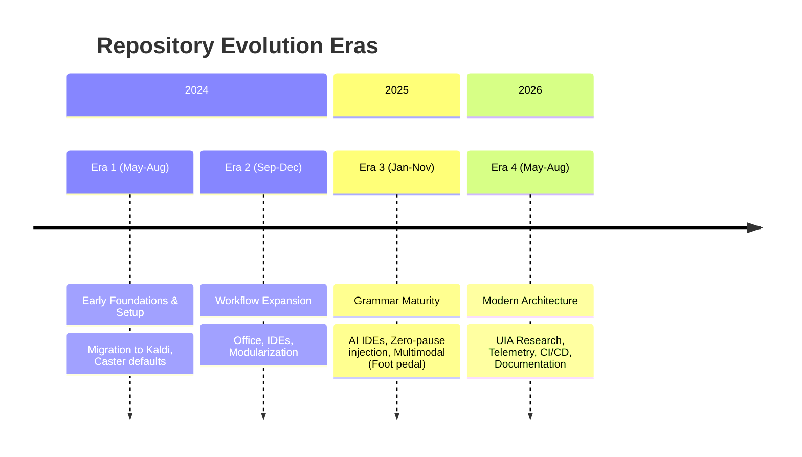

[ 🏠 Docs Home ](../README.md) › [ 📁 History ](../README.md#history) › **Repository Timeline & Technical Journey**

# Repository Timeline & Technical Journey

## Overarching Narrative
**From Exploratory Speech Setup to Resilient Voice OS**
The journey of this repository represents a 27-month evolution from initial experiments with speech recognition alternatives to a highly robust, multi-modal Voice OS. Starting as an exploratory migration away from legacy Windows Speech Recognition towards the Kaldi ASR engine, the codebase progressively matured. It expanded through deep application-specific workflows, overcame profound architectural challenges in latency and threading, and culminated in a resilient, research-backed systems architecture capable of hands-free coding and desktop control.

## Executive Overview & Metrics
- **969 total commits spanning 27 months**
- **4 Distinct Eras** characterizing the transition from basic mappings to complex OS-level integrations.

## High-level Timeline

## Era 1: Early Foundations & Setup (May 2024 - Aug 2024)
**Date Range:** 2024-05-12 to 2024-08-31

The transition from legacy Windows Speech Recognition (WSR/WSRMacros) to modern Dragonfly/Caster powered by the Kaldi ASR engine. The era begins with trial-and-error experimentation around words.txt transformers to map legacy phonetic habits, evolves into writing native Python Dragonfly rules, discovers the architectural boundaries between CCR (Continuous Command Recognition) and non-CCR grammars, establishes modular app-specific and global rule hierarchies, adopts the Talon phonetic alphabet to reduce vocal strain, and learns to embrace Caster's ergonomic defaults over legacy WSR workarounds.

### Landmark Commits
| Date | Hash | Title | Practical Impact |
| :--- | :--- | :--- | :--- |
| 2024-05-12 | 7888a3d | First commit & Repository Initialization | Initial repository setup establishing the caster_user_content directory structure and marking the formal migration away from Windows Speech Recognition. |
| 2024-05-15 | 7b57f4b | Replacing keyboard key mappings with transformers | First attempt to bridge muscle memory from WSR to Caster using words.txt transformer substitutions (e.g. mapping enter, alphabet letters). |
| 2024-05-28 | a4978fd | Create custom rule for window switching | First standalone Dragonfly Python rule written in the workspace, implementing 1-indexed and negative taskbar window switching. |
| 2024-06-02 | d461bbb | Added the f2 key ccr with a custom rule | Architectural turning point recognizing that scattered single-action rules must be consolidated into a unified global Continuous Command Recognition (CCR) rule. |
| 2024-06-05 | 840dbd5 | Cleaned up/organized some rule files and added more programs to bringme | Major codebase restructuring separating user rules into dedicated 'apps/' and 'global/' directories while expanding the sm_bringme app launcher. |
| 2024-05-31 | 053a2db | Switch to ShortIntegerRef and build VS Code extensions | Optimization for recognition latency by replacing standard IntegerRef with ShortIntegerRef across rules and introducing VS Code pane navigation. |
| 2024-07-04 | a35d3b1 | Switch to using the Talon alphabet where possible | Migration from legacy/NATO phonetic alphabets to the Talon voice alphabet, vastly improving acoustic distinctiveness and vocal ergonomics. |
| 2024-07-11 | c155dff | Replace explorer, update words, and package modular rule directories | Modularization of app rules into distinct Python packages (apps/explorer, apps/firefox, apps/vscode) with dedicated merge and mapping rules. |
| 2024-07-25 | d13987c | Status update on embracing Caster defaults over WSR legacy specs | Mindset breakthrough: documenting how Kaldi's acoustic precision eliminates the need for bulky multi-syllable WSR workarounds, enabling shorter, less straining utterances. |
| 2024-08-22 | 5a8e89e | Create CCR rule for Microsoft Word | Expansion of voice coding patterns into rich desktop document processing, separating formatting into chained CCR commands and deep UI navigation. |
| 2024-08-31 | 8df0a5a | Create and enable custom mouse alternatives rule | Pruning upstream Caster bloat by replacing unstable builtin mouse alternative rules with a streamlined, collision-free custom rule. |

## Era 2: Workflow Expansion & Phonetic Evolution (Sep 2024 - Dec 2024)
**Date Range:** 2024-09-01 to 2024-12-31

Era 2 represents a massive expansion phase driven by academic thesis writing and full-desktop hands-free workflows. The repository expanded from basic navigation into deep application-specific automation across Microsoft Office (Word, PowerPoint, Excel, Outlook), LibreOffice (Writer, Calc), IDEs (migrating from VS Code to VSCodium to fix dropped characters), and terminal environments. In parallel, the author engaged in intense phonetic iteration in `words.txt` and command specs to resolve Kaldi acoustic collisions, separated monolithic global rules into modular subsystems (taskbar, CLI, programming), and established strict privacy boundaries via environment variables.

### Landmark Commits
| Date | Hash | Title | Practical Impact |
| :--- | :--- | :--- | :--- |
| 2024-09-30 | e9ef954 | Moved window switching into its own rule and separate file | Initiated architectural modularization by extracting window/taskbar management from monolithic global rules into a dedicated `taskbar.py` rule with numbered taskbar indexing (1-9). |
| 2024-10-09 | 00b8d30 | update vscodium rule and create vscodium_ccr | Executed an IDE pivot from VS Code to VSCodium to bypass an input-lag bug where Quick Open dropped initial characters during voice dictation. |
| 2024-10-09 | ffc0105 | stop tracking settings | Established a security and privacy milestone by untracking local machine configuration (`settings/*.toml`) to allow private directory paths without dirtying version control. |
| 2024-11-18 | cffb0b8 | Update enable_viacam.py and create .gitattributes | Standardized repository line endings across Windows environments via `.gitattributes` and integrated hands-free head-tracking mouse control (`enable_viacam.py`) into CCR merge rules. |
| 2024-11-22 | 97b03b3 | update file_dialog.py and .gitignore | Architected the `environment_variables.py` pattern (untracked in `.gitignore`) allowing voice rules to safely reference private file paths and personal details. |
| 2024-11-26 | 4a10773 | Created Programming directory with a global rule and custom python rules | Structured a modular `programming/` domain, consolidating CCR formatted operators (`+=`, `!=`, `->`, `==`) and custom Python rules away from app-specific grammars. |
| 2024-12-06 | 437e475 | Update excel.py | Overcame application context binding hurdles by explicitly mapping executable contexts, unlocking rich spreadsheet automation in Excel and later LibreOffice Calc. |
| 2024-12-12 | 7b8c049 | Create WriterCCR | Expanded the voice-coding grammar to LibreOffice Writer with paired non-CCR and Continuous Command Recognition (CCR) grammars for rapid document formatting. |
| 2024-12-23 | 6a14fcd | Moved windows terminal commands into cli_ccr | Consolidated fragmented terminal rules (Git Bash, Windows Terminal, CMD) into a unified `cli` domain supporting cross-shell commands and SQLite. |

## Era 3: Grammar Maturity & Rule Refinement (Jan 2025 - Nov 2025)
**Date Range:** 2025-01-01 to 2025-11-30

Era 3 represents a major leap in system maturity, responsiveness, and breadth. Spanning 454 commits across 11 months, this era transitioned Caster from a foundational voice-coding environment into an omnipresent, highly-optimized multimodal operating system. Key architectural thrusts include: (1) System-wide latency elimination via zero-pause text insertion (pause=0.0) and clipboard-injection buffers; (2) Deep integration with the generative AI coding paradigm (Cursor, Windsurf, Copilot Desktop, Claude, and local Ollama/DeepSeek CLI workflows); (3) Robust continuous command recognition (CCR) across diverse specialized applications including LibreOffice Writer, Figma, PowerShell, and MS Word; (4) Sophisticated OS-level window management tackling Windows 11 foreground-lock restrictions and UI Automation taskbar button inspection; and (5) Multimodal physical expansion through Olympus RS31H foot pedal automation with AutoHotkey v2.

### Landmark Commits
| Date | Hash | Title | Practical Impact |
| :--- | :--- | :--- | :--- |
| 2025-01-14 | 8c0faea | Update vscodium rules to include recognition with Cursor | Initiated the rapid pivot into AI-first IDEs, extending VS Code grammar rules to recognize Cursor and laying the foundation for dedicated AI editor rules. |
| 2025-03-05 | 21e76c7 | Optimize PowerShell commands with zero-pause text entry | Breakthrough latency reduction by overriding Dragonfly's default typing delay with pause=0.0 across terminal, editor, and browser rules, making voice commands instant. |
| 2025-03-04 | 8a587eb | Add Windsurf CCR rule and file context commands | Established first-class Continuous Command Recognition (CCR) for Codeium's Windsurf IDE, integrating voice macros with AI context windows and cascade workflows. |
| 2025-04-15 | ba05776 | Add text_to_clipboard utility and optimize commit prompt generation | Architectural shift from character-by-character text simulation to atomic clipboard injection (Function(text_to_clipboard) + Ctrl+V) for long structured prompts and commit messages. |
| 2025-06-28 | 97c10b7 | Add Alt key workaround for Windows foreground-lock in window switching | Solved a core OS limitation where Windows 11 blocks background processes from raising windows by injecting synthetic Alt-key tap events to satisfy OS user-interaction requirements. |
| 2025-08-08 | b2a2015 | Move window management code to attic | Pragmatic architectural retreat: an ambitious abstract window-management backend interface was deprecated and archived in favor of simpler, reliable UI Automation taskbar routines. |
| 2025-09-15 | 2c6a9af | Add Olympus RS31H Foot Pedal Control with AutoHotkey v2 | Expanded the voice environment into multimodal physical computing, introducing debounced hardware foot pedal triggers for smart drag-clicking and continuous scrolling. |
| 2025-09-17 | f60c3f9 | Refactor window switching and taskbar interaction | Replaced fragile control.invoke() with control.click_input() for window switching focus, while isolating Dragonfly's 'Cannot add list while loaded' dynamic grammar limitation. |
| 2025-10-08 | 1d4efba | Add Figma voice command rule and CCR support | Extended voice-coding grammar principles into professional visual design, enabling continuous command chaining, canvas pan/zoom modes, and spatial transform grammar (rake/lake, stretch/squeeze). |
| 2025-11-21 | fe2ec4d | Add UV package management commands to PowerShell rule | Modernized the Python CLI toolchain by incorporating Astral's blazing-fast uv package manager into daily voice-activated terminal workflows. |

## Era 4: Modern Architecture, Threading & Deep Dives (May 2026 - Aug 2026)
**Date Range:** 2026-05-01 to 2026-08-31

Era 4 marks a profound shift from practical rule-crafting toward deep systems architecture, concurrency engineering, and rigorous empirical research. Facing subtle multi-threading deadlocks and speech engine hangs, the developer launched the Socratic Wayfinder research initiative—an exhaustive 38-ticket exploration into Microsoft COM STA/MTA threading models, assistive technology architectures (NVDA, Terminator, UFO), and Model Context Protocol (MCP) servers. In a pivotal moment of empirical engineering, detailed runtime telemetry debunked the prevailing COM deadlock hypothesis by identifying Windows PowerShell QuickEdit console freezes as the true culprit behind speech stack hangs. Simultaneously, the era resolved critical Kaldi FST compiler race conditions in the Dragonfly BPC fork, introduced a 3-tier failsafe window switcher with Virtual Desktop (pyvda) awareness, engineered a dedicated XML-RPC IPC microphone bridge for the Olympus RS31H foot pedal, and conducted an in-depth evaluation of LexiconCode PR #881. The era culminated in a comprehensive overhaul of the documentation suite, establishing 'docs/context/repository-brain.md' as the canonical architectural source of truth with automated CI link validation and strict relative path hygiene.

### Landmark Commits
| Date | Hash | Title | Practical Impact |
| :--- | :--- | :--- | :--- |
| 2026-05-31 | afb6f63 | Consolidate window switching under deep app switcher module with 3-tier failsafe | Replaced legacy taskbar scripts with a unified 3-tier failsafe window focus pipeline (pywinauto focus -> taskbar UIA click simulation -> Win+T keyboard macro) and restored window/tab alias commands. |
| 2026-06-07 | f747d5a | Add Caster microphone toggle IPC integration and document foot pedal changes | Engineered an XML-RPC IPC server on localhost port 8341 to achieve instant, deterministic microphone sleep/wake state toggling via the Olympus RS31H foot pedal without simulated keystrokes. |
| 2026-07-07 | 3fcfd81 | Document Kaldi engine crash root-cause and UIA status report | Identified and resolved a critical race condition in the Dragonfly BPC fork where Kaldi grammar observer lifecycle timing during Mimic() voice transitions caused mid-phrase engine crashes. |
| 2026-07-16 | 2588603 | Add dynamic dictation aliases and local/remote CI validation pipeline | Enabled on-the-fly voice dictation for window/tab aliases while establishing pre-commit and GitHub Actions CI pipelines enforcing Ruff linting, absolute path leak prevention, and command uniqueness. |
| 2026-08-04 | 8645829 | Establish Wayfinder map and deprecate thread pool ADR for UIA Server refactor | Launched the Socratic Wayfinder research initiative and deprecated the background worker pool ADR after uncovering Microsoft COM Single-Threaded Apartment (STA) threading constraints. |
| 2026-08-08 | ca5dc70 | Debunk COM deadlocks via empirical app switcher investigation and telemetry | Empirical timing telemetry proved that speech thread freezes previously blamed on COM/UIA deadlocks were actually caused by Windows PowerShell QuickEdit mode halting console stdout upon text selection. |
| 2026-08-12 | 3d2965c | Add testing feedback and focus analysis for LexiconCode PR #881 | Produced an architectural critique of LexiconCode PR #881 window switching, contrasting its regex dynamic polling against Win32 AttachThreadInput bypass and exposing Kaldi runtime graph recompilation limits. |
| 2026-08-14 | 770bdba | Overhaul documentation hierarchy and establish repository brain | Consolidated fragmented notes and research into a structured documentation hub centered around 'docs/context/repository-brain.md', backed by CI markdown link validation and workspace privacy rules. |
| 2026-08-14 | 8397b0c | Optimize window focus tiers and eliminate keystate deadlocks | Replaced pywinauto wrappers with direct sub-millisecond Win32 focus tiers, introduced guarded context managers (_alt_key_bypass, _attached_threads) with deterministic cleanup, encapsulated alias persistence in AliasRegistry, and optimized verification with 10ms micro-polling. |
| 2026-08-23 | 569f974 | Establish 4-gate epistemic protocol, empirical tab benchmarks, and ADCE handover | Executed empirical micro-spikes disproving browser DOM crawl costs via container-scoped UIA queries (10ms for 30 tabs), codified the definitive UI Automation SSOT (Doc 017), and transitioned active engine development to standalone active-desktop-context-engine repository. |

## Core Subsystem Evolution Sections

### Active Desktop Context Engine (ADCE) & Accessibility MCP
Began with an exploratory Python event-driven prototype (`scripts/context_poc.py`) listening to zero-polling Win32 `SetWinEventHook` events. Encountered severe 5.8-second freezes caused by recursive tree walks traversing 6,800+ web DOM nodes. Established a 4-gate epistemic verification protocol ([015](../accessibility_mcp/015_recalibration_and_adversarial_architecture_review.md)), executed empirical micro-spikes ([016](../accessibility_mcp/016_micro_spike_2_win32_shallow_python_telemetry.md)) demonstrating that direct container targeting (`tabs-container`, `tabs normal`) extracts 30 tabs in **10.17 ms** and shallow focus in **0.66 ms**, codified a complete UI Automation Single Source of Truth ([017](../accessibility_mcp/017_ui_automation_tree_structures_and_target_zones_reference.md)), and transitioned production C# engine implementation to the standalone [`amirf147/active-desktop-context-engine`](https://github.com/amirf147/active-desktop-context-engine) repository.

### Window Switching & App Focus
Began as scattered single-action rules and basic numbered taskbar switching. Evolved into a sophisticated abstraction tackling Windows 11 foreground-lock restrictions using Alt-key workarounds, matured through a 3-tier failsafe pipeline (pywinauto -> UIA click -> Win+T) with Virtual Desktop (pyvda) awareness, and culminated in the **v3 sub-millisecond native Win32 focus engine** (`8397b0c`) with guarded keystate context managers (`_alt_key_bypass`, `_attached_threads`), `AliasRegistry` persistence, 10ms micro-polling, and dedicated architectural history in [`app_switcher_timeline.md`](app_switcher_timeline.md).

### Phonetics & Alphabet
Transitioned from legacy WSR muscle memory and NATO alphabet to the Talon phonetic alphabet. Addressed phonetic collisions through iterative acoustic tuning (e.g., tweaking monosyllabic commands to avoid dictation overlap) and established strict phonetic boundaries.

### CCR Numeric Rules
Started with latency-inducing IntegerRef, optimized to ShortIntegerRef to reduce lag, and expanded into continuous command recognition (CCR) across rich desktop documents, spreadsheets, and design tools (Figma), enabling complex chained formatting and multi-directional snapping commands.

### Kaldi & Threading Stability
Encountered critical speech engine hangs initially attributed to COM STA/MTA threading deadlocks. Conducted the Socratic Wayfinder research initiative, which empirically debunked the COM deadlock theory (tracing the issue to PowerShell QuickEdit mode) and resolved Kaldi FST compiler race conditions in the Dragonfly BPC fork.
