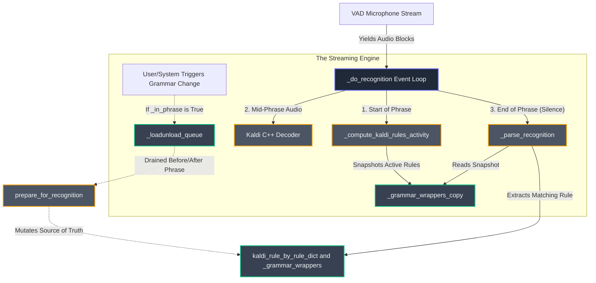

Welcome to Phase 1 (Revision A). As your Principal Systems Architect, my goal is to guide you to mastery over the `dragonfly/engines/backend_kaldi/engine.py` architecture. We will dissect the streaming engine one layer at a time, deeply analyzing how data flows and how state is preserved under the pressure of real-time audio.

Here is the architectural data flow map. Study how the audio physically moves through the loops and how mutations are safely deferred before we dive into the component groups below.

### 1. Connection & Setup State
This group initializes the engine, wires the configuration options, and bootstraps the underlying Kaldi C++ decoder and VAD (Voice Activity Detection) iterators.
*   `__init__(self, **options)`: Ingests configuration limits and initializes the state variables, timers, and the recognition observer manager. It prepares the engine for a future connection.
*   `_reset_state(self)`: Nullifies all critical runtime objects (`_compiler`, `_decoder`, `_audio`) and zeroes out all state-tracking boolean flags and queues. It brings the engine back to a pristine, disconnected baseline.
*   `connect(self)`: Wakes up the system. It provisions the `KaldiCompiler`, initializes the `decoder`, starts the `VADAudio` microphone iterators, and binds the `AudioStore`.
*   `disconnect(self)`: Tears down the system. If called while the mic is cold, it destroys the audio streams and zeroes state immediately; if called mid-phrase, it gracefully defers the disconnect flag for the main loop to process safely.

### 2. Grammar Lifecycle Management
This group acts as the bridge between Dragonfly's high-level grammars and Kaldi's C++ rule graphs.
*   `_load_grammar(self, grammar)`: When a grammar is loaded, this function translates the high-level Python Dragonfly grammar into Kaldi's C++ active grammar format. It then binds this compiled C++ structure to a Python `GrammarWrapper`. Crucially, before executing the load, it checks the `_in_phrase` flag. If the user is currently speaking (meaning the decoder is actively processing audio against the current rule graph), this function intercepts the load command and physically pushes it as a closure (a function object) into the `_loadunload_queue`. This mechanism guarantees the underlying C++ graph is not mutated while the audio block processor is actively traversing it.
*   `_unload_grammar(self, grammar, wrapper)`: Instructs the compiler to destroy the associated rules. Similarly, it protects the decoder by enqueuing the unload action into `_loadunload_queue` if an utterance is currently in progress.
*   `activate_grammar(self, grammar)` / `deactivate_grammar(self, grammar)` / `set_exclusiveness(self, grammar, exclusive)`: Modifies the activation and exclusivity flags on the `GrammarWrapper`. These changes determine which rules are passed to Kaldi during the *next* context calculation.

### 3. Main Execution Loops
This is the core streaming loop that pumps audio into Kaldi, extracts transcribed text, and figures out which Dragonfly rule was spoken.
*   `_do_recognition(self, timeout, single, audio_iter)`: This is the massive, async-like `while` loop that acts as the beating heart of the engine. It continuously pulls blocks of audio from the VAD (Voice Activity Detection) iterator. When it detects the start of a phrase, it locks in the current state by copying `_grammar_wrappers` into `_grammar_wrappers_copy` and calculating the precise rules allowed in the current foreground window context. As audio streams in, it feeds these blocks directly to the Kaldi C++ `_decoder`. When the VAD yields a silence block, signaling the end of the phrase, this loop triggers `_parse_recognition` to determine what was said, fires the callbacks to execute the user's command, resets the `_in_phrase` flag, and finally invokes `prepare_for_recognition` to safely apply any grammar changes that piled up while the user was speaking.
*   `prepare_for_recognition(self)`: This function acts as the mandatory synchronization checkpoint that physically drains the `_loadunload_queue`. When called (typically right before the microphone starts listening or right after an utterance fully concludes), it enters a `while self._loadunload_queue:` loop, popping each deferred load or unload closure and executing it synchronously. This action safely mutates the underlying `_grammar_wrappers` and Kaldi rule structures *only* when the engine guarantees the decoder is idle and not holding active pointers to the rule graph.
*   `_compute_kaldi_rules_activity(self, phrase_start)`: Polls the OS for the foreground window and fires Dragonfly's context callbacks. It compiles a boolean mask (`_kaldi_rules_activity`) of which rules are legally allowed to trigger in this exact millisecond.
*   `_parse_recognition(self, output, mimic)`: Takes raw text (or tokens) from Kaldi and compares it against the active kaldi rules snapshot. It determines *which* grammar rule was spoken and extracts any free-form dictation words.

### 4. Offline / Simulation Bypasses
This group provides deterministic testing avenues and file-based processing.
*   `mimic(self, words)`: Simulates a user speaking the `words`. It completely bypasses the `_do_recognition` audio loop, manually triggers rule context calculation, parses the text directly, and forces rule execution.
*   `recognize_wave_file(self, filename, realtime, **kwargs)`: Overrides the live microphone iterator with a file reader. It tricks `_do_recognition` into processing an offline `.wav` file as if it were a live stream.

---

### Key Class-Level Private Variables (The State Keepers)
These variables dictate the flow of the entire engine and bridge Python to C++:

**The Global Sources of Truth:**
*   `self._grammar_wrappers` (Inherited from `EngineBase`): A global dictionary storing the true, authoritative list of all currently loaded `GrammarWrapper` objects, keyed by the memory ID of their parent Dragonfly grammars. It bridges the gap between Dragonfly's Python grammar definitions and the engine's rule management.
*   `self.kaldi_rule_by_rule_dict` (Owned by `_compiler` and `GrammarWrapper`): This dictionary is the definitive source of truth mapping the high-level Python Dragonfly rules to the low-level Kaldi C++ rule objects (`KaldiRule`). This dictionary dictates exactly which C++ memory structures the decoder traverses during recognition.

**Collections & Snapshots:**
*   `self._loadunload_queue` (`collections.deque`): A buffer that caches grammar loads/unloads requested while the user is actively speaking, preventing mid-phrase graph corruption.
*   `self._grammar_wrappers_copy` (`dict`): A frozen snapshot of the active grammar wrappers taken exactly at the millisecond the microphone detected a voice. 

**Execution Booleans:**
*   `self._in_phrase`: `True` if VAD has detected speech and Kaldi is actively chewing on audio blocks.
*   `self._doing_recognition`: `True` if the thread is currently trapped inside the `_do_recognition` `while` loop listening to the microphone.
*   `self._deferred_disconnect`: `True` if a shutdown was requested while `_doing_recognition` was active. It tells the loop to exit on its next cycle.
*   `self._ignore_current_phrase`: `True` if a user command demands the engine instantly trash the current active utterance upon completion.
*   `self._any_exclusive_grammars`: `True` if any grammar currently asserts exclusivity (locking out all global commands).
*   `self._saving_adaptation_state`: `True` if the engine is retaining acoustic profile adjustments between utterances.

---

### Your Socratic Challenge

Imagine a scenario where the `_in_phrase` safeguard is accidentally bypassed. The user is halfway through speaking a complex command, meaning the Kaldi C++ decoder is actively traversing memory pointers inside the loaded rule graph. At that exact millisecond, a background script triggers a grammar reload, and `prepare_for_recognition` executes an unload immediately instead of deferring it to `_loadunload_queue`.

If this mid-phrase mutation violently alters the `kaldi_rule_by_rule_dict` and `_grammar_wrappers`, what exactly happens to the C++ memory pointers the decoder is currently holding? Trace the catastrophic failure path this race condition would trigger in the `_do_recognition` event loop.

*(Please answer, and once you are ready, say "Proceed to the next phase.")*