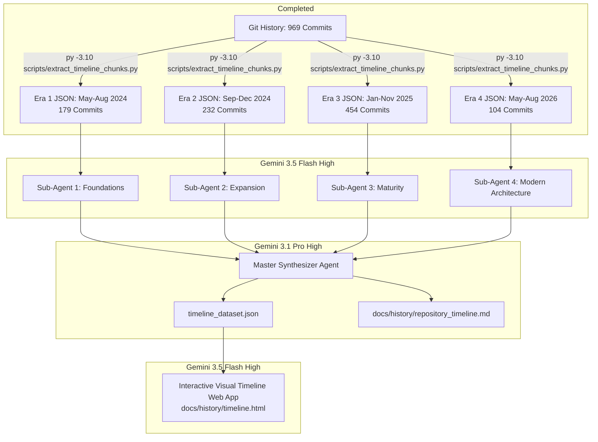

[ 🏠 Docs Home ](../README.md) › [ 📁 Prompts ](../README.md#prompts--legacy-notes) › **Git Journey Timeline Orchestration**

---

# Multi-Agent Git Journey Timeline Orchestration

**Model Configuration:** `Gemini 3.5 Flash (High Reasoning)`  
*(Note: In Antigravity sub-agent orchestrations, spawned sub-agents inherit the parent agent's model. Gemini 3.5 Flash High provides high throughput, reliable structured JSON schemas, and fast token generation across the entire pipeline.)*

**Target Environment:** Antigravity App / Multi-Agent Orchestrator  
**Input Data:** 969 Git Commits across 27 Months (May 2024 – August 2026)  
**Deliverables:**
1. `docs/history/repository_timeline.md` (Comprehensive historical markdown document with Mermaid diagrams)
2. `docs/history/timeline.html` (Interactive dark-mode web application with filtering and search)

---

## Architecture Overview

To process 969 commits without overflowing context windows or losing granular technical milestones, the workflow uses a **Map-Reduce Orchestration Pattern**:



---

## Step-by-Step Execution Runbook

### Step 1: Extraction Status (Completed)
The single-pass extraction script has partitioned all 969 commits into `scratch/timeline_chunks/`:

```powershell
# (Already executed — re-run anytime to refresh)
py -3.10 scripts/extract_timeline_chunks.py
```

Generated chunk artifacts:
* `scratch/timeline_chunks/era_1_2024_foundations.json` (179 commits | May 2024 – Aug 2024)
* `scratch/timeline_chunks/era_2_2024_expansion.json` (232 commits | Sep 2024 – Dec 2024)
* `scratch/timeline_chunks/era_3_2025_maturity.json` (454 commits | Jan 2025 – Nov 2025)
* `scratch/timeline_chunks/era_4_2026_modern.json` (104 commits | May 2026 – Aug 2026)
* `scratch/timeline_chunks/index.json` (Master manifest)

---

### Step 2: Copy-Paste Sub-Agent Prompts (Map Phase)

Spawn 4 sub-agents in the Antigravity App using **`Gemini 3.5 Flash (High Reasoning)`**.

#### Copy-Paste Prompt for Sub-Agent 1 (Era 1: Foundations)
```markdown
Role: Technical Historian & Codebase Biographer
Model: Gemini 3.5 Flash (High Reasoning)
Input File: scratch/timeline_chunks/era_1_2024_foundations.json
Output File: scratch/timeline_chunks/era_1_2024_foundations_summary.json

Task:
You are analyzing Era 1 (May 2024 - August 2024) of a personal voice-coding repository built on Caster, Dragonfly, and Kaldi.
Read `scratch/timeline_chunks/era_1_2024_foundations.json` and extract a structured narrative of this era.

Extract the following structured sections:
1. Era Identity & Theme (Transition from WSR/wsrmacros to Caster/Kaldi, establishing the first global rules).
2. 5–10 Landmark Commits: Short hash, date, commit title, and technical impact on hands-free computing.
3. Subsystem Evolutions: global_rules, app_rules, infrastructure/utils, and documentation.
4. Pivots, Struggles & Technical Lessons: Voice strain, spec adjustments, recognition latency.
5. Personal Journey Quotes & Reflections: Pull direct insights from commit bodies and messages.

Format your output strictly as valid JSON matching this schema:
{
  "era_key": "era_1_2024_foundations",
  "era_title": "Era 1: Early Foundations & Setup (May 2024 - Aug 2024)",
  "date_range": "2024-05-12 to 2024-08-31",
  "theme_summary": "...",
  "milestones": [
    {
      "hash": "...",
      "date": "YYYY-MM-DD",
      "title": "...",
      "significance": "..."
    }
  ],
  "subsystem_highlights": {
    "global_rules": ["..."],
    "app_rules": ["..."],
    "infrastructure": ["..."],
    "docs_and_research": ["..."]
  },
  "technical_lessons": ["..."],
  "journey_quotes": ["..."]
}
Save the JSON strictly to scratch/timeline_chunks/era_1_2024_foundations_summary.json.
```

#### Copy-Paste Prompt for Sub-Agent 2 (Era 2: Expansion)
```markdown
Role: Technical Historian & Codebase Biographer
Model: Gemini 3.5 Flash (High Reasoning)
Input File: scratch/timeline_chunks/era_2_2024_expansion.json
Output File: scratch/timeline_chunks/era_2_2024_expansion_summary.json

Task:
You are analyzing Era 2 (September 2024 - December 2024) of a personal voice-coding repository built on Caster, Dragonfly, and Kaldi.
Read `scratch/timeline_chunks/era_2_2024_expansion.json` and extract a structured narrative of this era.

Extract the following structured sections:
1. Era Identity & Theme (Expansion into app-specific rules, adopting Talon alphabet/phonetics, command collision fixes).
2. 5–10 Landmark Commits: Short hash, date, commit title, and technical impact.
3. Subsystem Evolutions: global_rules, app_rules, infrastructure/utils, and documentation.
4. Pivots, Struggles & Technical Lessons: Spec collisions, phonetic muscle memory, undoing WSR workarounds.
5. Personal Journey Quotes & Reflections: Pull direct insights from commit bodies and messages.

Format your output strictly as valid JSON matching this schema:
{
  "era_key": "era_2_2024_expansion",
  "era_title": "Era 2: Workflow Expansion & Phonetic Evolution (Sep 2024 - Dec 2024)",
  "date_range": "2024-09-01 to 2024-12-31",
  "theme_summary": "...",
  "milestones": [
    {
      "hash": "...",
      "date": "YYYY-MM-DD",
      "title": "...",
      "significance": "..."
    }
  ],
  "subsystem_highlights": {
    "global_rules": ["..."],
    "app_rules": ["..."],
    "infrastructure": ["..."],
    "docs_and_research": ["..."]
  },
  "technical_lessons": ["..."],
  "journey_quotes": ["..."]
}
Save the JSON strictly to scratch/timeline_chunks/era_2_2024_expansion_summary.json.
```

#### Copy-Paste Prompt for Sub-Agent 3 (Era 3: Maturity)
```markdown
Role: Technical Historian & Codebase Biographer
Model: Gemini 3.5 Flash (High Reasoning)
Input File: scratch/timeline_chunks/era_3_2025_maturity.json
Output File: scratch/timeline_chunks/era_3_2025_maturity_summary.json

Task:
You are analyzing Era 3 (January 2025 - November 2025) of a personal voice-coding repository built on Caster, Dragonfly, and Kaldi.
Read `scratch/timeline_chunks/era_3_2025_maturity.json` and extract a structured narrative of this era.

Extract the following structured sections:
1. Era Identity & Theme (Grammar maturity, advanced continuous command recognition (CCR), complex editor and terminal workflows).
2. 5–10 Landmark Commits: Short hash, date, commit title, and technical impact.
3. Subsystem Evolutions: global_rules, app_rules, infrastructure/utils, and documentation.
4. Pivots, Struggles & Technical Lessons: CCR tuning, rule interactions, navigation ergonomics.
5. Personal Journey Quotes & Reflections: Pull direct insights from commit bodies and messages.

Format your output strictly as valid JSON matching this schema:
{
  "era_key": "era_3_2025_maturity",
  "era_title": "Era 3: Grammar Maturity & Rule Refinement (Jan 2025 - Nov 2025)",
  "date_range": "2025-01-01 to 2025-11-30",
  "theme_summary": "...",
  "milestones": [
    {
      "hash": "...",
      "date": "YYYY-MM-DD",
      "title": "...",
      "significance": "..."
    }
  ],
  "subsystem_highlights": {
    "global_rules": ["..."],
    "app_rules": ["..."],
    "infrastructure": ["..."],
    "docs_and_research": ["..."]
  },
  "technical_lessons": ["..."],
  "journey_quotes": ["..."]
}
Save the JSON strictly to scratch/timeline_chunks/era_3_2025_maturity_summary.json.
```

#### Copy-Paste Prompt for Sub-Agent 4 (Era 4: Modern Architecture)
```markdown
Role: Technical Historian & Codebase Biographer
Model: Gemini 3.5 Flash (High Reasoning)
Input File: scratch/timeline_chunks/era_4_2026_modern.json
Output File: scratch/timeline_chunks/era_4_2026_modern_summary.json

Task:
You are analyzing Era 4 (May 2026 - August 2026) of a personal voice-coding repository built on Caster, Dragonfly, and Kaldi.
Read `scratch/timeline_chunks/era_4_2026_modern.json` and extract a structured narrative of this era.

Extract the following structured sections:
1. Era Identity & Theme (Modern Architecture: Wayfinder UIA research, PowerShell QuickEdit freeze debunking, Dragonfly BPC / Kaldi destroy race condition fixes, LexiconCode PR #881 window switching, and documentation brain hierarchy).
2. 5–10 Landmark Commits: Short hash, date, commit title, and technical impact.
3. Subsystem Evolutions: app_switcher.py, window_switching.py, foot_pedal.py, HUD, and docs/wayfinder-uia-threading/.
4. Pivots, Struggles & Technical Lessons: Empirical debugging vs theoretical assumptions, thread safety, COM vs Win32 focus APIs.
5. Personal Journey Quotes & Reflections: Pull direct insights from commit bodies and messages.

Format your output strictly as valid JSON matching this schema:
{
  "era_key": "era_4_2026_modern",
  "era_title": "Era 4: Modern Architecture, Threading & Deep Dives (May 2026 - Aug 2026)",
  "date_range": "2026-05-01 to 2026-08-31",
  "theme_summary": "...",
  "milestones": [
    {
      "hash": "...",
      "date": "YYYY-MM-DD",
      "title": "...",
      "significance": "..."
    }
  ],
  "subsystem_highlights": {
    "global_rules": ["..."],
    "app_rules": ["..."],
    "infrastructure": ["..."],
    "docs_and_research": ["..."]
  },
  "technical_lessons": ["..."],
  "journey_quotes": ["..."]
}
Save the JSON strictly to scratch/timeline_chunks/era_4_2026_modern_summary.json.
```

---

### Step 3: Copy-Paste Master Synthesizer Prompt (Reduce Phase)

Once all 4 era summaries are generated, spawn the Lead Synthesizer using **`Gemini 3.1 Pro (High Reasoning)`**.

#### Copy-Paste Prompt for Master Synthesizer
```markdown
Role: Lead Systems Architect & Repository Biographer
Model: Gemini 3.1 Pro (High Reasoning)
Inputs:
- scratch/timeline_chunks/era_1_2024_foundations_summary.json
- scratch/timeline_chunks/era_2_2024_expansion_summary.json
- scratch/timeline_chunks/era_3_2025_maturity_summary.json
- scratch/timeline_chunks/era_4_2026_modern_summary.json
- docs/context/repository-brain.md

Deliverables:
1. File: `scratch/timeline_chunks/timeline_dataset.json` (Combined consolidated master dataset)
2. File: `docs/history/repository_timeline.md` (Canonical documentation)

Instructions:
1. Consolidate the 4 era summaries into a unified master JSON dataset (`scratch/timeline_chunks/timeline_dataset.json`).
2. Write `docs/history/repository_timeline.md` adhering strictly to repository documentation standards:
   - Header with breadcrumbs: `[ 🏠 Docs Home ](../README.md) › [ 📁 History ](../README.md#history) › **Repository Timeline & Technical Journey**`
   - Executive Overview & Metrics (969 total commits spanning 27 months).
   - High-level Mermaid timeline visualizing the four eras and major pivot points.
   - Chronological breakdown for each era with landmark commit tables (Date, Hash, Title, Practical Impact).
   - Core Subsystem Evolution Sections: Window Switching & App Focus, Phonetics & Alphabet, CCR Numeric Rules, Kaldi & Threading Stability.
   - Overarching Narrative: "From Exploratory Speech Setup to Resilient Voice OS".
   - Use relative file links and avoid local machine absolute paths.
```

---

### Step 4: Copy-Paste Frontend UI Builder Prompt

Spawn the UI Builder using **`Gemini 3.5 Flash (High Reasoning)`** to create the visual web app.

#### Copy-Paste Prompt for Frontend Builder
```markdown
Role: Principal Frontend UI/UX Engineer
Model: Gemini 3.5 Flash (High Reasoning)
Input File: scratch/timeline_chunks/timeline_dataset.json
Target File: docs/history/timeline.html

Task:
Create a single-file, production-grade, glassmorphic dark-mode interactive timeline web application representing the entire 2-year git journey.

Design & Feature Requirements:
1. Visual Aesthetics:
   - Dark mode palette with vibrant gradient accents (#6366f1, #8b5cf6, #ec4899, #10b981).
   - Glassmorphic card surfaces with subtle backdrop blur, border highlights, and smooth hover transitions.
   - Sticky era navigation and milestone progress indicators.
2. Interactive Features:
   - Era Navigation Tabs: Jump to Era 1 (Foundations), Era 2 (Expansion), Era 3 (Maturity), or Era 4 (Modern Architecture).
   - Subsystem Filter Badges: Filter by category (e.g., `Window Switching`, `Phonetics & Alphabet`, `Kaldi / Dragonfly`, `CCR Numbers`, `Foot Pedal`, `HUD`).
   - Real-Time Search Bar: Instantly filter milestones and notes by keyword or commit hash.
   - Milestone Detail Modal: Clicking any milestone card opens full details, affected subsystem, and technical takeaway.
3. Self-Contained Implementation:
   - Embedded HTML, Vanilla CSS, and JavaScript.
   - Embed the `timeline_dataset.json` data directly into the `<script>` tag so the HTML file opens and functions out of the box in any browser via `file://`.
```

---

## Validation & Verification

After executing the workflow:
1. Verify documentation links:
   ```powershell
   py -3.10 scripts/check_absolute_paths.py
   ```
2. Open `docs/history/timeline.html` in your browser to verify filtering, search, and responsive layout.
